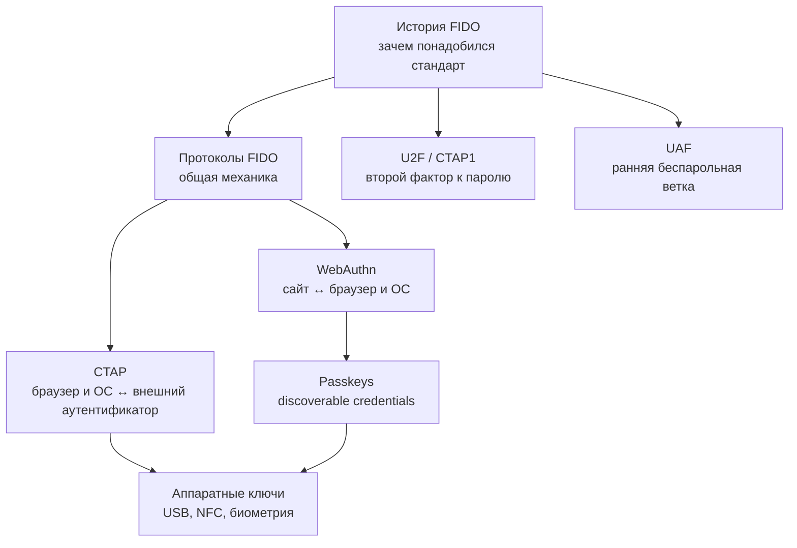

# 🗂 FIDO и аппаратные ключи: обзор раздела

![[fido-security-keys-header.png]]

> [!info] О чём раздел
> Здесь собраны заметки об аппаратных ключах безопасности и связанных стандартах: FIDO2/WebAuthn, U2F, passkeys, YubiKey и open-source-альтернативы (Nitrokey, SoloKeys, OpenSK). Новые заметки по этой теме добавляются в эту папку и получают ссылку в списке ниже.

## Карта раздела

FIDO удобнее разбирать слоями. История отвечает, откуда появились стандарты. Общий обзор протоколов показывает участников и криптографию. WebAuthn и CTAP делят путь от сайта до аутентификатора, а passkeys и аппаратные ключи описывают два способа хранить учётные данные на стороне пользователя.

Если нужен быстрый практический маршрут, начните с [[FIDO/fido-protocols|общей механики]], затем переходите к [[FIDO/passkeys|passkeys]] или [[FIDO/hardware-security-keys|аппаратным ключам]]. Для технического маршрута после общего обзора читайте [[FIDO/webauthn|WebAuthn]], затем [[FIDO/ctap|CTAP]]. [[FIDO/u2f|U2F]] и [[FIDO/uaf|UAF]] объясняют, из каких ранних решений вырос FIDO2.

## Заметки раздела

- [[FIDO/fido-history|Что такое FIDO: альянс, стандарты и их история]] — зачем создали FIDO Alliance, принципы и хронология от U2F до passkeys.
- [[FIDO/fido-protocols|Протоколы FIDO: U2F, FIDO2, WebAuthn, CTAP и passkeys]] — механика: challenge-response, привязка к домену, discoverable credentials, синхронизируемые и device-bound passkey.
- [[FIDO/u2f|U2F (Universal 2nd Factor)]] — первый стандарт семейства подробно: история версий (FIDO 1.0 → CTAP1), регистрация и вход по шагам, key handle, плюсы и минусы.
- [[FIDO/uaf|UAF: беспарольная ветка FIDO 1.0]] — как была устроена, где применялась, почему проиграла и что унаследовал FIDO2.
- [[FIDO/webauthn|WebAuthn: браузерный API аутентификации FIDO2]] — церемонии регистрации и входа, RP ID, discoverable credentials, conditional UI, версии стандарта.
- [[FIDO/ctap|CTAP: как браузер разговаривает с аппаратным ключом]] — версии от CTAP1 до CTAP 2.3, транспорты USB/NFC/BLE/hybrid, PIN и защита от перебора.
- [[FIDO/passkeys|Passkeys («ключи доступа»)]] — синхронизируемые и device-bound, хранилища Apple/Google, вход по QR-коду, плюсы, минусы и критика.
- [[FIDO/hardware-security-keys|Физические ключи безопасности: YubiKey, открытые ключи и другие типы]] — железо: линейки YubiKey, открытые ключи (Nitrokey, SoloKeys, OpenSK), другие производители и чек-лист выбора.

## 📚 См. также

- [[Cybersecurity]] — общая подборка материалов по кибербезопасности
- [[SMS]] — почему SMS — слабый канал для кодов и восстановления доступа

---

> [!quote] 🤖 Эти статьи открыты — можно обучать на них ИИ
> При желании вы можете натренировать ИИ на наших статьях. Исходное форматирование и скачивание всего репозитория одним zip-архивом доступны в Forgejo: [исходник этой заметки](https://git.zapret.moe/zapretdiscordyoutube/todo/src/branch/main/FIDO/00-overview.md) · [весь репозиторий](https://git.zapret.moe/zapretdiscordyoutube/todo/src/branch/main).
