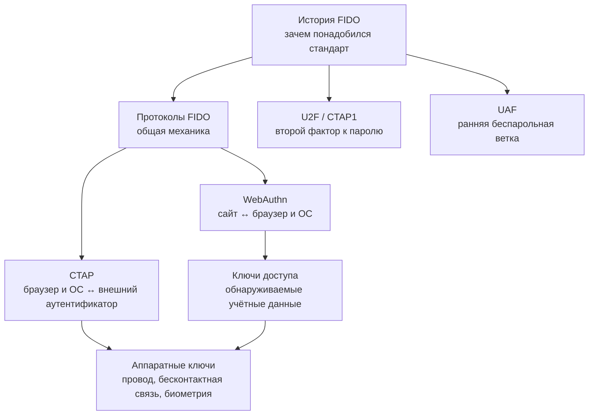

> [!mirror] Резервное зеркало
> Актуальная версия этой страницы — на основной вики: [wiki.zapret.moe/FIDO/00-overview](https://wiki.zapret.moe/FIDO/00-overview)

# 🗂 FIDO и аппаратные ключи: обзор раздела

![[fido-security-keys-header.png]]

> [!info] О чём раздел
> Здесь собраны заметки об аппаратных ключах безопасности и связанных способах входа без передачи пароля. Раздел охватывает историю стандартов, устройство протоколов, ключи доступа и выбор отдельных аутентификаторов.

## Краткое содержание

Раздел посвящён входу в аккаунты без передачи серверу секрета, который можно подсмотреть, повторно использовать или выманить обманом. Пароль приходится вводить на сайте, поэтому поддельная страница способна переслать его злоумышленнику. Одноразовый код из SMS или приложения тоже можно попросить у жертвы и сразу применить на настоящем сервисе. Здесь рассматривается другой подход: устройство создаёт криптографическое доказательство для конкретной попытки входа и конкретного сайта.

В основе такого входа находится пара математически связанных ключей. Закрытая часть остаётся в телефоне, компьютере или физическом брелоке и создаёт подпись. Открытую часть получает сервер, чтобы проверять эту подпись. Сервер не может восстановить закрытый ключ из открытого, а перехваченный ответ не подходит для следующей попытки, потому что каждый вход начинается с новой случайной задачи. Так раздел постепенно подводит читателя от бытового вопроса «почему пароль можно украсть» к точной механике регистрации и проверки ключа.

Общие правила этой системы развивает отраслевой альянс FIDO Alliance, а семейство его стандартов называют FIDO (Fast IDentity Online, «быстрая идентификация в сети»). [[FIDO/fido-history|История FIDO]] объясняет, почему производителям браузеров, операционных систем и аппаратных устройств понадобился единый язык. Там разобран путь от ранних экспериментов Google и Yubico до массовой поддержки в Android, iOS, браузерах и Windows, а также показано, почему пользовательский интерфейс менялся быстрее, чем основные криптографические гарантии.

Первое поколение разделяло два сценария. Физический ключ мог дополнять пароль вторым фактором: после обычного входа сервер просил коснуться устройства и проверить подпись. Этот стандарт называется U2F (Universal 2nd Factor, «универсальный второй фактор») и подробно разобран в [[FIDO/u2f|отдельной статье]]. Параллельная ветка позволяла мобильному приложению заменить пароль локальным подтверждением владельца; её назвали UAF (Universal Authentication Framework, «универсальная платформа аутентификации»). [[FIDO/uaf|Статья об UAF]] показывает архитектуру этой системы и причины, по которым она не стала единым интерфейсом массового веба.

Современная схема стала удобнее для сайтов благодаря чёткому разделению ролей. Сервер создаёт одноразовый запрос и хранит открытый ключ. Страница передаёт запрос браузеру. Браузер вместе с операционной системой проверяет адрес сайта, показывает человеку системное окно и выбирает подходящее устройство. Аутентификатор хранит закрытый ключ, выполняет локальную проверку и возвращает подпись. [[FIDO/fido-protocols|Общая статья о протоколах]] проходит весь этот маршрут по шагам и объясняет, какие данные создаёт каждый участник.

Связь сайта с устройством разделена на два участка, потому что веб-страница не должна напрямую управлять USB-ключом, датчиком отпечатка или телефоном. Набор функций, через который страница просит браузер зарегистрировать ключ или начать вход, называется WebAuthn. [[FIDO/webauthn|Статья о WebAuthn]] разбирает запросы страницы, привязку подписи к адресу сайта, содержимое ответа и обязательные проверки на сервере. Отдельный протокол передаёт команды от браузера или операционной системы к внешнему аутентификатору; он называется CTAP. В [[FIDO/ctap|статье о CTAP]] описаны команды создания и получения учётных данных, USB и бесконтактная связь, локальный PIN, биометрия, защита от перебора и управление памятью ключа. Вместе WebAuthn и CTAP2 образуют FIDO2.

Отдельная часть раздела посвящена ключам доступа, которые в интерфейсах часто называют passkeys. Устройство может само найти подходящую запись для сайта, показать аккаунт до ввода логина и попросить подтвердить вход кодом разблокировки или биометрией. Такая запись способна синхронизироваться между устройствами пользователя, оставаться только на одном телефоне или храниться в отдельном аппаратном ключе. [[FIDO/passkeys|Статья о ключах доступа]] сравнивает эти варианты, объясняет вход телефоном на чужом компьютере и показывает, как удобство синхронизации меняет доверие к аккаунту провайдера и процедуре восстановления.

Физические ключи вынесены в собственную практическую статью, потому что одинаковый корпус ещё ничего не говорит о возможностях устройства. Одни модели поддерживают только вход на сайты, другие дополнительно хранят ключи электронной подписи, сертификаты или секреты для одноразовых кодов. Различаются объём памяти, наличие биометрии, бесконтактная связь, возможность обновить прошивку, открытость исходного кода и уровень сертификации. [[FIDO/hardware-security-keys|Обзор аппаратных ключей]] сравнивает YubiKey, Nitrokey, SoloKeys, OpenSK и другие варианты, а в конце помогает выбрать два совместимых устройства: основной и резервный.

Сильный способ входа защищает только тот путь, на котором он действительно используется. Слабый пароль, SMS или письмо для восстановления могут оставить обходной маршрут. Вредоносная программа способна использовать уже открытую сессию, а потеря единственного устройства приводит пользователя к процедуре восстановления сервиса. Поэтому в статьях вместе с криптографией рассматриваются резервные ключи, коды восстановления, защита аккаунта синхронизации и серверные ошибки проверки. Эти границы показывают, где заканчивается гарантия криптографической подписи.

Материалы рассчитаны на несколько маршрутов чтения. Новичку достаточно начать с [[FIDO/fido-history|истории]] и [[FIDO/fido-protocols|общего принципа]], а затем выбрать [[FIDO/passkeys|ключи доступа]] или [[FIDO/hardware-security-keys|физические устройства]]. Разработчику после общей механики полезны статьи о [[FIDO/webauthn|браузерном интерфейсе]] и [[FIDO/ctap|командах аутентификатора]]. Старые стандарты U2F и UAF нужны для понимания совместимости, исторических решений и того, почему современная система устроена именно так. Раздел объясняет, какое доказательство получает сервер, кто хранит закрытый ключ и где остаётся слабое место после отказа от пароля, а затем помогает выбрать подходящий способ входа и резервирования.

## Карта раздела

FIDO удобнее разбирать слоями. История отвечает, откуда появились стандарты. Общий обзор протоколов показывает участников и криптографию. WebAuthn и CTAP делят путь от сайта до аутентификатора, а passkeys и аппаратные ключи описывают два способа хранить учётные данные на стороне пользователя.

Если нужен быстрый практический маршрут, начните с [[FIDO/fido-protocols|общей механики]], затем переходите к [[FIDO/passkeys|passkeys]] или [[FIDO/hardware-security-keys|аппаратным ключам]]. Для технического маршрута после общего обзора читайте [[FIDO/webauthn|WebAuthn]], затем [[FIDO/ctap|CTAP]]. [[FIDO/u2f|U2F]] и [[FIDO/uaf|UAF]] объясняют, из каких ранних решений вырос FIDO2.

## Заметки раздела

- [[FIDO/fido-history|Что такое FIDO: альянс, стандарты и их история]] — зачем создали FIDO Alliance, принципы и хронология от U2F до passkeys.
- [[FIDO/fido-protocols|Протоколы FIDO: U2F, FIDO2, WebAuthn, CTAP и passkeys]] — одноразовый запрос и подписанный ответ, привязка к сайту, обнаруживаемые учётные данные и способы их хранения.
- [[FIDO/u2f|U2F (Universal 2nd Factor)]] — первый стандарт семейства подробно: история версий, регистрация и вход по шагам, идентификатор ключа, плюсы и минусы.
- [[FIDO/uaf|UAF: беспарольная ветка FIDO 1.0]] — как была устроена, где применялась, почему проиграла и что унаследовал FIDO2.
- [[FIDO/webauthn|WebAuthn: браузерный интерфейс аутентификации FIDO2]] — регистрация и вход, привязка ключа к сервису, автозаполнение и версии стандарта.
- [[FIDO/ctap|CTAP: как браузер разговаривает с аппаратным ключом]] — версии от CTAP1 до CTAP 2.3, способы подключения, PIN и защита от перебора.
- [[FIDO/passkeys|Passkeys («ключи доступа»)]] — синхронизируемые и привязанные к одному устройству варианты, хранилища Apple/Google, вход по QR-коду, плюсы и минусы.
- [[FIDO/hardware-security-keys|Физические ключи безопасности: YubiKey, открытые ключи и другие типы]] — железо: линейки YubiKey, открытые ключи (Nitrokey, SoloKeys, OpenSK), другие производители и чек-лист выбора.

## 📚 См. также

- [[Cybersecurity|Кибербезопасность]] — общая подборка материалов по кибербезопасности
- [[SMS]] — почему SMS — слабый канал для кодов и восстановления доступа

---

> [!quote] 🤖 Эти статьи открыты — можно обучать на них ИИ
> При желании вы можете натренировать ИИ на наших статьях. Исходное форматирование и скачивание всего репозитория одним zip-архивом доступны в Forgejo: [исходник этой заметки](https://git.zapret.moe/zapretdiscordyoutube/todo/src/branch/main/FIDO/00-overview.md) · [весь репозиторий](https://git.zapret.moe/zapretdiscordyoutube/todo/src/branch/main).
