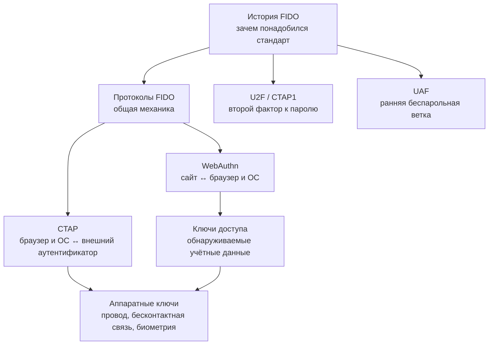

# 🗂 FIDO и аппаратные ключи: обзор раздела

![[fido-security-keys-header.png]]

> [!info] О чём раздел
> Здесь собраны заметки об аппаратных ключах безопасности и связанных способах входа без передачи пароля. Новые заметки по этой теме добавляются в эту папку и получают ссылку в списке ниже.

## С какой проблемы всё начинается

Пароль можно сообщить другому человеку, ввести на поддельной странице или повторно использовать на нескольких сайтах. Аппаратный ключ и встроенная защита телефона работают с другим доказательством: устройство подписывает запрос закрытым ключом, а сервер проверяет подпись открытым. Закрытый ключ при этом не отправляется сайту.

Вокруг этого принципа появился отраслевой альянс и семейство открытых стандартов FIDO (Fast IDentity Online, «быстрая идентификация в сети»). Первые решения пошли двумя путями. Физический брелок усиливал пароль вторым шагом; этот вариант назвали U2F (Universal 2nd Factor, «универсальный второй фактор»). Мобильное приложение могло заменить пароль локальной проверкой владельца; эту ветку назвали UAF (Universal Authentication Framework, «универсальная платформа аутентификации»).

Современный вариант пришлось разделить на два участка, потому что сайт не должен напрямую управлять конкретным ключом. Страница просит браузер начать регистрацию или вход, браузер вместе с операционной системой выбирает устройство, а сервер получает единый проверяемый ответ. Набор функций страницы для первого участка называется WebAuthn. Команды между браузером или операционной системой и внешним устройством передаёт протокол CTAP. Вместе они образуют FIDO2.

Когда устройство способно само найти подходящую учётную запись по сайту, человек выбирает аккаунт в системном окне и подтверждает вход локальным кодом или биометрией. Такой пользовательский сценарий называют ключом доступа (passkey). Ключ доступа может синхронизироваться между устройствами или оставаться внутри одного физического ключа; эти варианты дают разное удобство восстановления и разную модель доверия.

Поэтому раздел лучше читать не как словарь сокращений, а как один путь: сначала причина появления FIDO, затем движение запроса от сайта к устройству, после него детали двух протоколов и только потом выбор между синхронизацией и отдельным железом.

## Карта раздела

FIDO удобнее разбирать слоями. История отвечает, откуда появились стандарты. Общий обзор протоколов показывает участников и криптографию. WebAuthn и CTAP делят путь от сайта до аутентификатора, а passkeys и аппаратные ключи описывают два способа хранить учётные данные на стороне пользователя.

Если нужен быстрый практический маршрут, начните с [[FIDO/fido-protocols|общей механики]], затем переходите к [[FIDO/passkeys|passkeys]] или [[FIDO/hardware-security-keys|аппаратным ключам]]. Для технического маршрута после общего обзора читайте [[FIDO/webauthn|WebAuthn]], затем [[FIDO/ctap|CTAP]]. [[FIDO/u2f|U2F]] и [[FIDO/uaf|UAF]] объясняют, из каких ранних решений вырос FIDO2.

## Заметки раздела

- [[FIDO/fido-history|Что такое FIDO: альянс, стандарты и их история]] — зачем создали FIDO Alliance, принципы и хронология от U2F до passkeys.
- [[FIDO/fido-protocols|Протоколы FIDO: U2F, FIDO2, WebAuthn, CTAP и passkeys]] — одноразовый запрос и подписанный ответ, привязка к сайту, обнаруживаемые учётные данные и способы их хранения.
- [[FIDO/u2f|U2F (Universal 2nd Factor)]] — первый стандарт семейства подробно: история версий, регистрация и вход по шагам, идентификатор ключа, плюсы и минусы.
- [[FIDO/uaf|UAF: беспарольная ветка FIDO 1.0]] — как была устроена, где применялась, почему проиграла и что унаследовал FIDO2.
- [[FIDO/webauthn|WebAuthn: браузерный интерфейс аутентификации FIDO2]] — регистрация и вход, привязка ключа к сервису, автозаполнение и версии стандарта.
- [[FIDO/ctap|CTAP: как браузер разговаривает с аппаратным ключом]] — версии от CTAP1 до CTAP 2.3, способы подключения, PIN и защита от перебора.
- [[FIDO/passkeys|Passkeys («ключи доступа»)]] — синхронизируемые и привязанные к одному устройству варианты, хранилища Apple/Google, вход по QR-коду, плюсы и минусы.
- [[FIDO/hardware-security-keys|Физические ключи безопасности: YubiKey, открытые ключи и другие типы]] — железо: линейки YubiKey, открытые ключи (Nitrokey, SoloKeys, OpenSK), другие производители и чек-лист выбора.

## 📚 См. также

- [[Cybersecurity|Кибербезопасность]] — общая подборка материалов по кибербезопасности
- [[SMS]] — почему SMS — слабый канал для кодов и восстановления доступа

---

> [!quote] 🤖 Эти статьи открыты — можно обучать на них ИИ
> При желании вы можете натренировать ИИ на наших статьях. Исходное форматирование и скачивание всего репозитория одним zip-архивом доступны в Forgejo: [исходник этой заметки](https://git.zapret.moe/zapretdiscordyoutube/todo/src/branch/main/FIDO/00-overview.md) · [весь репозиторий](https://git.zapret.moe/zapretdiscordyoutube/todo/src/branch/main).
