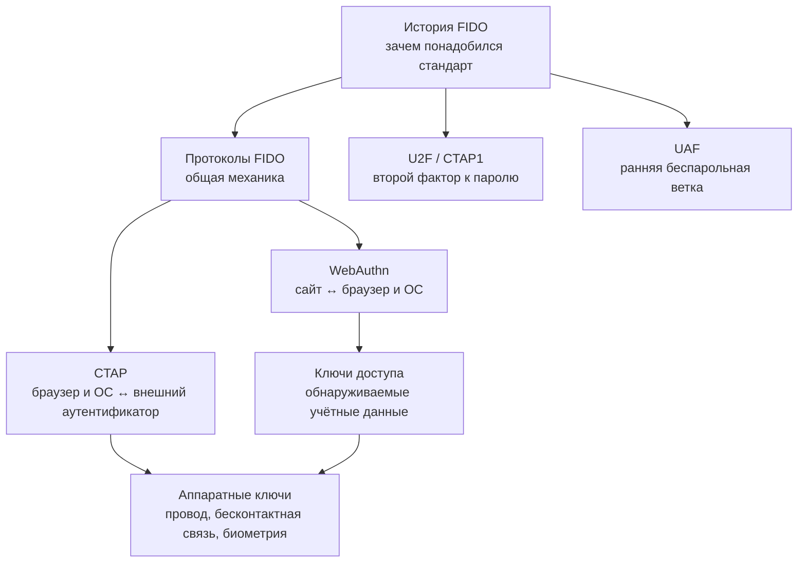

# 🗂 FIDO и аппаратные ключи: обзор раздела

![[fido-security-keys-header.png]]

> [!info] О чём раздел
> Здесь собраны заметки об аппаратных ключах безопасности и связанных способах входа без передачи пароля. Новые заметки по этой теме добавляются в эту папку и получают ссылку в списке ниже.

Перед чтением списка полезно различать уровни системы. Сайт проверяет криптографическую подпись устройства: в старом U2F она дополняет пароль вторым фактором, а в современных беспарольных сценариях заменяет пароль при обычном входе.

Такую систему и её отраслевой альянс называют FIDO (Fast IDentity Online, «быстрая идентификация в сети»), а современную ветку для веб-сайтов и приложений — FIDO2.

В веб-части браузер передаёт запрос от страницы к операционной системе и возвращает серверу результат проверки. Для внешнего ключа безопасности нужен отдельный обмен командами между браузером или операционной системой и самим устройством.

Программный интерфейс браузера, то есть набор доступных странице функций, называется API. Интерфейс регистрации и входа WebAuthn работает между сайтом и браузером, а протокол CTAP — между браузером или операционной системой и внешним устройством. Поэтому эти названия описывают разные участки одного пути.

Современный беспарольный сценарий позволяет войти без ручного ввода пароля. Такие учётные данные могут синхронизироваться между устройствами или оставаться только на одном ключе.

Пользовательское название этого способа — passkey, или «ключ доступа». Слово «обнаруживаемые» в выражении discoverable credentials означает, что устройство само находит подходящую запись по сайту, даже если сайт заранее не передал её идентификатор.

В раннем варианте ключ добавлял второй шаг после пароля, а другая ранняя ветка предназначалась для беспарольного входа в мобильных приложениях.

Первый вариант называется U2F (Universal 2nd Factor, «универсальный второй фактор»), второй — UAF (Universal Authentication Framework, «универсальная платформа аутентификации»). В составе FIDO2 старый протокол U2F получил имя CTAP1. В списке также встречаются названия производителей и проектов: YubiKey, Nitrokey, SoloKeys и OpenSK.

Локальный цифровой код для разблокировки устройства называют PIN. Для входа телефоном на другом компьютере может использоваться QR-код — квадратное машиночитаемое изображение с одноразовыми параметрами связи.

## Карта раздела

FIDO удобнее разбирать слоями. История отвечает, откуда появились стандарты. Общий обзор протоколов показывает участников и криптографию. WebAuthn и CTAP делят путь от сайта до аутентификатора, а passkeys и аппаратные ключи описывают два способа хранить учётные данные на стороне пользователя.

Если нужен быстрый практический маршрут, начните с [[FIDO/fido-protocols|общей механики]], затем переходите к [[FIDO/passkeys|passkeys]] или [[FIDO/hardware-security-keys|аппаратным ключам]]. Для технического маршрута после общего обзора читайте [[FIDO/webauthn|WebAuthn]], затем [[FIDO/ctap|CTAP]]. [[FIDO/u2f|U2F]] и [[FIDO/uaf|UAF]] объясняют, из каких ранних решений вырос FIDO2.

## Заметки раздела

- [[FIDO/fido-history|Что такое FIDO: альянс, стандарты и их история]] — зачем создали FIDO Alliance, принципы и хронология от U2F до passkeys.
- [[FIDO/fido-protocols|Протоколы FIDO: U2F, FIDO2, WebAuthn, CTAP и passkeys]] — одноразовый запрос и подписанный ответ, привязка к сайту, обнаруживаемые учётные данные и способы их хранения.
- [[FIDO/u2f|U2F (Universal 2nd Factor)]] — первый стандарт семейства подробно: история версий, регистрация и вход по шагам, идентификатор ключа, плюсы и минусы.
- [[FIDO/uaf|UAF: беспарольная ветка FIDO 1.0]] — как была устроена, где применялась, почему проиграла и что унаследовал FIDO2.
- [[FIDO/webauthn|WebAuthn: браузерный интерфейс аутентификации FIDO2]] — регистрация и вход, привязка ключа к сервису, автозаполнение и версии стандарта.
- [[FIDO/ctap|CTAP: как браузер разговаривает с аппаратным ключом]] — версии от CTAP1 до CTAP 2.3, способы подключения, PIN и защита от перебора.
- [[FIDO/passkeys|Passkeys («ключи доступа»)]] — синхронизируемые и привязанные к одному устройству варианты, хранилища Apple/Google, вход по QR-коду, плюсы и минусы.
- [[FIDO/hardware-security-keys|Физические ключи безопасности: YubiKey, открытые ключи и другие типы]] — железо: линейки YubiKey, открытые ключи (Nitrokey, SoloKeys, OpenSK), другие производители и чек-лист выбора.

## 📚 См. также

- [[Cybersecurity|Кибербезопасность]] — общая подборка материалов по кибербезопасности
- [[SMS]] — почему SMS — слабый канал для кодов и восстановления доступа

---

> [!quote] 🤖 Эти статьи открыты — можно обучать на них ИИ
> При желании вы можете натренировать ИИ на наших статьях. Исходное форматирование и скачивание всего репозитория одним zip-архивом доступны в Forgejo: [исходник этой заметки](https://git.zapret.moe/zapretdiscordyoutube/todo/src/branch/main/FIDO/00-overview.md) · [весь репозиторий](https://git.zapret.moe/zapretdiscordyoutube/todo/src/branch/main).
