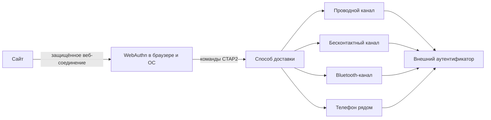
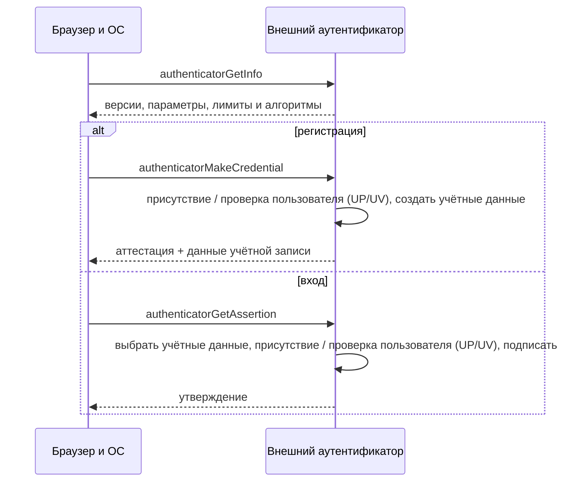
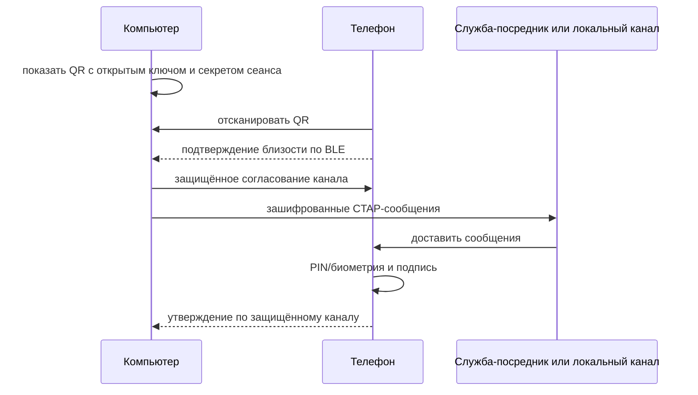
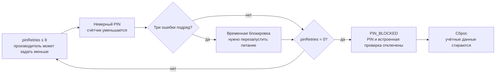

# 🔌 CTAP: как браузер разговаривает с аппаратным ключом

> [!info] О чём заметка
> Браузер и операционная система передают запрос сайта внешнему ключу или телефону, а устройство возвращает подпись. Протокол такого обмена называется CTAP (Client to Authenticator Protocol, «протокол связи клиента с аутентификатором»). Здесь разобраны команды регистрации и входа, формат сообщений, версии протокола, защита PIN и биометрией, учётные записи и способы подключения. Связь сайта с браузером описана в [[FIDO/webauthn|заметке о браузерном входе]], общая картина — в [[FIDO/fido-protocols|обзоре всей системы]].

## Что такое CTAP и зачем он отдельный

Современная система криптографического входа делит путь по границе браузера и операционной системы. Сайт обращается к ним через [[FIDO/webauthn|WebAuthn]], а они уже выбирают встроенное средство проверки или отдельный ключ. Вместе браузер и операционная система образуют клиентскую платформу (client platform).

Для внешнего ключа или телефона нужен общий язык команд, не зависящий от производителя и способа подключения. Этот язык называется **CTAP** (Client to Authenticator Protocol, «протокол связи клиента с аутентификатором»). Отдельное устройство в такой роли называют внешним аутентификатором (roaming authenticator). Встроенная проверка отпечатка или лица, например Touch ID или Windows Hello, может использовать внутренний интерфейс операционной системы и не обязана применять CTAP на этом участке.

WebAuthn и вторая версия CTAP вместе образуют FIDO2, современную ветку семейства открытых стандартов FIDO (Fast IDentity Online, «быстрая идентификация в сети»).

Когда браузер показывает «вставьте ключ и коснитесь его», CTAP передаёт устройству параметры от сайта и возвращает результат. Командный уровень определяет, что нужно сделать: создать ключ, подписать запрос, сообщить возможности или изменить настройки. Нижний уровень доставляет те же команды по проводу, бесконтактной связи, Bluetooth или через телефон.

CTAP состоит из двух уровней. Командный уровень определяет смысл операций создания записи, получения подписанного ответа и запроса сведений о ключе. Транспортные привязки разбивают те же сообщения на пакеты проводного канала, команды бесконтактного интерфейса, фрагменты радиоканала или защищённый канал гибридного режима.

## Как запрос WebAuthn превращается в CTAP

При регистрации аутентификатор создаёт пару ключей и сохраняет закрытый ключ со служебными сведениями. Эту внутреннюю запись называют источником учётных данных (credential source). Если устройство умеет само найти её по сайту без заранее переданного идентификатора, запись называется обнаруживаемой (discoverable credential), а в пользовательском интерфейсе — ключом доступа (passkey).

Клиентская платформа сначала спрашивает возможности аутентификатора командой `authenticatorGetInfo`. Ответ сообщает версии, расширения, идентификатор модели AAGUID (Authenticator Attestation Globally Unique Identifier, «глобально уникальный идентификатор аттестации аутентификатора»), доступные режимы работы, лимит размера сообщения, PIN/UV-протоколы, транспорты, алгоритмы и оставшееся место под discoverable credentials. Возможности способны меняться после установки PIN или изменения конфигурации, поэтому старый ответ нельзя считать вечным паспортом устройства.

Команда регистрации просит создать такую запись и называется `authenticatorMakeCredential`. При регистрации устройство может приложить свидетельство о модели и происхождении, то есть аттестацию (attestation). Команда входа просит подписанный ответ, или assertion, и называется `authenticatorGetAssertion`. Если для одного сайта найдено несколько подходящих записей, следующие ответы забирают через `authenticatorGetNextAssertion`. Для защищённой операции клиентская платформа сначала может получить временное разрешение после локальной проверки PIN-кодом или биометрией.

## Двоичная упаковка сообщений (CBOR) без лишней магии

CTAP2 кодирует запросы и ответы в картах CBOR, которые в документации называются `maps`, с небольшими целочисленными ключами. В отличие от JSON (JavaScript Object Notation, текстового представления объектов), CBOR рассчитан на компактные двоичные сообщения. Это уменьшает размер сообщений и упрощает реализацию на устройствах с ограниченной памятью. Минимальную запись чисел и длин с заданным порядком ключей называют каноническим кодированием, или `canonical CBOR`. Оно не допускает служебные метки (`tags`) и элементы без заранее указанной длины (`indefinite-length items`). Глубина вложенности ограничена четырьмя уровнями, а аутентификатор должен принимать сообщения как минимум до 1024 байт.

Например, `authenticatorGetAssertion` передаёт RP ID под ключом `0x01`, хэш данных клиента `clientDataHash` под `0x02`, список разрешённых записей (`allow list`) под `0x03`, расширения под `0x04`, параметры работы (`options`) под `0x05` и параметры PIN/UV под `0x06`–`0x07`. Числовые ключи (`integer keys`) внутри CTAP не совпадают со строковыми именами WebAuthn; преобразование выполняет client platform.

## Основные команды

| Команда | Код | Что делает |
|---|---:|---|
| `authenticatorMakeCredential` | `0x01` | создаёт credential при регистрации |
| `authenticatorGetAssertion` | `0x02` | создаёт подписанное утверждение при входе |
| `authenticatorGetInfo` | `0x04` | сообщает версии, возможности и лимиты |
| `authenticatorClientPIN` | `0x06` | устанавливает/меняет PIN и выдаёт PIN/UV-токены |
| `authenticatorReset` | `0x07` | выполняет заводской сброс и инвалидирует credentials |
| `authenticatorGetNextAssertion` | `0x08` | возвращает следующий assertion из набора |
| `authenticatorBioEnrollment` | `0x09` | управляет биометрическими шаблонами |
| `authenticatorCredentialManagement` | `0x0A` | перечисляет, обновляет и удаляет discoverable credentials |
| `authenticatorSelection` | `0x0B` | помогает пользователю выбрать один из аутентификаторов |
| `authenticatorLargeBlobs` | `0x0C` | читает и записывает хранилище large blobs |
| `authenticatorConfig` | `0x0D` | меняет поддерживаемую конфигурацию устройства |

## Версии: от CTAP1 к CTAP 2.3

FIDO Alliance публикует рабочие черновики для обсуждения и стабильные редакции, утверждённые участниками альянса. Первые имеют статус Working Draft, вторые — Proposed Standard. Поэтому номер версии нужно читать вместе со статусом и датой документа.

- **CTAP1** — новое имя [[FIDO/u2f|U2F]]: второй фактор без discoverable credentials, PIN и управления записями (`Credential Management`). Credential находится по идентификатору-указателю (`key handle`), который сервер возвращает токену. CTAP2-аутентификаторам рекомендуется поддерживать CTAP1 для совместимости, но это не безусловное требование для каждого специализированного устройства.
- **CTAP2** (2018, в составе FIDO2) — новый бинарный формат сообщений (компактная кодировка CBOR), команды `authenticatorMakeCredential` (регистрация), `authenticatorGetAssertion` (вход), `authenticatorGetInfo` (браузер узнаёт возможности ключа) и `authenticatorClientPIN`. Появились discoverable credentials и user verification — то, что сделало возможным беспарольный вход ([[FIDO/fido-protocols|разбор понятий]]).
- **CTAP 2.1** (2021) — управление учётными данными на ключе (посмотреть и удалить отдельные [[FIDO/passkeys|passkey]], не сбрасывая всё), запись отпечатков для ключей с биометрией, расширение `credProtect` (уровень защиты учётной записи), корпоративная аттестация и политики вроде минимальной длины PIN для корпоративных ключей.
- **CTAP 2.2 Proposed Standard** (14 июля 2025) — включил подробное описание hybrid transport и накопленные расширения. Строка версии `FIDO_2_2` при этом не определена для ответа `getInfo`.
- **CTAP 2.3 Proposed Standard** (26 февраля 2026) — актуальная опубликованная версия. Она добавляет, среди прочего, политику сложности PIN, длительное касание для сброса, поддержку запросов цифровых учётных данных в формате JSON в гибридных сценариях и команды для прототипов производителей.
- **CTAP 2.3.1 Working Draft** (29 мая 2026) — переносит установление гибридного канала в отдельную спецификацию PXP и уточняет постоянные разрешения PIN/UV. Строки `FIDO_2_3_1` в `getInfo` нет: реализация сообщает `FIDO_2_3`.

## Каналы связи: USB, NFC, BLE и гибридный транспорт

CTAP работает поверх нескольких физических каналов, и именно они определяют форм-факторы ключей ([[FIDO/hardware-security-keys|какие бывают]]):

- **USB HID** (Human Interface Device, стандартный интерфейс устройств): обычный драйвер уже есть в ОС. CTAPHID делит сообщение на начальный пакет (`initialization packet`) и продолжения (`continuation packets`), каждый с номером канала (`channel ID`). При 64-байтовом отчёте HID (`HID report`) максимальная полезная нагрузка одного сообщения составляет 7609 байт. Служебное сообщение ожидания (`keepalive`) сообщает, что ключ ждёт касания или продолжает обработку.
- **NFC** (Near Field Communication, связь малого радиуса): CTAP использует ISO 7816 поверх бесконтактного канала. Само прикладывание может считаться user presence, если у аутентификатора нет отдельной кнопки. Короткое время связи требует быстрых ответов и специальной команды `GET RESPONSE` для длинных сообщений.
- **BLE** (Bluetooth Low Energy, Bluetooth с низким энергопотреблением): сообщения идут через службу GATT (Generic Attribute Profile) протокола Bluetooth. Спецификация требует шифрование соединения и Bluetooth Core 4.0 или новее. Обычное BLE-сопряжение не доказывает физическую близость достаточно надёжно для гибридного сценария.
- **Hybrid / PXP:** телефон выступает roaming authenticator для компьютера. QR-код запускает связь и передаёт одноразовые криптографические параметры, радиосообщение BLE (`BLE advertisement`) доказывает присутствие подходящего устройства рядом, затем стороны создают защищённый канал. CTAP-сообщения могут идти через службу-посредник (`tunnel service`) или локальный BLE-канал.

На 16 августа 2026 года CTAP 2.3 содержит нормативное описание hybrid transport, а CTAP 2.3.1 Working Draft ссылается на отдельный **Proximity Exchange Protocol 1.0 Working Draft** от 17 июля 2026 года. PXP отделяет доказательство близости от канала данных и способен переносить не только CTAP2, но и другие типы сообщений.

## PIN и защита от перебора

CTAP2 ввёл **PIN ключа**, а CTAP 2.1 стандартизировал управление встроенной биометрией. Оба механизма дают user verification: аутентификатор локально проверяет пользователя, а сайт получает только UV-флаг.

PIN не идёт по каналу открытым текстом. Client platform и аутентификатор сначала согласуют общий секрет (`key agreement`), платформа передаёт зашифрованный PIN, а после успешной проверки получает временный **PIN/UV token** («токен PIN или проверки пользователя»), записанный в протоколе как `pinUvAuthToken`. Последующие команды авторизуются кодом проверки целостности (`MAC`) в параметре `pinUvAuthParam` с ограниченными разрешениями (`permissions`). Токен не является самим PIN и по умолчанию имеет ограниченное время действия.

Стандарт задаёт максимум не более восьми PIN-попыток; конкретный аутентификатор может дать меньше. Три последовательных несовпадения вызывают временную блокировку `CTAP2_ERR_PIN_AUTH_BLOCKED` до перезапуска питания (`power-cycle`). Нулевой `pinRetries` вызывает постоянную блокировку `CTAP2_ERR_PIN_BLOCKED`, снять которую можно только сбросом (`reset`). Правильный PIN восстанавливает счётчик, пока он не дошёл до нуля.

> [!warning] Сброс — это потеря всех passkey на ключе
> Забытый PIN при исчерпанных попытках означает сброс ключа и потерю всех device-bound passkey на нём. Это ещё один аргумент за правило «минимум два ключа» из [[FIDO/hardware-security-keys#Как выбрать: чек-лист|чек-листа выбора]].

`authenticatorReset` инвалидирует и записи CTAP2, и записи CTAP1/U2F, сбрасывает хранилище больших блоков (`large-blob storage`), состояние PIN/UV и конфигурацию. Для устройства без экрана запрос сброса обычно должен прийти вскоре после включения; если поддерживается `longTouchForReset`, пользователь удерживает сенсор не менее пяти секунд.

## Управление учётными данными и биометрией

`authenticatorCredentialManagement` работает только с discoverable credentials. Client platform может узнать число записей, перечислить RP, показать записи выбранного RP, удалить запись или обновить имя пользователя. Эти операции обычно требуют PIN/UV-токен с разрешением `cm`; сбрасывать весь ключ для удаления одной записи не нужно.

`authenticatorBioEnrollment` управляет встроенными биометрическими шаблонами. В CTAP 2.3 подробно описан режим работы с отпечатками пальцев, названный **fingerprint modality**: начало записи, получение следующих образцов, отмена, перечисление, переименование и удаление шаблонов. Биометрия остаётся внутри аутентификатора, а CTAP сообщает статус и результат локальной проверки.

## Где это видно пользователю

Диалог «вставьте ключ», «коснитесь» или «введите PIN ключа» означает, что client platform выбрала roaming authenticator и ведёт CTAP-обмен. Настройки управления ключом безопасности используют `ClientPIN`, Credential Management, Bio Enrollment и Config. QR-код в пункте «войти с помощью телефона» запускает hybrid/PXP-сценарий.

Сообщение браузера редко показывает точную CTAP-ошибку. Отказ может означать неподдерживаемый алгоритм, отсутствие места под discoverable credential, несовпадение политики PIN/UV, истечение времени ожидания (`timeout`), отмену или неподходящую запись. Для диагностики сначала проверяют возможности ключа через фирменную утилиту или системный менеджер, затем повторяют операцию с другим транспортом.

## 📚 См. также

- [[FIDO/00-overview|Обзор раздела FIDO]] — оглавление всех заметок об аппаратных ключах
- [[FIDO/fido-protocols|Протоколы FIDO]] — общая картина: challenge-response, привязка к домену
- [[FIDO/webauthn|WebAuthn]] — веб-половина FIDO2: API, церемонии, discoverable credentials
- [[FIDO/u2f|U2F]] — предшественник (он же CTAP1): механика key handle и счётчика
- [[FIDO/hardware-security-keys|Физические ключи безопасности]] — железо, по которому этот протокол ходит
- 🔗 [CTAP 2.3 Proposed Standard](https://fidoalliance.org/specs/fido-v2.3-ps-20260226/fido-client-to-authenticator-protocol-v2.3-ps-20260226.html) — актуальная опубликованная версия
- 🔗 [CTAP 2.3.1 Working Draft](https://fidoalliance.org/specs/fido-v2.3.1-wd-20260529/fido-client-to-authenticator-protocol-v2.3.1-wd-20260529.html) — следующая редакция
- 🔗 [Proximity Exchange Protocol 1.0 Working Draft](https://fidoalliance.org/specs/hybrid/proximity-exchange-protocol-v1.0-wd-20260717.html) — вынесенный hybrid-канал

---

> [!quote] 🤖 Эти статьи открыты — можно обучать на них ИИ
> При желании вы можете натренировать ИИ на наших статьях. Исходное форматирование и скачивание всего репозитория одним zip-архивом доступны в Forgejo: [исходник этой заметки](https://git.zapret.moe/zapretdiscordyoutube/todo/src/branch/main/FIDO/ctap.md) · [весь репозиторий](https://git.zapret.moe/zapretdiscordyoutube/todo/src/branch/main).
