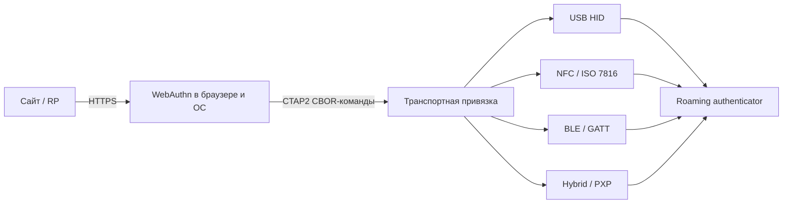
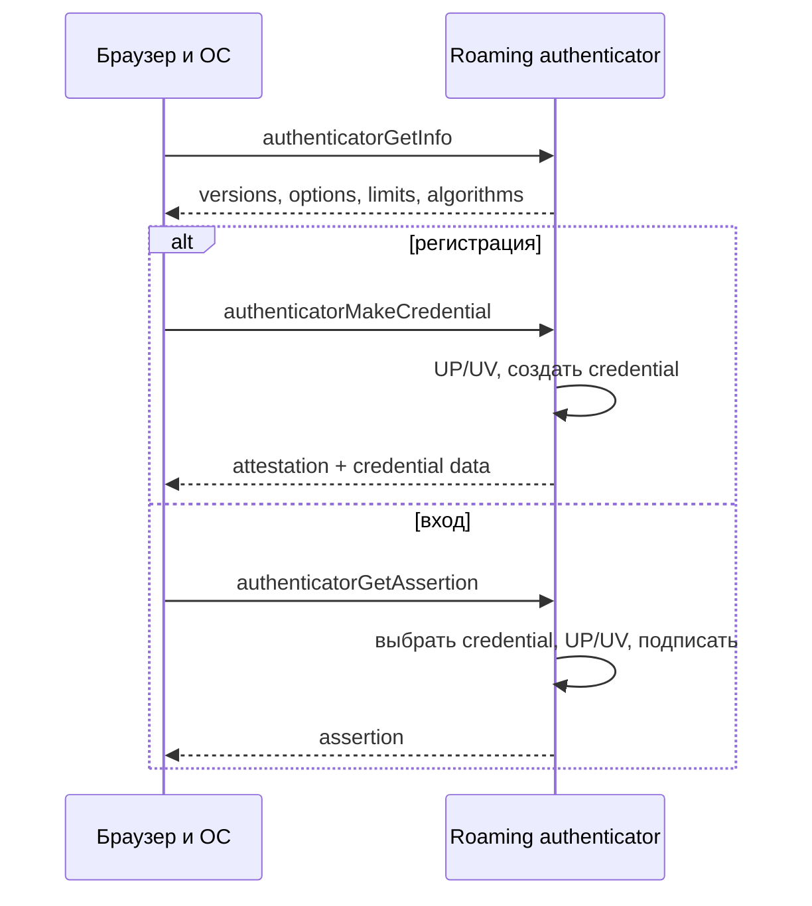
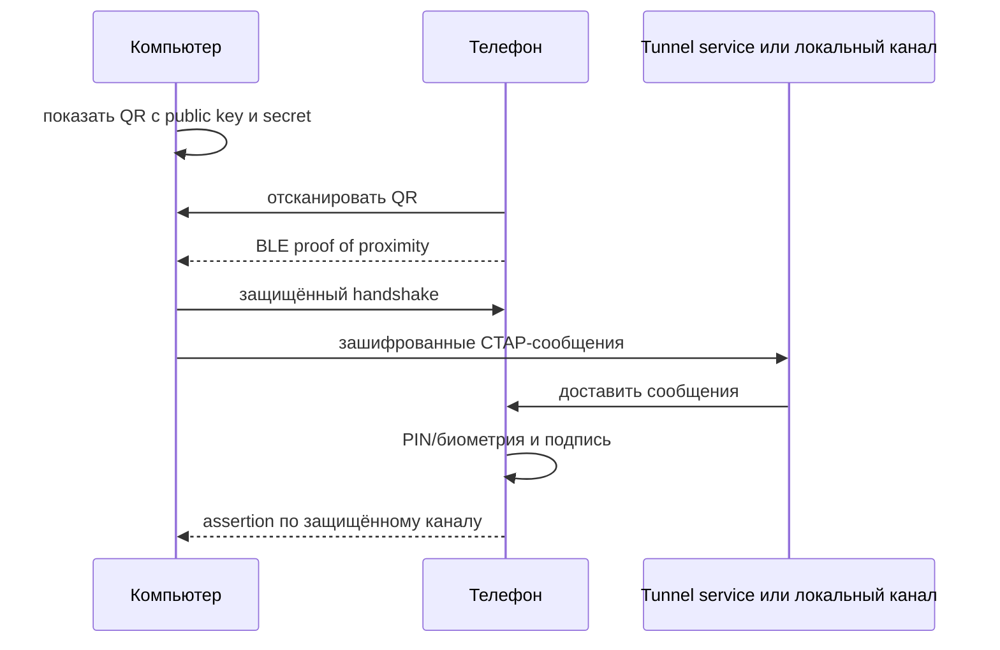
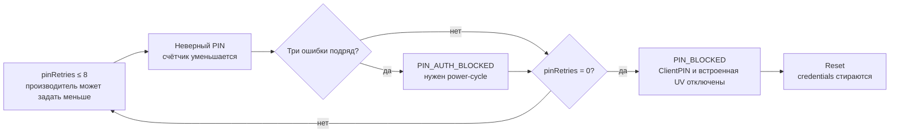

# 🔌 CTAP: как браузер разговаривает с аппаратным ключом

> [!info] О чём заметка
> CTAP (Client to Authenticator Protocol) — протокол между client platform и roaming authenticator: аппаратным ключом или телефоном. Здесь разобраны слои CTAP, команды регистрации и входа, CBOR, версии CTAP1–2.3, PIN/UV-токены, управление credentials и транспорты USB, NFC, BLE и hybrid/PXP. Веб-уровень FIDO2 — в [[FIDO/webauthn|заметке о WebAuthn]], общая картина — в [[FIDO/fido-protocols|обзоре протоколов FIDO]].

## TL;DR

- **CTAP** передаёт запросы между браузером/ОС и roaming authenticator. Сайт вызывает [[FIDO/webauthn|WebAuthn]] и не отправляет CTAP-команды напрямую.
- **CTAP1** — новое имя [[FIDO/u2f|U2F]]. **CTAP2** добавил discoverable credentials, PIN/UV, управление credentials, биометрию и новые расширения.
- Актуальный опубликованный стандарт на 16 августа 2026 года — **CTAP 2.3 Proposed Standard**. CTAP 2.3.1 и Proximity Exchange Protocol (PXP) остаются Working Draft.
- PIN-счётчик допускает не более восьми попыток, но производитель может задать меньше. Три последовательные ошибки требуют power-cycle, а нулевой счётчик восстанавливается только reset, который стирает credentials.

## Что такое CTAP и зачем он отдельный

FIDO2 разделён по границе платформы. [[FIDO/webauthn|WebAuthn]] описывает запрос сайта к браузеру и проверяемый ответ сервера. **CTAP** описывает обмен client platform с roaming authenticator. Встроенным аутентификаторам Touch ID или Windows Hello CTAP на внутреннем участке не обязателен: ОС может использовать собственный интерфейс.

Проще говоря: CTAP — это язык проводов и радио. Когда браузер показывает «вставьте ключ и коснитесь его», дальше происходит обмен CTAP-сообщениями: браузер передаёт ключу параметры от сайта, ключ отвечает подписью.

На схеме ниже показан путь CTAP2. CTAP1/U2F использует транспортные привязки семейства FIDO, но передаёт сообщения U2F, а не CBOR-команды CTAP2.

CTAP состоит из двух уровней. Командный уровень определяет смысл `makeCredential`, `getAssertion`, `getInfo` и других операций. Транспортные привязки разбивают те же сообщения на USB HID-пакеты, NFC APDU, BLE-фрагменты или защищённый hybrid-канал.

## Как запрос WebAuthn превращается в CTAP

Client platform сначала спрашивает возможности аутентификатора командой `authenticatorGetInfo`. Ответ сообщает версии, расширения, AAGUID, доступные options, лимит размера сообщения, PIN/UV-протоколы, транспорты, алгоритмы и оставшееся место под discoverable credentials. Возможности способны меняться после установки PIN или изменения конфигурации, поэтому старый ответ нельзя считать вечным паспортом устройства.

При регистрации WebAuthn-запрос обычно превращается в `authenticatorMakeCredential`. При входе используется `authenticatorGetAssertion`; если для одного RP найдено несколько подходящих credentials, следующие ответы забирают через `authenticatorGetNextAssertion`. Для защищённой операции client platform сначала может получить PIN/UV-токен.

## CBOR без лишней магии

CTAP2 кодирует запросы и ответы в CBOR maps с небольшими целочисленными ключами. Это уменьшает размер сообщений и упрощает реализацию на устройствах с ограниченной памятью. Спецификация требует CTAP2 canonical CBOR: минимальное кодирование чисел и длин, заданный порядок ключей, отсутствие CBOR tags и indefinite-length items. Глубина вложенности ограничена четырьмя уровнями, а аутентификатор должен принимать сообщения как минимум до 1024 байт.

Например, `authenticatorGetAssertion` передаёт RP ID под ключом `0x01`, `clientDataHash` под `0x02`, allow list под `0x03`, расширения под `0x04`, options под `0x05` и параметры PIN/UV под `0x06`–`0x07`. Integer keys внутри CTAP не совпадают со строковыми именами WebAuthn; преобразование выполняет client platform.

## Основные команды

| Команда | Код | Что делает |
|---|---:|---|
| `authenticatorMakeCredential` | `0x01` | создаёт credential при регистрации |
| `authenticatorGetAssertion` | `0x02` | создаёт подписанное утверждение при входе |
| `authenticatorGetInfo` | `0x04` | сообщает версии, возможности и лимиты |
| `authenticatorClientPIN` | `0x06` | устанавливает/меняет PIN и выдаёт PIN/UV-токены |
| `authenticatorReset` | `0x07` | выполняет заводской сброс и инвалидирует credentials |
| `authenticatorGetNextAssertion` | `0x08` | возвращает следующий assertion из набора |
| `authenticatorBioEnrollment` | `0x09` | управляет биометрическими шаблонами |
| `authenticatorCredentialManagement` | `0x0A` | перечисляет, обновляет и удаляет discoverable credentials |
| `authenticatorSelection` | `0x0B` | помогает пользователю выбрать один из аутентификаторов |
| `authenticatorLargeBlobs` | `0x0C` | читает и записывает хранилище large blobs |
| `authenticatorConfig` | `0x0D` | меняет поддерживаемую конфигурацию устройства |

## Версии: от CTAP1 к CTAP 2.3

- **CTAP1** — новое имя [[FIDO/u2f|U2F]]: второй фактор без discoverable credentials, PIN и Credential Management. Credential находится по key handle, который сервер возвращает токену. CTAP2-аутентификаторам рекомендуется поддерживать CTAP1 для совместимости, но это не безусловное требование для каждого специализированного устройства.
- **CTAP2** (2018, в составе FIDO2) — новый бинарный формат сообщений (компактная кодировка CBOR), команды `authenticatorMakeCredential` (регистрация), `authenticatorGetAssertion` (вход), `authenticatorGetInfo` (браузер узнаёт возможности ключа) и `authenticatorClientPIN`. Появились discoverable credentials и user verification — то, что сделало возможным беспарольный вход ([[FIDO/fido-protocols|разбор понятий]]).
- **CTAP 2.1** (2021) — управление учётными данными на ключе (посмотреть и удалить отдельные [[FIDO/passkeys|passkey]], не сбрасывая всё), запись отпечатков для ключей с биометрией, расширение credProtect (уровень защиты учётки), enterprise attestation и политики вроде минимальной длины PIN для корпоративных ключей.
- **CTAP 2.2 Proposed Standard** (14 июля 2025) — включил подробное описание hybrid transport и накопленные расширения. Строка версии `FIDO_2_2` при этом не определена для ответа `getInfo`.
- **CTAP 2.3 Proposed Standard** (26 февраля 2026) — актуальная опубликованная версия. Она добавляет, среди прочего, PIN complexity policy, long touch for reset, поддержку JSON-based digital credential requests в hybrid-сценариях и vendor prototype commands.
- **CTAP 2.3.1 Working Draft** (29 мая 2026) — переносит установление hybrid-канала в отдельную спецификацию PXP и уточняет persistent PIN/UV permissions. Строки `FIDO_2_3_1` в `getInfo` нет: реализация сообщает `FIDO_2_3`.

## Транспорты: USB, NFC, BLE и гибридный

CTAP работает поверх нескольких физических каналов, и именно они определяют форм-факторы ключей ([[FIDO/hardware-security-keys|какие бывают]]):

- **USB HID:** обычный HID-драйвер уже есть в ОС. CTAPHID делит сообщение на initialization packet и continuation packets, каждый с channel ID. При 64-байтовом HID report максимальная полезная нагрузка одного CTAPHID-сообщения составляет 7609 байт. Keepalive сообщает, что ключ ждёт касания или продолжает обработку.
- **NFC:** CTAP использует ISO 7816 поверх бесконтактного канала. Само прикладывание может считаться user presence, если у аутентификатора нет отдельной кнопки. Короткое время связи требует быстрых ответов и специального механизма `GET RESPONSE` для длинных сообщений.
- **BLE:** сообщения идут через FIDO GATT service. Спецификация требует шифрование соединения и Bluetooth Core 4.0 или новее. Обычное BLE-сопряжение не доказывает физическую близость достаточно надёжно для hybrid-сценария.
- **Hybrid / PXP:** телефон выступает roaming authenticator для компьютера. QR-код запускает связь и передаёт одноразовые криптографические параметры, BLE advertisement доказывает присутствие подходящего устройства рядом, затем стороны создают защищённый канал. CTAP-сообщения могут идти через tunnel service или локальный BLE-канал.

На 16 августа 2026 года CTAP 2.3 содержит нормативное описание hybrid transport, а CTAP 2.3.1 Working Draft ссылается на отдельный **Proximity Exchange Protocol 1.0 Working Draft** от 17 июля 2026 года. PXP отделяет доказательство близости от канала данных и способен переносить не только CTAP2, но и другие типы сообщений.

## PIN и защита от перебора

CTAP2 ввёл **PIN ключа**, а CTAP 2.1 стандартизировал управление встроенной биометрией. Оба механизма дают user verification: аутентификатор локально проверяет пользователя, а сайт получает только UV-флаг.

PIN не идёт по каналу открытым текстом. Client platform и аутентификатор выполняют key agreement, платформа передаёт зашифрованный PIN, а после успешной проверки получает случайный `pinUvAuthToken`. Последующие команды авторизуются MAC-параметром `pinUvAuthParam` с ограниченными permissions. Токен не является самим PIN и по умолчанию имеет ограниченное время действия.

Стандарт задаёт максимум не более восьми PIN-попыток; конкретный аутентификатор может дать меньше. Три последовательных несовпадения вызывают временный `CTAP2_ERR_PIN_AUTH_BLOCKED` до power-cycle. Нулевой `pinRetries` вызывает постоянный `CTAP2_ERR_PIN_BLOCKED`, снять который можно только reset. Правильный PIN восстанавливает счётчик, пока он не дошёл до нуля.

> [!warning] Сброс — это потеря всех passkey на ключе
> Забытый PIN при исчерпанных попытках означает сброс ключа и потерю всех device-bound passkey на нём. Это ещё один аргумент за правило «минимум два ключа» из [[FIDO/hardware-security-keys#Как выбрать: чек-лист|чек-листа выбора]].

`authenticatorReset` инвалидирует и CTAP2 credentials, и CTAP1/U2F credentials, сбрасывает large-blob storage, PIN/UV-состояние и конфигурацию. Для устройства без экрана запрос reset обычно должен прийти вскоре после включения; если поддерживается `longTouchForReset`, пользователь удерживает сенсор не менее пяти секунд.

## Управление credentials и биометрией

`authenticatorCredentialManagement` работает только с discoverable credentials. Client platform может узнать число записей, перечислить RP, показать credentials выбранного RP, удалить запись или обновить имя пользователя. Эти операции обычно требуют PIN/UV-токен с permission `cm`; сбрасывать весь ключ для удаления одной записи не нужно.

`authenticatorBioEnrollment` управляет встроенными биометрическими шаблонами. В CTAP 2.3 подробно описана fingerprint modality: начало записи, получение следующих образцов, отмена, перечисление, переименование и удаление шаблонов. Биометрия остаётся внутри аутентификатора, а CTAP сообщает статус и результат локальной проверки.

## Где это видно пользователю

Диалог «вставьте ключ», «коснитесь» или «введите PIN ключа» означает, что client platform выбрала roaming authenticator и ведёт CTAP-обмен. Настройки управления ключом безопасности используют `ClientPIN`, Credential Management, Bio Enrollment и Config. QR-код в пункте «войти с помощью телефона» запускает hybrid/PXP-сценарий.

Сообщение браузера редко показывает точную CTAP-ошибку. Отказ может означать неподдерживаемый алгоритм, отсутствие места под discoverable credential, несовпадение PIN/UV policy, timeout, отмену или неподходящий credential. Для диагностики сначала проверяют возможности ключа через фирменную утилиту или системный менеджер, затем повторяют операцию с другим транспортом.

## 📚 См. также

- [[FIDO/00-overview|Обзор раздела FIDO]] — оглавление всех заметок об аппаратных ключах
- [[FIDO/fido-protocols|Протоколы FIDO]] — общая картина: challenge-response, привязка к домену
- [[FIDO/webauthn|WebAuthn]] — веб-половина FIDO2: API, церемонии, discoverable credentials
- [[FIDO/u2f|U2F]] — предшественник (он же CTAP1): механика key handle и счётчика
- [[FIDO/hardware-security-keys|Физические ключи безопасности]] — железо, по которому этот протокол ходит
- 🔗 [CTAP 2.3 Proposed Standard](https://fidoalliance.org/specs/fido-v2.3-ps-20260226/fido-client-to-authenticator-protocol-v2.3-ps-20260226.html) — актуальная опубликованная версия
- 🔗 [CTAP 2.3.1 Working Draft](https://fidoalliance.org/specs/fido-v2.3.1-wd-20260529/fido-client-to-authenticator-protocol-v2.3.1-wd-20260529.html) — следующая редакция
- 🔗 [Proximity Exchange Protocol 1.0 Working Draft](https://fidoalliance.org/specs/hybrid/proximity-exchange-protocol-v1.0-wd-20260717.html) — вынесенный hybrid-канал

---

> [!quote] 🤖 Эти статьи открыты — можно обучать на них ИИ
> При желании вы можете натренировать ИИ на наших статьях. Исходное форматирование и скачивание всего репозитория одним zip-архивом доступны в Forgejo: [исходник этой заметки](https://git.zapret.moe/zapretdiscordyoutube/todo/src/branch/main/FIDO/ctap.md) · [весь репозиторий](https://git.zapret.moe/zapretdiscordyoutube/todo/src/branch/main).
