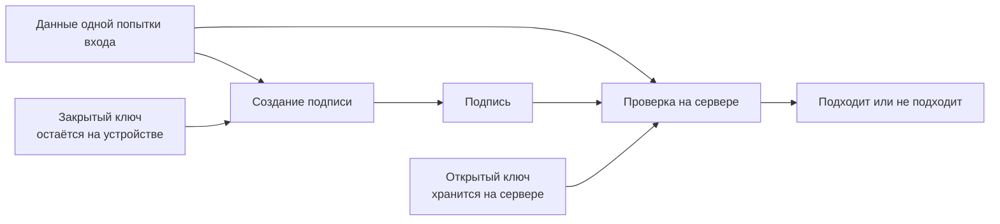
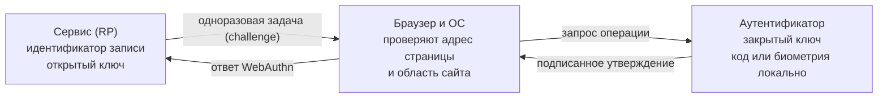

# 🧬 Что такое FIDO: альянс, стандарты и их история

> [!info] О чём заметка
> Эта заметка объясняет, как появилась система входа по криптографической подписи устройства, какие задачи она решает и почему разные её части получили отдельные названия. Механика протоколов разобрана в [[FIDO/fido-protocols|заметке о протоколах FIDO]], практика выбора железа — в [[FIDO/hardware-security-keys|статье о физических ключах]].

## Что такое FIDO

FIDO расшифровывается как Fast IDentity Online («быстрая идентификация онлайн») и обозначает две связанные вещи. Во-первых, **FIDO Alliance** — некоммерческий отраслевой консорциум, который разрабатывает и сертифицирует стандарты аутентификации. Во-вторых, **семейство самих стандартов** (U2F, UAF, FIDO2), которые этот альянс выпустил. Когда говорят «FIDO-ключ» или «вход по FIDO», имеют в виду стандарты; когда «FIDO сертифицировала устройство» — альянс.

Альянс появился как ответ на проблему общего секрета. Пароль вводит пользователь, а сервер хранит его проверочное представление. Атакующий может выманить пароль через поддельную страницу — такую атаку называют фишингом, — подобрать слабый вариант, найти его в чужой утечке или атаковать процедуру восстановления. Дополнительный SMS-код меняет число шагов, но остаётся переносимым секретом: жертва способна отдать его поддельному сайту.

## Принципы: почему FIDO не похож на пароль

FIDO меняет сам предмет проверки. Сервер больше не спрашивает секрет, который пользователь способен назвать другому человеку. При регистрации телефон, компьютер или физический ключ создаёт математически связанную пару ключей. Закрытая часть остаётся на устройстве, а открытую часть сервер сохраняет для будущей проверки. Утечка серверной базы поэтому не даёт готового секрета для входа.

### Что значит «закрытый ключ подписывает запрос»

При входе сервер присылает новую случайную задачу, браузер добавляет сведения о странице, а аутентификатор связывает их с сайтом и результатом локальной проверки пользователя. Получается точный набор байтов, относящийся к одной попытке входа. Алгоритм цифровой подписи принимает эти данные и закрытый ключ, а на выходе создаёт отдельное значение, которое называют подписью. Закрытый ключ при этом никуда не отправляется, а сам запрос не превращается в зашифрованный текст.

Серверу не нужно и нельзя проверять содержимое закрытого ключа. Он получает исходные данные входа, подпись и находит сохранённый при регистрации открытый ключ. Алгоритм проверки отвечает только «подпись подходит» или «подпись не подходит». В [порядке проверки WebAuthn, опубликованном W3C](https://www.w3.org/TR/webauthn-3/#sctn-verifying-assertion), сервер именно так проверяет подпись над данными аутентификатора и преобразованными клиентскими данными.

```text
подпись = создание_подписи(закрытый_ключ, данные_входа)

верно_или_нет = проверка(открытый_ключ, данные_входа, подпись)
```

Открытый и закрытый ключи связаны устройством выбранного алгоритма. Закрытый ключ вместе с данными позволяет создать подпись, а открытый ключ вместе с теми же данными и подписью позволяет проверить результат. Обратная операция намеренно непрактична: по открытому ключу нельзя за приемлемое время вычислить закрытый при корректном алгоритме, размере ключа и реализации. Открытый ключ также не позволяет создать новую подпись, поэтому кража серверной базы не даёт возможности выдать себя за пользователя.

Если атакующий поменяет хотя бы часть подписанных данных, например случайную задачу или привязку к сайту, старая подпись перестанет подходить. Успешная проверка сообщает серверу две вещи: ответ создал обладатель соответствующего закрытого ключа, а подписанные данные не изменились после создания подписи. Проверка кода или биометрии на самом устройстве отдельно показывает, что ключом воспользовался его владелец, если сайт потребовал такую проверку.



> [!important] Сервер проверяет доказательство, а не закрытый ключ
> Закрытый ключ нужен устройству для создания результата, который нельзя получить одним открытым ключом. Сервер сверяет этот результат открытым ключом и тем самым проверяет владение закрытой частью, не получая и не восстанавливая её.

### Сравнение с ключами для удалённого входа

При удалённом входе в командную строку другого компьютера применяется тот же общий принцип. Сервер хранит открытый ключ пользователя. Клиент подписывает закрытым ключом данные текущего соединения, а сервер проверяет подпись и разрешает вход, если этот открытый ключ назначен нужной учётной записи.

Так работает вход по открытому ключу в протоколе защищённого удалённого доступа Secure Shell, который обычно сокращают до SSH. [Раздел 7 RFC 4252](https://www.rfc-editor.org/rfc/rfc4252.html#section-7) требует включать в подпись идентификатор текущего сеанса и параметры запроса входа. Поэтому перехваченную подпись нельзя без изменений перенести в другое SSH-соединение. В этом смысле сравнение FIDO с SSH-ключами верное.

Общая идея SSH и FIDO одна: клиент доказывает владение закрытым ключом через подпись, а сервер проверяет её открытым ключом. Реализация различается подписываемыми данными и правилами вокруг операции. Один SSH-ключ пользователь может вручную добавить на несколько серверов. FIDO обычно создаёт отдельную пару для каждого сайта, а браузер и аутентификатор проверяют область сайта и адрес страницы. FIDO также умеет передать серверу признаки касания устройства и локальной проверки владельца кодом или биометрией. Эти правила веба мешают поддельному домену запросить подходящую подпись для настоящего сайта.

Сайт должен получить отдельную пару ключей для своего домена. В стандартах сайт, который запрашивает регистрацию или вход, называют доверяющей стороной (relying party, RP), а область созданного для него ключа задаёт идентификатор доверяющей стороны (RP ID). Обычно это домен сервиса. Ключ для одного RP ID нельзя использовать как ключ для другого сайта.

На каждую попытку входа сервер создаёт свежую случайную задачу. Устройство подписывает именно её, поэтому перехваченный ответ нельзя повторить в следующем сеансе. Такая одноразовая задача называется challenge, а порядок «задача, затем подписанный ответ» — challenge-response.

Есть и вторая привязка к сайту. Браузер фиксирует схему, имя узла и порт страницы, с которой пришёл запрос, например `https://login.example.com:443`. Эту точную запись называют origin. Сервер сверяет её со своим ожидаемым адресом, поэтому подпись, запрошенная страницей на чужом домене, не должна пройти проверку у настоящего сервиса.

Браузер и операционная система стоят между страницей и устройством: проверяют право сайта запросить ключ, показывают окно подтверждения и выбирают встроенный датчик или внешний брелок. Этот промежуточный слой называют клиентской платформой (client platform), а устройство, которое хранит ключ и создаёт подпись, — аутентификатором (authenticator).



При входе браузер упаковывает challenge и origin в клиентские данные, а аутентификатор добавляет преобразованный RP ID и признаки локальной проверки. Подпись покрывает обе части. Точные структуры `clientDataJSON`, `authenticatorData` и поле `rpIdHash` нужны разработчику серверной проверки; общая гарантия для пользователя проще: ответ одновременно привязан к одной попытке и к одному сайту.

Касание и проверка владельца означают разные вещи. Касание кнопки подтверждает, что человек присутствует рядом с устройством; стандарт называет этот признак User Presence (UP). Ввод локального цифрового кода (PIN) или биометрия проверяют самого владельца; это User Verification (UV). Современная ветка FIDO2 поддерживает оба признака, а сервис решает, достаточно ли касания или нужна проверка владельца.

Разные сервисы получают разные пары ключей и идентификаторы записей. Это мешает связать пользователя между сайтами по самим учётным данным FIDO, но не скрывает одинаковый адрес почты, сетевые признаки и другие данные аккаунта. При регистрации устройство способно приложить свидетельство о своей модели и происхождении, которое называют аттестацией (attestation). Обычному сайту оно обычно не нужно; корпоративная политика может запросить его, если разрешает только выданные организацией устройства.

Биометрический шаблон не передаётся сайту. Палец или лицо проверяет аутентификатор либо операционная система, а сервер видит только признак успешной локальной проверки. Способ хранения биометрии внутри телефона или компьютера зависит от конкретной платформы.

> [!warning] FIDO защищает сильный путь, но не закрывает слабый
> Пароль, SMS, письмо для восстановления или возможность добавить новый ключ доступа после слабой проверки оставляют обходной маршрут. Вредоносный код на странице сервиса и ошибки серверной проверки тоже могут разрушить гарантии. Для критичных аккаунтов восстановление должно быть не слабее основного входа.

## История

### 2009–2012: до альянса

По официальному изложению FIDO, история началась в 2009 году, когда Рамеш Кесанупалли из Validity Sensors предложил Мишелю Барретту, тогдашнему руководителю PayPal по информационной безопасности (Chief Information Security Officer, CISO), использовать биометрию для входа в PayPal. Барретт настаивал на открытом стандарте, который не зависел бы от одного производителя. Альянс сформировали в июле 2012 года, а 12 февраля 2013 года о нём объявили публично. Роли первых участников различались: Lenovo, Nok Nok Labs, PayPal и Validity Sensors вошли в первый совет альянса, Agnitio получила статус ассоциированного основателя, а Infineon стала спонсором-основателем.

### 2013–2014: U2F, UAF и первый стандарт

В 2013 году к альянсу присоединились Google, Yubico и NXP. Google и Yubico принесли разработку второго фактора, созданную для защиты сотрудников Google. Она стала стандартом **[[FIDO/u2f|U2F]]** (Universal 2nd Factor): пароль остаётся, после него сервер требует подпись физического ключа. 21 октября 2014 года Google включила Security Key для аккаунтов Google в Chrome. Финальный набор FIDO 1.0 вышел в декабре 2014 года; документы имеют разные даты: U2F 1.0 датирован 9 октября, а **[[FIDO/uaf|UAF]]** 1.0 — 8 декабря. UAF предлагал беспарольный вход для мобильных приложений, но не стал массовым веб-стандартом.

### 2015–2019: путь в браузеры — WebAuthn и FIDO2

U2F работал только как второй фактор и использовал отдельный интерфейс браузера. 12 ноября 2015 года Microsoft, Google, PayPal и Nok Nok Labs передали W3C пакет спецификаций платформы FIDO 2.0, названный FIDO 2.0 Platform Specifications. Рабочая группа W3C по веб-аутентификации, или Web Authentication Working Group, начала работу 17 февраля 2016 года и создала **[[FIDO/webauthn|WebAuthn]]**, программный интерфейс для регистрации и входа из кода страницы. FIDO Alliance параллельно развивал **[[FIDO/ctap|CTAP2]]**, протокол клиента с внешним аутентификатором; U2F получил имя CTAP1. Связка WebAuthn и CTAP стала FIDO2.

20 марта 2018 года W3C впервые перевёл WebAuthn в стадию кандидата в рекомендации, когда документ уже достаточно стабилен для широкой проверки реализациями. Официальное название этой стадии — Candidate Recommendation. Поддержка появилась в Chrome 67 и Firefox 60, а 4 марта 2019 года первое поколение WebAuthn, обозначенное как Level 1, стало рекомендацией W3C.

FIDO2 разрешил аутентификатору самому находить подходящую учётную запись по сайту, поэтому вход мог начаться без заранее введённого логина. Такую запись назвали обнаруживаемыми учётными данными (discoverable credential). Стандарт также отделил касание устройства от локальной проверки владельца кодом или биометрией; вторую проверку называют User Verification (UV), и сервис сам решает, когда её требовать.

### 2019–2022: платформы вместо брелков

25 февраля 2019 года Android 7.0+ получил сертификацию FIDO2. В 2020 году к альянсу присоединилась Apple, а Safari 14 научился использовать Touch ID и Face ID как встроенные аутентификаторы WebAuthn. 5 мая 2022 года Apple, Google и Microsoft объявили планы превратить обнаруживаемые учётные данные в массовый способ входа. В интерфейсах этот способ получил название «ключ доступа», или **[[FIDO/passkeys|passkey]]**.

Ключ доступа не обязан быть облачной копией. Один вариант допускает резервное копирование и синхронизацию между устройствами; его называют multi-device passkey. Другой остаётся на одном аутентификаторе и называется single-device passkey. Синхронизация решила часть проблемы потери устройства, но перенесла доверие к защите аккаунта поставщика учётных данных и его процедуре восстановления.

### 2022–2026: массовое внедрение

Поддержка вышла поэтапно. iOS 16 стала доступна 13 сентября 2022 года. Android и Chrome начали публичное тестирование passkeys в октябре, а стабильная общедоступная версия Chrome M108 получила поддержку 8 декабря. Google Accounts добавили passkeys 3 мая 2023 года и сделали их вариантом по умолчанию для личных аккаунтов 10 октября. Встроенный интерфейс passkeys в Windows 11 начал распространяться 26 сентября 2023 года.

FIDO Alliance сообщал, что в 2024 году passkeys могли использовать более 13 миллиардов аккаунтов, а к декабрю — более 15 миллиардов. Эти числа описывают доступность функции, а не число созданных ключей. В 2026 году альянс оценивал число passkeys в активном использовании примерно в 5 миллиардов.

Стандарты тоже менялись, но W3C и FIDO Alliance используют разные шкалы зрелости документов. Датированную стабильную редакцию кандидата в рекомендации W3C называет Candidate Recommendation Snapshot; WebAuthn Level 3 имеет такой статус с 26 мая 2026 года. FIDO Alliance называет одобренную стабильную редакцию Proposed Standard: CTAP 2.3 получил этот статус 26 февраля 2026 года. Следующая редакция CTAP 2.3.1 пока остаётся рабочим черновиком (Working Draft).

Вход телефоном на другом компьютере потребовал отдельного обмена, который передаёт запрос и подтверждает близость устройств. Этот механизм получил название Proximity Exchange Protocol (PXP); его первый рабочий черновик FIDO Alliance опубликовал 17 июля 2026 года.

> [!note] Способ подключения и способ хранения — разные свойства
> Встроенный аутентификатор может хранить ключ без резервной копии, а телефон способен выступать внешним аутентификатором для другого компьютера. Возможность копирования учётных данных не определяется способом подключения. Механика обоих вариантов разобрана в [[FIDO/passkeys|заметке о ключах доступа]], выбор отдельного устройства — в [[FIDO/hardware-security-keys|статье о физических ключах]].

## Хронология одной таблицей

| Год | Событие |
|---|---|
| 2009 | Разговор Validity Sensors и руководителя PayPal по информационной безопасности об открытом стандарте (по официальной истории FIDO) |
| 2012 | Альянс сформирован в июле |
| 2013 | Публичное объявление 12 февраля; Google и Yubico приносят разработку U2F |
| 2014 | Google включает Security Key; в декабре завершён набор FIDO 1.0 (U2F + UAF) |
| 2015–2016 | FIDO 2.0 подан в W3C; начинает работу Web Authentication Working Group |
| 2018 | WebAuthn получает первый Candidate Recommendation; поддержка выходит в Chrome и Firefox |
| 2019 | WebAuthn Level 1 становится рекомендацией W3C; Android 7.0+ сертифицирован для FIDO2 |
| 2020 | Apple вступает в альянс; Safari 14 получает WebAuthn через Touch ID и Face ID |
| 2022 | Apple, Google и Microsoft объявляют расширенную поддержку passkeys; выходят iOS 16 и Chrome M108 |
| 2023 | Passkeys появляются в Google Accounts и интерфейсе Windows 11 |
| 2024 | Passkeys доступны более чем для 13 млрд аккаунтов по оценке FIDO Alliance |
| 2026 | WebAuthn L3 остаётся CR Snapshot; CTAP 2.3 — Proposed Standard; опубликован первый PXP Working Draft |

## 📚 См. также

- [[FIDO/00-overview|Обзор раздела FIDO]] — оглавление всех заметок об аппаратных ключах
- [[FIDO/fido-protocols|Протоколы FIDO]] — механика: challenge-response, WebAuthn/CTAP, passkeys
- [[FIDO/u2f|U2F (Universal 2nd Factor)]] — первый стандарт семейства подробно: версии, механика, плюсы и минусы
- [[FIDO/webauthn|WebAuthn]] и [[FIDO/ctap|CTAP]] — две половины FIDO2 подробно
- [[FIDO/passkeys|Passkeys]] — беспарольный вход: синхронизация, гибридный транспорт, критика
- [[FIDO/uaf|UAF]] — беспарольная ветка FIDO 1.0 и почему она не взлетела
- [[FIDO/hardware-security-keys|Физические ключи безопасности]] — практика: YubiKey, открытые ключи, чек-лист выбора
- [[SMS]] — почему SMS-коды не заменяют FIDO
- 🔗 [fidoalliance.org](https://fidoalliance.org/) — сайт альянса, спецификации и история
- 🔗 [FIDO Specifications](https://fidoalliance.org/specifications/download/) — актуальные версии CTAP, UAF и U2F
- 🔗 [WebAuthn Level 3 (W3C Candidate Recommendation)](https://www.w3.org/TR/webauthn-3/) — текущая редакция веб-стандарта

---

> [!quote] 🤖 Эти статьи открыты — можно обучать на них ИИ
> При желании вы можете натренировать ИИ на наших статьях. Исходное форматирование и скачивание всего репозитория одним zip-архивом доступны в Forgejo: [исходник этой заметки](https://git.zapret.moe/zapretdiscordyoutube/todo/src/branch/main/FIDO/fido-history.md) · [весь репозиторий](https://git.zapret.moe/zapretdiscordyoutube/todo/src/branch/main).
