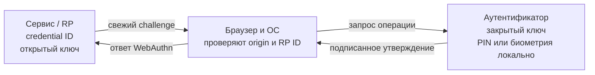

# 🧬 Что такое FIDO: альянс, стандарты и их история

> [!info] О чём заметка
> Эта заметка объясняет, как появилась система входа по криптографической подписи устройства, какие задачи она решает и почему разные её части получили отдельные названия. Механика протоколов разобрана в [[FIDO/fido-protocols|заметке о протоколах FIDO]], практика выбора железа — в [[FIDO/hardware-security-keys|статье о физических ключах]].

Система объединяет организации, браузеры, операционные системы и устройства вокруг одного правила: сервер проверяет подпись, а закрытый ключ не передаётся ему.

Эту систему называют FIDO (Fast IDentity Online, «быстрая идентификация в сети»); название относится и к отраслевому альянсу, который выпускает правила, и к семейству стандартов сильной онлайн-аутентификации.

В раннем варианте физический ключ добавляет второй шаг после пароля. В другой ранней ветке устройство позволяет войти без пароля после локальной проверки пользователя, прежде всего в мобильном приложении.

Первый вариант называется U2F (Universal 2nd Factor, «универсальный второй фактор»), а второй — UAF (Universal Authentication Framework, «универсальная платформа аутентификации»).

Современная ветка объединяет веб-интерфейс регистрации и входа с протоколом передачи команд внешнему ключу. Страница вызывает первый слой через браузер, а второй слой связывает браузер или операционную систему с устройством.

Эта связка называется FIDO2: веб-интерфейс — WebAuthn, протокол общения с внешним ключом — CTAP.

Пользователь выбирает сохранённый на устройстве ключ доступа и подтверждает вход, не вводя пароль. Такие учётные данные могут синхронизироваться или оставаться на одном ключе; англоязычное пользовательское название этого способа — passkey.

Сервер посылает одноразовую случайную задачу, которую устройство включает в подпись. Старая подпись от другой попытки поэтому не подходит.

В стандартах эту задачу называют challenge, а схему «задача — подписанный ответ» — challenge-response.

Браузер фиксирует точный адрес страницы, включая схему, имя узла и порт. Сервер сравнивает эту запись с ожидаемым адресом и отбрасывает ответ с поддельной страницы.

Такая запись называется origin.

Сайт, который просит вход, получает собственный идентификатор доверяющей стороны, обычно совпадающий с доменом сервиса. Встроенное в телефон или компьютер средство проверки работает через операционную систему, а отдельный ключ или телефон для другого компьютера использует внешний канал.

В стандартах сайт называют relying party, или RP, его идентификатор — RP ID, встроенное средство — platform authenticator, а отдельный ключ или телефон — roaming authenticator.

Каждая регистрация оставляет на устройстве запись с закрытым ключом и служебными данными, а серверу передаётся отдельный идентификатор этой записи. Если устройство может найти запись по сайту без заранее переданного списка, пользователь выбирает её в системном окне.

Такую запись называют credential source, её идентификатор — credential ID, а саму обнаруживаемую запись — discoverable credential. Passkey, введённый выше как «ключ доступа», представляет пользовательский сценарий работы с такой обнаруживаемой записью.

Касание кнопки или другая локальная команда подтверждает присутствие пользователя. Персональный цифровой код называют PIN; такой код или биометрия подтверждают, что пользователь прошёл проверку на самом устройстве.

В стандартах эти признаки называются User Presence (UP) и User Verification (UV). Сервер получает только признаки успешной проверки, а не отпечаток пальца или изображение лица.

При регистрации устройство может предъявить отдельное свидетельство о происхождении и свойствах своей модели. Обычный сайт может не запрашивать его и сохранить только открытый ключ.

Такое свидетельство называется attestation.

Если организация разрешает вход только с выданных ею устройств, она может запросить вариант свидетельства с устойчивой привязкой к корпоративному парку. Такой режим называется enterprise attestation, или «корпоративная аттестация», и применяется только по политике сервиса.

Учётные данные могут оставаться на одном устройстве или получать защищённую копию в системном хранилище, которое переносит их между устройствами пользователя. Такое хранилище называют credential provider, или «поставщик учётных данных». В первом случае в стандартах говорят single-device, во втором — multi-device.

Веб-стандарты WebAuthn публикует международный консорциум W3C (World Wide Web Consortium), а протоколы устройств — FIDO Alliance. У этих организаций разные шкалы статусов, поэтому одинаково звучащие этапы нельзя складывать в одну лестницу.

Рабочий черновик обе организации обозначают как Working Draft. W3C называет Candidate Recommendation документ, прошедший широкую проверку и собирающий опыт реализаций на пути к рекомендации. FIDO Alliance называет Proposed Standard утверждённую участниками альянса стабильную редакцию своей спецификации.

Слово Snapshot в статусе W3C означает зафиксированную датированную редакцию документа. Слово Level и номер обозначают последовательное поколение спецификации WebAuthn, а не класс защиты устройства.

Для входа с телефона на другом компьютере нужен отдельный обмен сообщениями, который подтверждает близость устройств и защищает передачу запроса. Этот механизм называют Proximity Exchange Protocol, или PXP; опубликованная на 17 июля 2026 года редакция имеет статус рабочего черновика FIDO.

Браузер упаковывает одноразовый challenge и origin в структуру `clientDataJSON`, то есть в данные клиента в текстовом формате JSON. Аутентификатор создаёт бинарную структуру `authenticatorData` с хэшем RP ID, флагами проверок и счётчиком подписей. Хэш — это короткий результат одностороннего преобразования; здесь используется алгоритм `SHA-256`, а поле с результатом для RP ID называется `rpIdHash`.

## Кратко

- **FIDO** (Fast IDentity Online) — альянс, сформированный в июле 2012 года и публично представленный 12 февраля 2013 года. Его участники разрабатывают открытые стандарты аутентификации на основе криптографии с открытым ключом.
- Сервер хранит открытый ключ, а закрытый ключ остаётся у аутентификатора. Утечка серверной базы не даёт атакующему материала для создания подписи, хотя метаданные аккаунтов всё равно требуют защиты.
- Два поколения протоколов: **U2F** и **UAF** из FIDO 1.0, затем **FIDO2** как связка W3C **WebAuthn** и FIDO **CTAP**. Позже появилось пользовательское название **passkeys** для обнаруживаемых учётных данных FIDO2, привязанных к одному устройству или допускающих синхронизацию.
- 5 мая 2022 года Apple, Google и Microsoft объявили планы расширить поддержку passkeys. iOS 16 получила их в сентябре 2022 года, стабильная общедоступная версия Chrome — в декабре 2022 года, а встроенный интерфейс Windows 11 начал распространяться в сентябре 2023 года.

## Что такое FIDO

FIDO расшифровывается как Fast IDentity Online («быстрая идентификация онлайн») и обозначает две связанные вещи. Во-первых, **FIDO Alliance** — некоммерческий отраслевой консорциум, который разрабатывает и сертифицирует стандарты аутентификации. Во-вторых, **семейство самих стандартов** (U2F, UAF, FIDO2), которые этот альянс выпустил. Когда говорят «FIDO-ключ» или «вход по FIDO», имеют в виду стандарты; когда «FIDO сертифицировала устройство» — альянс.

Альянс появился как ответ на проблему общего секрета. Пароль вводит пользователь, а сервер хранит его проверочное представление. Атакующий может выманить пароль через поддельную страницу — такую атаку называют фишингом, — подобрать слабый вариант, найти его в чужой утечке или атаковать процедуру восстановления. Дополнительный SMS-код меняет число шагов, но остаётся переносимым секретом: жертва способна отдать его поддельному сайту.

## Принципы: почему FIDO не похож на пароль

FIDO меняет сам предмет проверки. Сервер больше не спрашивает секрет, который пользователь способен назвать другому человеку. При регистрации аутентификатор создаёт пару ключей в области конкретного RP ID (Relying Party ID, обычно домен сервиса). Сервер получает открытый ключ и идентификатор учётных данных, а закрытый ключ остаётся у аутентификатора или его защищённого провайдера.

Случайный challenge делает каждый ответ одноразовым. Сервер создаёт его в доверенной среде, сохраняет на время церемонии и принимает только точное совпадение. Перехваченная старая подпись не подходит к новому challenge.

Привязка к сервису строится из двух проверок. Браузер помещает полный origin страницы в `clientDataJSON`, а аутентификатор помещает `SHA-256(RP ID)` в `authenticatorData`. Подпись покрывает хэш клиентских данных и данные аутентификатора. Сервер обязан проверить origin, RP ID и подпись. Поэтому фишинговый домен не получает утверждение, подходящее настоящему сервису, при условии корректной реализации и отсутствия слабого запасного входа.

Касание и проверка владельца означают разные вещи. User presence (UP) подтверждает физическое действие: например, касание кнопки. User verification (UV) означает локальную проверку персональным цифровым кодом PIN или биометрией. FIDO2 поддерживает оба режима, а сервис выбирает обязательную проверку (`required`), желательную при наличии возможности (`preferred`) или отсутствие требования (`discouraged`); PIN или биометрия не обязательны для каждой операции FIDO2.

Приватность обеспечивается областью RP ID: разные сервисы получают разные пары ключей и credential IDs. Это мешает корреляции по самим FIDO-учётным данным, но не скрывает одинаковый адрес почты, сетевые признаки и другие данные аккаунта. Enterprise attestation тоже может ослаблять эту гарантию, поэтому обычным сайтам модель конкретного устройства обычно не нужна.

Биометрический шаблон не передаётся WebAuthn-сервису. Палец или лицо проверяет аутентификатор либо платформа, а сервер видит флаг успешной UV. Это утверждение относится к границе WebAuthn RP; хранение биометрии внутри ОС и устройства зависит от реализации платформы.

> [!warning] FIDO защищает сильный путь, но не закрывает слабый
> Пароль, SMS, письмо для восстановления или возможность добавить новый passkey после слабой проверки оставляют обходной маршрут. Вредоносный код на origin сервиса и ошибки серверной валидации тоже могут разрушить гарантии. Для критичных аккаунтов восстановление должно быть не слабее основного входа.

## История

### 2009–2012: до альянса

По официальному изложению FIDO, история началась в 2009 году, когда Рамеш Кесанупалли из Validity Sensors предложил Мишелю Барретту, тогдашнему руководителю PayPal по информационной безопасности (Chief Information Security Officer, CISO), использовать биометрию для входа в PayPal. Барретт настаивал на открытом стандарте, который не зависел бы от одного производителя. Альянс сформировали в июле 2012 года, а 12 февраля 2013 года о нём объявили публично. Роли первых участников различались: Lenovo, Nok Nok Labs, PayPal и Validity Sensors вошли в первый совет альянса, Agnitio получила статус ассоциированного основателя, а Infineon стала спонсором-основателем.

### 2013–2014: U2F, UAF и первый стандарт

В 2013 году к альянсу присоединились Google, Yubico и NXP. Google и Yubico принесли разработку второго фактора, созданную для защиты сотрудников Google. Она стала стандартом **[[FIDO/u2f|U2F]]** (Universal 2nd Factor): пароль остаётся, после него сервер требует подпись физического ключа. 21 октября 2014 года Google включила Security Key для аккаунтов Google в Chrome. Финальный набор FIDO 1.0 вышел в декабре 2014 года; документы имеют разные даты: U2F 1.0 датирован 9 октября, а **[[FIDO/uaf|UAF]]** 1.0 — 8 декабря. UAF предлагал беспарольный вход для мобильных приложений, но не стал массовым веб-стандартом.

### 2015–2019: путь в браузеры — WebAuthn и FIDO2

U2F работал только как второй фактор и использовал отдельный интерфейс браузера. 12 ноября 2015 года Microsoft, Google, PayPal и Nok Nok Labs передали W3C пакет спецификаций платформы FIDO 2.0, названный FIDO 2.0 Platform Specifications. Рабочая группа W3C по веб-аутентификации, или Web Authentication Working Group, начала работу 17 февраля 2016 года и создала **[[FIDO/webauthn|WebAuthn]]**, программный интерфейс для регистрации и входа из кода страницы. FIDO Alliance параллельно развивал **[[FIDO/ctap|CTAP2]]**, протокол клиента с внешним аутентификатором; U2F получил имя CTAP1. Связка WebAuthn и CTAP стала FIDO2.

Первый Candidate Recommendation WebAuthn вышел 20 марта 2018 года. Поддержка появилась в Chrome 67 и Firefox 60, а 4 марта 2019 года WebAuthn Level 1 стал рекомендацией W3C. FIDO2 добавил discoverable credentials для входа без заранее названного логина и механизм user verification. Сервис сам решает, требовать ли PIN или биометрию; стандарт не делает UV обязательной для каждой операции.

### 2019–2022: платформы вместо брелков

25 февраля 2019 года Android 7.0+ получил сертификацию FIDO2. В 2020 году к альянсу присоединилась Apple, а Safari 14 научился использовать Touch ID и Face ID как платформенные аутентификаторы WebAuthn. 5 мая 2022 года Apple, Google и Microsoft объявили планы расширить поддержку **[[FIDO/passkeys|passkeys]]** (в русских интерфейсах «ключи доступа»).

Passkey — discoverable credential FIDO2, а не обязательная облачная копия. Multi-device passkey допускает резервное копирование и синхронизацию провайдером учётных данных. Single-device passkey остаётся на одном аутентификаторе. Синхронизация решила часть проблемы потери устройства, но перенесла доверие к защите аккаунта провайдера и его процедуре восстановления.

### 2022–2026: массовое внедрение

Поддержка вышла поэтапно. iOS 16 стала доступна 13 сентября 2022 года. Android и Chrome начали публичное тестирование passkeys в октябре, а стабильная общедоступная версия Chrome M108 получила поддержку 8 декабря. Google Accounts добавили passkeys 3 мая 2023 года и сделали их вариантом по умолчанию для личных аккаунтов 10 октября. Встроенный интерфейс passkeys в Windows 11 начал распространяться 26 сентября 2023 года.

FIDO Alliance сообщал, что в 2024 году passkeys могли использовать более 13 миллиардов аккаунтов, а к декабрю — более 15 миллиардов. Эти числа описывают доступность функции, а не число созданных ключей. В 2026 году альянс оценивал число passkeys в активном использовании примерно в 5 миллиардов.

Стандарты тоже менялись. WebAuthn Level 3 остаётся Candidate Recommendation Snapshot, сокращённо CR Snapshot, от 26 мая 2026 года. CTAP 2.3 получил статус Proposed Standard 26 февраля 2026 года, а CTAP 2.3.1 остаётся Working Draft. Гибридный вход по QR-коду и проверке близости вынесли в отдельный Proximity Exchange Protocol (PXP), чей первый Working Draft опубликован 17 июля 2026 года.

> [!note] Способ подключения и способ хранения — разные свойства
> Platform authenticator может хранить single-device credential, а телефон способен выступать roaming authenticator для другого компьютера. Multi-device credential допускает резервное копирование; single-device credential не допускает. Механика обоих вариантов — в [[FIDO/passkeys|заметке о passkeys]], выбор отдельного устройства — в [[FIDO/hardware-security-keys|статье о физических ключах]].

## Хронология одной таблицей

| Год | Событие |
|---|---|
| 2009 | Разговор Validity Sensors и руководителя PayPal по информационной безопасности об открытом стандарте (по официальной истории FIDO) |
| 2012 | Альянс сформирован в июле |
| 2013 | Публичное объявление 12 февраля; Google и Yubico приносят разработку U2F |
| 2014 | Google включает Security Key; в декабре завершён набор FIDO 1.0 (U2F + UAF) |
| 2015–2016 | FIDO 2.0 подан в W3C; начинает работу Web Authentication Working Group |
| 2018 | WebAuthn получает первый Candidate Recommendation; поддержка выходит в Chrome и Firefox |
| 2019 | WebAuthn Level 1 становится рекомендацией W3C; Android 7.0+ сертифицирован для FIDO2 |
| 2020 | Apple вступает в альянс; Safari 14 получает WebAuthn через Touch ID и Face ID |
| 2022 | Apple, Google и Microsoft объявляют расширенную поддержку passkeys; выходят iOS 16 и Chrome M108 |
| 2023 | Passkeys появляются в Google Accounts и интерфейсе Windows 11 |
| 2024 | Passkeys доступны более чем для 13 млрд аккаунтов по оценке FIDO Alliance |
| 2026 | WebAuthn L3 остаётся CR Snapshot; CTAP 2.3 — Proposed Standard; опубликован первый PXP Working Draft |

## 📚 См. также

- [[FIDO/00-overview|Обзор раздела FIDO]] — оглавление всех заметок об аппаратных ключах
- [[FIDO/fido-protocols|Протоколы FIDO]] — механика: challenge-response, WebAuthn/CTAP, passkeys
- [[FIDO/u2f|U2F (Universal 2nd Factor)]] — первый стандарт семейства подробно: версии, механика, плюсы и минусы
- [[FIDO/webauthn|WebAuthn]] и [[FIDO/ctap|CTAP]] — две половины FIDO2 подробно
- [[FIDO/passkeys|Passkeys]] — беспарольный вход: синхронизация, гибридный транспорт, критика
- [[FIDO/uaf|UAF]] — беспарольная ветка FIDO 1.0 и почему она не взлетела
- [[FIDO/hardware-security-keys|Физические ключи безопасности]] — практика: YubiKey, открытые ключи, чек-лист выбора
- [[SMS]] — почему SMS-коды не заменяют FIDO
- 🔗 [fidoalliance.org](https://fidoalliance.org/) — сайт альянса, спецификации и история
- 🔗 [FIDO Specifications](https://fidoalliance.org/specifications/download/) — актуальные версии CTAP, UAF и U2F
- 🔗 [WebAuthn Level 3 (W3C Candidate Recommendation)](https://www.w3.org/TR/webauthn-3/) — текущая редакция веб-стандарта

---

> [!quote] 🤖 Эти статьи открыты — можно обучать на них ИИ
> При желании вы можете натренировать ИИ на наших статьях. Исходное форматирование и скачивание всего репозитория одним zip-архивом доступны в Forgejo: [исходник этой заметки](https://git.zapret.moe/zapretdiscordyoutube/todo/src/branch/main/FIDO/fido-history.md) · [весь репозиторий](https://git.zapret.moe/zapretdiscordyoutube/todo/src/branch/main).
