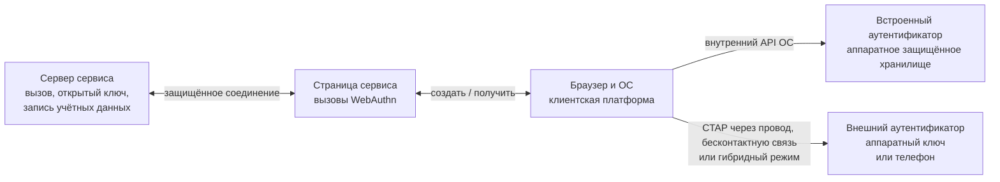
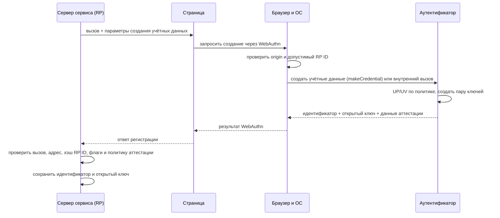
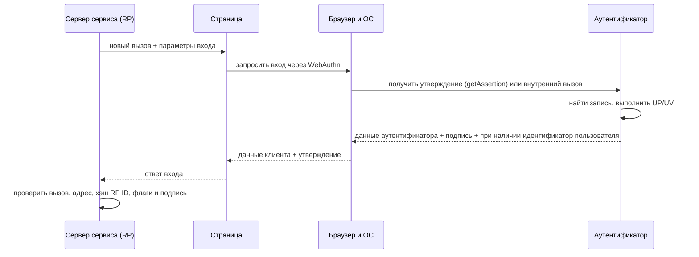

# ⚙️ Протоколы FIDO: U2F, FIDO2, WebAuthn, CTAP и passkeys

> [!info] О чём заметка
> Эта заметка показывает путь запроса от сайта к браузеру, операционной системе и устройству, а затем обратно к серверу. Отдельно разобраны защита от поддельного сайта, различия ранних и современных вариантов FIDO и способы хранения учётных данных. История — в [[FIDO/fido-history|истории FIDO]], выбор железа — в [[FIDO/hardware-security-keys|статье о физических ключах]].

## Термины перед разбором

Семейство открытых стандартов, по которым сайт проверяет криптографическую подпись устройства, называют FIDO (Fast IDentity Online, «быстрая идентификация в сети»). Современная ветка FIDO2 делит путь на браузерный интерфейс и протокол связи с внешним устройством.

Криптография с открытым ключом использует математически связанную пару: закрытый ключ создаёт подпись, а открытый позволяет серверу её проверить. Закрытую часть нельзя восстановить из открытой; такую схему называют асимметричной криптографией.

Вход начинается с сервера, который создаёт свежую случайную задачу для конкретной попытки. Браузер передаёт эту задачу устройству, а устройство возвращает подпись, пригодную только для данного запроса.

В стандартах такую задачу называют challenge, а схему «задача — подписанный ответ» — challenge-response.

Сайт должен связать ключ именно со своей страницей. Браузер фиксирует схему, имя узла и порт страницы, например `https://login.example.com:443`.

Эта точная запись называется origin. Она позволяет серверу отличить настоящую страницу от похожего адреса.

Сайт, который просит вход, получает отдельный идентификатор доверяющей стороны. Обычно он совпадает с доменом сервиса, но не включает схему и порт.

Такой идентификатор называется RP ID, от relying party ID, а сам сайт в стандартах называют relying party, или RP.

Между страницей и устройством работает промежуточный слой браузера и операционной системы. Он проверяет право страницы запрашивать ключ, показывает доступные способы подтверждения и выбирает канал связи.

Этот слой называется client platform. Встроенный в телефон или компьютер механизм проверки называют platform authenticator, а отдельный физический ключ или телефон, подтверждающий вход на другом компьютере, — roaming authenticator.

Аутентификатор хранит закрытый ключ и служебные сведения о регистрации. Запись должна позволять найти нужный ключ и связать его с учётной записью на сервере.

Такую хранимую запись называют credential source, а её отдельный идентификатор — credential ID.

Если устройство способно найти подходящую запись по идентификатору сайта без заранее переданного списка, пользователь видит доступную учётную запись прямо в системном окне выбора.

Такую запись называют discoverable credential, то есть обнаруживаемой учётной записью. Если сайт должен заранее передать список идентификаторов, запись называют non-discoverable credential.

В современном вебе страница обращается к браузеру через программный интерфейс регистрации и входа. Для внешнего ключа браузер или операционная система передаёт команды по отдельному протоколу связи с аутентификатором.

Набор функций, который страница вызывает в браузере, называют программным интерфейсом, или API (Application Programming Interface). Браузерный API регистрации и входа называется WebAuthn, а протокол связи с внешним устройством — CTAP.

Эта связка называется FIDO2 и включает WebAuthn вместе с CTAP2. Защищённое веб-соединение с проверкой сертификата обозначают HTTPS; сайт использует его для связи страницы с сервером, но не отправляет CTAP-команды ключу напрямую.

Некоторые учётные данные можно восстановить на новом устройстве через защищённую синхронизацию, а другие остаются только на одном физическом ключе. Телефон также может подтвердить вход на другом компьютере по QR-коду и каналу проверки близости.

Пользовательское название passkey, или «ключ доступа», означает обнаруживаемые учётные данные FIDO2.

Синхронизируемый вариант хранится в связке устройств, а вариант без разрешённой резервной копии на другое устройство называют device-bound. Способ подтверждения через телефон называют hybrid transport. Квадратный машиночитаемый рисунок, с которого телефон получает одноразовые параметры связи, называется QR-кодом. Короткое радиосообщение BLE подтверждает близость, а данные затем могут идти через службу-посредник или локальный канал.

Поддельную страницу, которая выманивает пароль или код под видом настоящего сервиса, называют фишинговой, а саму атаку — фишингом. Привязка подписи к origin и RP ID не даёт ответу с такой страницы подойти настоящему сервису.

При регистрации внешний аутентификатор получает команду создать учётные данные; её полное имя в CTAP — `authenticatorMakeCredential`. При входе команда просит сформировать подписанное утверждение и называется `authenticatorGetAssertion`. Точные английские имена нужны разработчику для сверки со спецификацией, а далее текст сначала описывает их роль по-русски.

При регистрации устройство может дополнительно предъявить свидетельство о происхождении и свойствах своей модели. Сервер использует его, только если политика сервиса требует проверки устройства.

Такое свидетельство называется attestation. Обычному сайту чаще достаточно открытого ключа без раскрытия модели.

Физическое касание или другая локальная команда подтверждает присутствие пользователя. Персональный цифровой код называют PIN; проверка таким кодом или биометрией подтверждает, что пользователь прошёл локальную проверку.

В стандартах эти признаки называются User Presence (UP) и User Verification (UV). Они независимы: касание не доказывает знание PIN, а успешная биометрия не обязательно означает отдельное касание.

Для синхронизируемых записей сервер видит два флага. BE (Backup Eligibility) сообщает, допускает ли запись резервное копирование, а BS (Backup State) — существует ли резервная копия сейчас. Эти признаки не называют конкретное облачное хранилище.

В раннем варианте FIDO физический ключ добавляет второй шаг после обычного входа по паролю. Такой режим предназначен для усиления уже существующей парольной схемы.

Этот вариант называется U2F, а его современное имя для обмена с внешним ключом — CTAP1.

Параллельная ранняя ветка позволяла мобильному приложению заменить пароль локальной проверкой пользователя. Она называется UAF (Universal Authentication Framework, «универсальная платформа аутентификации») и использует другую архитектуру, чем FIDO2.

Браузер записывает challenge и origin в структуру `clientDataJSON`, то есть данные клиента в текстовом формате JSON. Аутентификатор создаёт бинарную структуру `authenticatorData` с хэшем RP ID, флагами и счётчиком. Хэш — короткий результат одностороннего преобразования; поле с хэшем RP ID называется `rpIdHash`, а алгоритм `SHA-256` создаёт 256-битный результат.

Подписанный ответ устройства при входе называют assertion, или «утверждением аутентификатора». Поле `userHandle` содержит внутренний идентификатор пользователя для обнаруживаемой учётной записи, а `signature` — саму криптографическую подпись.

Внешний ключ может подключаться проводным интерфейсом USB, бесконтактным каналом NFC или экономичным радиорежимом Bluetooth Low Energy, сокращённо BLE. Эти обозначения описывают способ доставки команд CTAP, а не разные способы проверки подписи.

## Кратко

- Вся схема держится на асимметричной криптографии: закрытый ключ живёт в аутентификаторе (брелок, телефон, ноутбук), сервер хранит только открытый и на каждый вход присылает случайный вызов на подпись.
- Origin и RP ID входят в два подписываемых слоя данных; сервер проверяет оба. Фишинговый домен не может получить утверждение для настоящего сервиса при корректной реализации.
- **U2F** (2014, он же CTAP1) — только второй фактор после пароля. **FIDO2** (2018) = браузерный API **WebAuthn** + протокол **CTAP2** для внешних устройств; добавил вход вообще без пароля.
- **Passkey** — учётные данные FIDO2 «для людей»: синхронизируемые или без резервной копии на другое устройство (device-bound); гибридный транспорт позволяет подтверждать вход телефоном через QR-код и Bluetooth.

## Кто участвует в FIDO-входе

Схему часто сокращают до трёх участников, но новичку полезно разделить сайт на веб-приложение и сервер. Сервер создаёт challenge, хранит открытые ключи и проверяет ответы. Код страницы вызывает WebAuthn. Браузер и ОС образуют client platform, а аутентификатор создаёт ключи и подписи.



CTAP нужен прежде всего для roaming authenticator. Встроенный аутентификатор может общаться с ОС через закрытый внутренний API и вообще не использовать CTAP на этом участке. Телефон меняет роль в зависимости от контекста: для приложений на самом телефоне он platform authenticator, а для входа на ноутбуке через hybrid transport — roaming authenticator.

## Регистрация: от challenge до открытого ключа

При регистрации сервис создаёт свежий challenge и передаёт WebAuthn параметры RP, пользователя, алгоритмов и политики аутентификатора. Для внешнего ключа client platform преобразует запрос в CTAP-команду `authenticatorMakeCredential`. Аутентификатор создаёт пару ключей в области RP ID и возвращает открытый ключ, credential ID и данные attestation. Закрытый ключ остаётся на стороне аутентификатора или провайдера учётных данных.



## Вход: что именно подписывается

При входе сервер создаёт другой challenge. Client platform получает подписанное утверждение через `navigator.credentials.get()` и, если нужен внешний аутентификатор, отправляет CTAP-команду `authenticatorGetAssertion`. User presence (UP) подтверждает физическое действие, а user verification (UV) подтверждает локальную проверку PIN-кодом или биометрией. Это разные флаги, и сервис может требовать UV либо ограничиться UP.



Аутентификатор подписывает не один challenge. Браузер создаёт `clientDataJSON` с типом операции, challenge и origin. Аутентификатор создаёт `authenticatorData` с `rpIdHash`, флагами и счётчиком. Формула утверждения выглядит так:

```text
signature = Sign(privateKey, authenticatorData || SHA-256(clientDataJSON))
```

Проще говоря: сервер задаёт одноразовую задачу, браузер фиксирует, с какой страницы она пришла, а аутентификатор привязывает ответ к RP ID. Сервер принимает вход только после проверки всех этих частей.

## Origin и RP ID: две границы доверия

Origin и RP ID нельзя считать одним «доменом в подписи». Origin — это схема, хост и порт страницы, например `https://login.example.com:443`. Его записывает браузер в `clientDataJSON`. RP ID — доменное имя без схемы и порта, например `example.com`; его хэш аутентификатор помещает в `authenticatorData`.

Явный RP ID должен совпадать с эффективным доменом страницы или быть допустимым суффиксом регистрируемого домена. Поэтому страница `https://login.example.com` способна использовать RP ID `login.example.com` или `example.com`, но не `com` и не чужой домен. Сервер проверяет полный ожидаемый origin и `rpIdHash` независимо.

Фишинговая страница на `gooogle-login.com` не может запросить учётные данные для RP ID настоящего Google. Даже если пользователь не заметил подмену, client platform ограничит область запроса, а настоящий сервер отвергнет origin или `rpIdHash`.

Одноразовый код из SMS или приложения можно ввести на поддельной странице, после чего злоумышленник перенесёт его на настоящую.

Вариант таких кодов, рассчитанный по времени, называют TOTP; этот механизм не связывает код с адресом страницы ([[SMS]]).

> [!warning] Устойчивость к фишингу не равна полной защите аккаунта
> Гарантия предполагает защищённое соединение HTTPS, корректную серверную проверку и доверенный код на origin сервиса. Внедрённый скрипт, который выполняется внутри страницы, слабое восстановление или сохранённый пароль дают атакующему другой путь.

## U2F (CTAP1): второй фактор

**U2F** (Universal 2nd Factor, стандарт 2014 года) не отменяет пароль, а добавляет к нему подпись ключа: сначала обычный вход, потом «коснитесь ключа». Сервер передаёт токену идентификатор записи ключа, а реализация токена сама решает, хранить учётные данные внутри или упаковать их в этот идентификатор.

В документации такой идентификатор называют key handle, или «дескриптором ключа». Поэтому некоторые U2F-ключи поддерживают очень много регистраций без отдельной записи на каждую, но стандарт не обещает безлимитность для любой модели. Счётчик подписей даёт серверу сигнал о возможном клонировании, а не безусловное доказательство. Полный разбор — в [[FIDO/u2f|отдельной заметке об U2F]].

## UAF: беспарольная ветка, которая не взлетела

Параллельно с U2F альянс выпустил **UAF** (Universal Authentication Framework) — беспарольный вход с локальной проверкой пользователя, нацеленный прежде всего на мобильные приложения. Встроенной частью массовой веб-платформы он не стал; позднее FIDO2 стандартизировал похожие пользовательские свойства через другую архитектуру — WebAuthn и CTAP2. Архитектура UAF, варианты внедрения и причины ограниченного распространения разобраны в [[FIDO/uaf|отдельной заметке об UAF]].

## FIDO2: WebAuthn + CTAP2

**FIDO2** — название связки двух взаимодополняющих стандартов. **[[FIDO/webauthn|WebAuthn]]** задаёт интерфейс и проверяемые структуры между relying party и client platform. **[[FIDO/ctap|CTAP2]]** задаёт команды и транспорт между client platform и roaming authenticator. Сайт не отправляет CTAP-команды напрямую, а внешний ключ не общается с сервером по HTTPS.

Разделение позволяет одному сайту работать с разными аутентификаторами. WebAuthn-запрос может уйти в Windows Hello, Touch ID, USB-ключ или телефон через hybrid transport. Сайт задаёт требования и предпочтения, client platform выбирает доступный путь, а сервер проверяет единый формат WebAuthn-ответа.

FIDO2 добавил к модели U2F два независимых свойства. **Discoverable credential** можно найти по RP ID без заранее переданного списка credential IDs, поэтому client platform способна показать учётные записи и вернуть `userHandle`. **User verification** позволяет аутентификатору подтвердить локальную проверку человека. Discoverable credential не обязана быть синхронизируемой, а UV не обязана использоваться при каждой операции.

| Вопрос | Возможные варианты | Что меняется |
|---|---|---|
| Где находится аутентификатор | встроенный / внешний | внутренний API ОС или CTAP-транспорт |
| Как находят учётные данные | обнаруживаемые / необнаруживаемые | пустой `allowCredentials` или список идентификаторов |
| Проверен ли человек | UP / UV | касание или локальный PIN/биометрия |
| Можно ли сделать резервную копию | одно устройство / несколько устройств | флаги BE и BS, модель восстановления |

Эти оси не подменяют друг друга. Platform authenticator способен хранить single-device credential, а roaming authenticator может быть телефоном с синхронизируемыми passkeys.

## Passkeys: синхронизируемые и привязанные к железу

**Passkey** (в русских интерфейсах «ключ доступа») — потребительское имя для discoverable credential FIDO2, продвигаемое альянсом и платформами с 2022 года. Passkey бывает **синхронизируемым** или **device-bound**. Первый вариант получает защищённые копии через связку устройств или менеджер учётных данных, второй не допускает резервной копии на другое устройство и может находиться как в отдельном ключе, так и во встроенном аутентификаторе телефона или компьютера. Отдельный механизм — **гибридный транспорт**: вход на чужом компьютере подтверждается телефоном через QR-код, близость проверяется по Bluetooth. Устройство хранилищ, механика синхронизации, плюсы, минусы и критика — в [[FIDO/passkeys|отдельной заметке о passkeys]]; выбор отдельного ключа — в [[FIDO/hardware-security-keys|статье о физических ключах]].

## Attestation: когда серверу важен тип аутентификатора

При регистрации аутентификатор может вернуть отдельное свидетельство о происхождении и свойствах устройства. Сервер использует его, если хочет ограничить перечень допустимых моделей и проверить цепочку доверия производителя.

Такое свидетельство называется **attestation**.

Идентификатор типа аутентификатора называют AAGUID, но он сам по себе ничего не доказывает: сервер получает криптографическую гарантию только после проверки структуры свидетельства и подходящей цепочки доверия.

Обычный сайт может запросить `attestation: "none"` и сохранить открытый ключ без знания модели. Такая проверка особенно нужна средам, где политика разрешает только определённые сертифицированные аутентификаторы.

Прямую или корпоративную форму attestation применяют по отдельной политике. Самосвидетельство и `none` не подтверждают конкретную модель производителем.

Attestation создаёт риск корреляции, поэтому потребительские схемы используют сертификаты одной партии или анонимизацию. Число 100 000 относится к рекомендациям и отдельным требованиям сертификации для свидетельств с сохранением приватности, а не к универсальному правилу каждого WebAuthn-аутентификатора.

## Что остаётся на сервере после отказа от пароля

Сервер обязательно хранит credential ID, открытый ключ и связь с аккаунтом. Он также обычно сохраняет счётчик и последние признаки резервного копирования, если использует их в политике риска; WebAuthn рекомендует обновлять это состояние после успешной проверки. Утечка этих данных не позволяет создать валидную подпись без закрытого ключа, но может раскрыть имена пользователей, используемые аутентификаторы и другие метаданные. Поэтому формула «на сервере нечего красть» означает отсутствие секрета для входа, а не отсутствие чувствительных данных.

Для каждого входа сервер обязан проверить тип операции, challenge, origin, `rpIdHash`, требуемые UP/UV-флаги и подпись. Счётчик может дать сигнал о клонировании, сбросе или гонке, но одно несоответствие не доказывает клон. После успешной проверки сервер обновляет сохранённое состояние учётной записи.

## 📚 См. также

- [[FIDO/00-overview|Обзор раздела FIDO]] — оглавление всех заметок об аппаратных ключах
- [[FIDO/fido-history|Что такое FIDO: альянс, стандарты и их история]] — кто и когда всё это создал
- [[FIDO/u2f|U2F (Universal 2nd Factor)]] — первый стандарт семейства подробно: версии, механика, плюсы и минусы
- [[FIDO/webauthn|WebAuthn]] — веб-половина FIDO2: API, церемонии, discoverable credentials
- [[FIDO/ctap|CTAP]] — «железная» половина FIDO2: транспорты, PIN, версии протокола
- [[FIDO/passkeys|Passkeys]] — беспарольный вход: синхронизация, гибридный транспорт, критика
- [[FIDO/uaf|UAF]] — беспарольная ветка FIDO 1.0 и почему она не взлетела
- [[FIDO/hardware-security-keys|Физические ключи безопасности]] — железо: YubiKey, открытые ключи, чек-лист выбора
- [[SMS]] — почему SMS-коды не защищают от фишинга
- 🔗 [WebAuthn Level 3 (W3C Candidate Recommendation)](https://www.w3.org/TR/webauthn-3/) — текущая редакция веб-стандарта
- 🔗 [CTAP 2.3 Proposed Standard (FIDO Alliance)](https://fidoalliance.org/specs/fido-v2.3-ps-20260226/fido-client-to-authenticator-protocol-v2.3-ps-20260226.html) — актуальная опубликованная версия протокола аутентификатора

---

> [!quote] 🤖 Эти статьи открыты — можно обучать на них ИИ
> При желании вы можете натренировать ИИ на наших статьях. Исходное форматирование и скачивание всего репозитория одним zip-архивом доступны в Forgejo: [исходник этой заметки](https://git.zapret.moe/zapretdiscordyoutube/todo/src/branch/main/FIDO/fido-protocols.md) · [весь репозиторий](https://git.zapret.moe/zapretdiscordyoutube/todo/src/branch/main).
