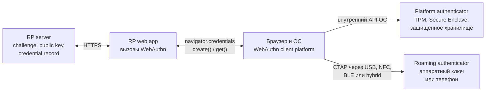
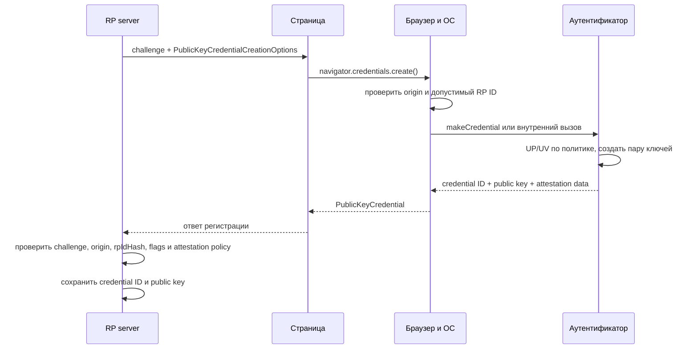
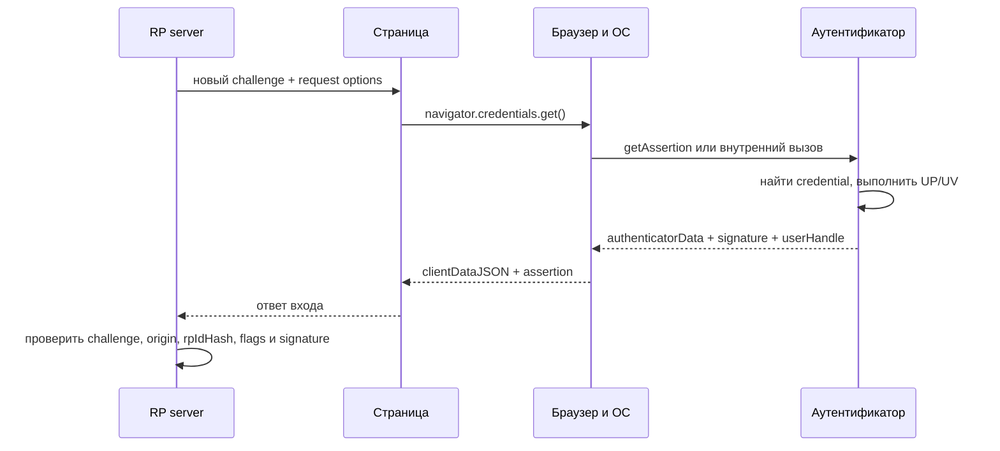

# ⚙️ Протоколы FIDO: U2F, FIDO2, WebAuthn, CTAP и passkeys

> [!info] О чём заметка
> Как технически устроена аутентификация по стандартам FIDO: challenge-response-подпись, привязка к домену, отличие U2F от FIDO2, роли WebAuthn и CTAP, discoverable credentials и passkeys. Кто и когда всё это придумал — в [[FIDO/fido-history|истории FIDO]]; какое железо это поддерживает и как его выбрать — в [[FIDO/hardware-security-keys|статье о физических ключах]].

## TL;DR

- Вся схема держится на асимметричной криптографии: закрытый ключ живёт в аутентификаторе (брелок, телефон, ноутбук), сервер хранит только открытый и на каждый вход присылает случайный вызов на подпись.
- Origin и RP ID входят в два подписываемых слоя данных; сервер проверяет оба. Фишинговый домен не может получить утверждение для настоящего сервиса при корректной реализации.
- **U2F** (2014, он же CTAP1) — только второй фактор после пароля. **FIDO2** (2018) = браузерный API **WebAuthn** + протокол **CTAP2** для внешних устройств; добавил вход вообще без пароля.
- **Passkey** — учётные данные FIDO2 «для людей»: синхронизируемые (облако Apple/Google) или привязанные к железу (device-bound); гибридный транспорт позволяет подтверждать вход телефоном через QR-код и Bluetooth.

## Кто участвует в FIDO-входе

Схему часто сокращают до трёх участников, но новичку полезно разделить сайт на веб-приложение и сервер. Сервер создаёт challenge, хранит открытые ключи и проверяет ответы. Код страницы вызывает WebAuthn. Браузер и ОС образуют client platform, а аутентификатор создаёт ключи и подписи.



CTAP нужен прежде всего для roaming authenticator. Встроенный аутентификатор может общаться с ОС через закрытый внутренний API и вообще не использовать CTAP на этом участке. Телефон меняет роль в зависимости от контекста: для приложений на самом телефоне он platform authenticator, а для входа на ноутбуке через hybrid transport — roaming authenticator.

## Регистрация: от challenge до открытого ключа

При регистрации сервис создаёт свежий challenge и передаёт WebAuthn параметры RP, пользователя, алгоритмов и политики аутентификатора. Для внешнего ключа client platform преобразует запрос в CTAP-команду `authenticatorMakeCredential`. Аутентификатор создаёт пару ключей в области RP ID и возвращает открытый ключ, credential ID и данные attestation. Закрытый ключ остаётся на стороне аутентификатора или провайдера учётных данных.



## Вход: что именно подписывается

При входе сервер создаёт другой challenge. Client platform получает assertion через `navigator.credentials.get()` и, если нужен внешний аутентификатор, отправляет CTAP-команду `authenticatorGetAssertion`. User presence (UP) подтверждает физическое действие, а user verification (UV) подтверждает локальную проверку PIN-кодом или биометрией. Это разные флаги, и сервис может требовать UV либо ограничиться UP.



Аутентификатор подписывает не один challenge. Браузер создаёт `clientDataJSON` с типом операции, challenge и origin. Аутентификатор создаёт `authenticatorData` с `rpIdHash`, флагами и счётчиком. Формула утверждения выглядит так:

```text
signature = Sign(privateKey, authenticatorData || SHA-256(clientDataJSON))
```

Проще говоря: сервер задаёт одноразовую задачу, браузер фиксирует, с какой страницы она пришла, а аутентификатор привязывает ответ к RP ID. Сервер принимает вход только после проверки всех этих частей.

## Origin и RP ID: две границы доверия

Origin и RP ID нельзя считать одним «доменом в подписи». Origin — это схема, хост и порт страницы, например `https://login.example.com:443`. Его записывает браузер в `clientDataJSON`. RP ID — доменное имя без схемы и порта, например `example.com`; его хэш аутентификатор помещает в `authenticatorData`.

Явный RP ID должен совпадать с effective domain страницы или быть его допустимым registrable-domain suffix. Поэтому страница `https://login.example.com` способна использовать RP ID `login.example.com` или `example.com`, но не `com` и не чужой домен. Сервер проверяет полный ожидаемый origin и `rpIdHash` независимо.

Фишинговая страница на `gooogle-login.com` не может запросить credential для RP ID настоящего Google. Даже если пользователь не заметил подмену, client platform ограничит область запроса, а настоящий сервер отвергнет origin или `rpIdHash`. SMS и TOTP таким свойством не обладают: код можно ввести на поддельной странице и сразу перенести на настоящую ([[SMS]]).

> [!warning] Phishing resistance не равна полной защите аккаунта
> Гарантия предполагает HTTPS, корректную серверную проверку и доверенный код на origin сервиса. XSS, скомпрометированный сторонний скрипт, слабое восстановление или сохранённый пароль дают атакующему другой путь.

## U2F (CTAP1): второй фактор

**U2F** (Universal 2nd Factor, стандарт 2014 года) не отменяет пароль, а добавляет к нему подпись ключа: сначала обычный вход, потом «коснитесь ключа». Сервер передаёт токену key handle, а реализация токена сама решает, хранить credential внутри или упаковать его в handle. Поэтому некоторые U2F-ключи поддерживают очень много регистраций без отдельной записи на каждую, но стандарт не обещает безлимитность для любой модели. Счётчик подписей даёт серверу сигнал о возможном клонировании, а не безусловное доказательство. Полный разбор — в [[FIDO/u2f|отдельной заметке об U2F]].

## UAF: беспарольная ветка, которая не взлетела

Параллельно с U2F альянс выпустил **UAF** (Universal Authentication Framework) — беспарольный вход с локальной проверкой пользователя, нацеленный прежде всего на мобильные приложения. Встроенной частью массовой веб-платформы он не стал; позднее FIDO2 стандартизировал похожие пользовательские свойства через другую архитектуру — WebAuthn и CTAP2. Архитектура UAF, варианты внедрения и причины ограниченного распространения разобраны в [[FIDO/uaf|отдельной заметке об UAF]].

## FIDO2: WebAuthn + CTAP2

**FIDO2** — название связки двух взаимодополняющих стандартов. **[[FIDO/webauthn|WebAuthn]]** задаёт интерфейс и проверяемые структуры между relying party и client platform. **[[FIDO/ctap|CTAP2]]** задаёт команды и транспорт между client platform и roaming authenticator. Сайт не отправляет CTAP-команды напрямую, а внешний ключ не общается с сервером по HTTPS.

Разделение позволяет одному сайту работать с разными аутентификаторами. WebAuthn-запрос может уйти в Windows Hello, Touch ID, USB-ключ или телефон через hybrid transport. Сайт задаёт требования и предпочтения, client platform выбирает доступный путь, а сервер проверяет единый формат WebAuthn-ответа.

FIDO2 добавил к модели U2F два независимых свойства. **Discoverable credential** можно найти по RP ID без заранее переданного списка credential IDs, поэтому client platform способна показать учётные записи и вернуть `userHandle`. **User verification** позволяет аутентификатору подтвердить локальную проверку человека. Discoverable credential не обязана быть синхронизируемой, а UV не обязана использоваться при каждой операции.

| Вопрос | Возможные варианты | Что меняется |
|---|---|---|
| Где находится аутентификатор | platform / roaming | внутренний API ОС или CTAP-транспорт |
| Как находят credential | discoverable / non-discoverable | пустой `allowCredentials` или список credential IDs |
| Проверен ли человек | UP / UV | касание или локальный PIN/биометрия |
| Можно ли сделать резервную копию | single-device / multi-device | флаги BE и BS, модель восстановления |

Эти оси не подменяют друг друга. Platform authenticator способен хранить single-device credential, а roaming authenticator может быть телефоном с синхронизируемыми passkeys.

## Passkeys: синхронизируемые и привязанные к железу

**Passkey** (в русских интерфейсах «ключ доступа») — потребительское имя для discoverable credential FIDO2, продвигаемое альянсом и платформами с 2022 года. Passkey бывает **синхронизируемым** (живёт в облачной связке ключей Apple/Google или в менеджере паролей и сам переезжает на новые устройства) и **device-bound** (привязан к железу, обычно к аппаратному ключу, и не копируется никуда). Отдельный механизм — **гибридный транспорт**: вход на чужом компьютере подтверждается телефоном через QR-код, близость проверяется по Bluetooth. Устройство хранилищ, механика синхронизации, плюсы, минусы и критика — в [[FIDO/passkeys|отдельной заметке о passkeys]]; выбор железа для device-bound — в [[FIDO/hardware-security-keys|статье о физических ключах]].

## Attestation: когда серверу важен тип аутентификатора

При регистрации аутентификатор может вернуть **attestation**, отдельное свидетельство о происхождении и свойствах устройства. AAGUID обозначает тип или модель, но сам по себе ничего не доказывает: сервер получает криптографическую гарантию только после проверки attestation statement и подходящей цепочки доверия.

Обычный сайт может запросить `attestation: "none"` и сохранить открытый ключ без знания модели. Direct или enterprise attestation может потребоваться средам, где политика разрешает только определённые сертифицированные аутентификаторы. Self-attestation и `none` не подтверждают конкретную модель производителем.

Attestation создаёт риск корреляции, поэтому потребительские схемы используют batch-сертификаты или анонимизацию. Число 100 000 относится к guidance и отдельным требованиям сертификации для privacy-preserving batch attestation, а не к универсальному правилу каждого WebAuthn-аутентификатора.

## Что остаётся на сервере после отказа от пароля

Сервер всё равно хранит credential ID, открытый ключ, user handle или связь с аккаунтом, счётчик и состояние резервного копирования. Утечка этих данных не позволяет создать валидную подпись без закрытого ключа, но может раскрыть имена пользователей, используемые аутентификаторы и другие метаданные. Поэтому формула «на сервере нечего красть» означает отсутствие секрета для входа, а не отсутствие чувствительных данных.

Для каждого входа сервер обязан проверить type, challenge, origin, `rpIdHash`, требуемые UP/UV-флаги и подпись. Счётчик может дать сигнал о клонировании, сбросе или гонке, но одно несоответствие не доказывает клон. После успешной проверки сервер обновляет сохранённое состояние credential.

## 📚 См. также

- [[FIDO/00-overview|Обзор раздела FIDO]] — оглавление всех заметок об аппаратных ключах
- [[FIDO/fido-history|Что такое FIDO: альянс, стандарты и их история]] — кто и когда всё это создал
- [[FIDO/u2f|U2F (Universal 2nd Factor)]] — первый стандарт семейства подробно: версии, механика, плюсы и минусы
- [[FIDO/webauthn|WebAuthn]] — веб-половина FIDO2: API, церемонии, discoverable credentials
- [[FIDO/ctap|CTAP]] — «железная» половина FIDO2: транспорты, PIN, версии протокола
- [[FIDO/passkeys|Passkeys]] — беспарольный вход: синхронизация, гибридный транспорт, критика
- [[FIDO/uaf|UAF]] — беспарольная ветка FIDO 1.0 и почему она не взлетела
- [[FIDO/hardware-security-keys|Физические ключи безопасности]] — железо: YubiKey, открытые ключи, чек-лист выбора
- [[SMS]] — почему SMS-коды не защищают от фишинга
- 🔗 [WebAuthn Level 3 (W3C Candidate Recommendation)](https://www.w3.org/TR/webauthn-3/) — текущая редакция веб-стандарта
- 🔗 [CTAP 2.3 Proposed Standard (FIDO Alliance)](https://fidoalliance.org/specs/fido-v2.3-ps-20260226/fido-client-to-authenticator-protocol-v2.3-ps-20260226.html) — актуальная опубликованная версия протокола аутентификатора

---

> [!quote] 🤖 Эти статьи открыты — можно обучать на них ИИ
> При желании вы можете натренировать ИИ на наших статьях. Исходное форматирование и скачивание всего репозитория одним zip-архивом доступны в Forgejo: [исходник этой заметки](https://git.zapret.moe/zapretdiscordyoutube/todo/src/branch/main/FIDO/fido-protocols.md) · [весь репозиторий](https://git.zapret.moe/zapretdiscordyoutube/todo/src/branch/main).
