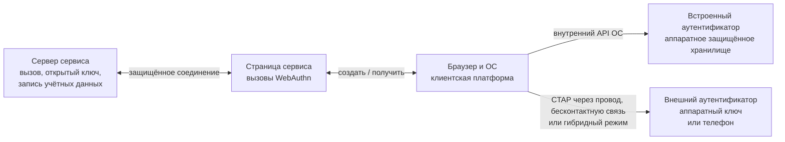
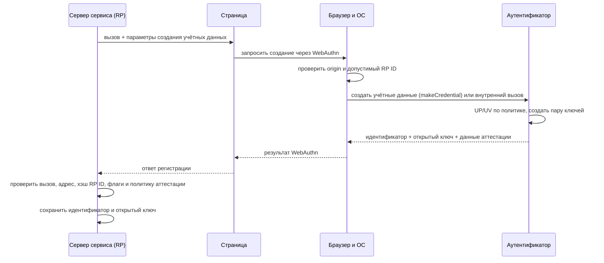
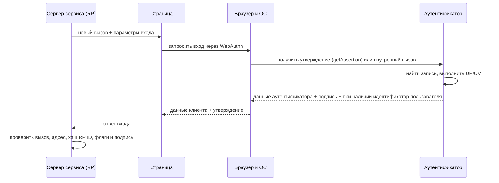

# ⚙️ Протоколы FIDO: U2F, FIDO2, WebAuthn, CTAP и passkeys

> [!info] О чём заметка
> Эта заметка показывает путь запроса от сайта к браузеру, операционной системе и устройству, а затем обратно к серверу. Отдельно разобраны защита от поддельного сайта, различия ранних и современных вариантов FIDO и способы хранения учётных данных. История — в [[FIDO/fido-history|истории FIDO]], выбор железа — в [[FIDO/hardware-security-keys|статье о физических ключах]].

Пароль проходит от пользователя к сайту и потому может попасть на поддельную страницу. Система FIDO (Fast IDentity Online, «быстрая идентификация в сети») устроена иначе: устройство создаёт подпись, а сервер проверяет её, не получая закрытый ключ.

## От пароля к паре ключей

При регистрации устройство создаёт два математически связанных ключа. Закрытый ключ остаётся в телефоне, компьютере или физическом брелоке и создаёт подписи. Открытый ключ получает сервер: он годится только для проверки. Такой способ называют криптографией с открытым ключом, или асимметричной криптографией.

Одна пара не используется сразу для всех сайтов. Для каждого сервиса устройство создаёт отдельную запись, а сервер сохраняет её идентификатор вместе с открытым ключом. Из-за этого утечка одного сервиса не раскрывает ключи для остальных, а украденная серверная база не содержит секрета, которым можно подписать новый вход.

Криптография объясняет основу, но ещё не показывает весь путь запроса. Между сайтом и закрытым ключом находятся страница, браузер, операционная система и сам аутентификатор. Каждый участник проверяет свою часть условий.

## Кто участвует в FIDO-входе

Сайт состоит из страницы и серверной части. Сервер создаёт запрос на регистрацию или вход, хранит открытые ключи и проверяет ответы. В стандарте такой сервис называют доверяющей стороной (relying party, RP). Страница лишь передаёт данные между сервером и браузером по защищённому веб-соединению.

Браузер и операционная система образуют промежуточный слой. Он проверяет, какой сайт просит доступ к ключу, показывает окно подтверждения и выбирает подходящее устройство. Этот слой называют клиентской платформой (client platform).

Закрытый ключ хранит и использует аутентификатор (authenticator). Если он встроен в телефон или компьютер, перед нами платформенный аутентификатор (platform authenticator). Физический брелок или телефон, которым подтверждают вход на другом компьютере, работает как внешний аутентификатор (roaming authenticator).

Страница вызывает в браузере набор функций регистрации и входа. Такой набор функций называют программным интерфейсом приложения (API), а веб-интерфейс этой системы — [[FIDO/webauthn|WebAuthn]]. Когда выбран внешний аутентификатор, браузер или операционная система передаёт ему команды по [[FIDO/ctap|протоколу CTAP]]. Современная связка WebAuthn и CTAP2 называется FIDO2.



CTAP нужен прежде всего для внешнего аутентификатора. Встроенный аутентификатор может общаться с операционной системой через внутренний интерфейс и вообще не использовать CTAP на этом участке. Поэтому один телефон способен играть две роли: обслуживать приложения на самом телефоне как платформенный аутентификатор или подтверждать вход на ноутбуке как внешний.

## Регистрация: от challenge до открытого ключа

Регистрация начинается со свежей случайной задачи, созданной сервером для одной попытки. Устройство должно включить эту задачу в подписываемый ответ, поэтому старый ответ нельзя повторить. В спецификациях такую задачу называют challenge, а порядок «задача, затем подписанный ответ» — challenge-response.

Браузер фиксирует точный адрес страницы, включая схему, имя узла и порт. Эту границу называют origin. Одновременно сервер указывает доменную область, для которой можно создать ключ; это идентификатор доверяющей стороны (RP ID). Браузер не разрешит странице чужого домена выбрать произвольный RP ID.

Клиентская платформа передаёт внешнему ключу команду создать учётные данные; её точное имя в CTAP — `authenticatorMakeCredential`. Аутентификатор создаёт пару ключей для указанного RP ID и сохраняет закрытый ключ со служебными сведениями. Такая внутренняя запись называется источником учётных данных (credential source), а её отдельный идентификатор — credential ID. Сервер получает идентификатор и открытый ключ.

При регистрации устройство может также приложить свидетельство о модели и происхождении. Это свидетельство называют аттестацией (attestation). Обычный сайт способен отказаться от сведений о модели; организация может проверять их, если разрешает только конкретные корпоративные устройства.

Наконец, устройство отмечает способ локального подтверждения. Касание кнопки доказывает присутствие человека и называется User Presence (UP). Ввод локального цифрового кода (PIN) или биометрия проверяют владельца; этот признак называется User Verification (UV). Сервис заранее указывает, какой уровень проверки ему нужен.



## Вход: что именно подписывается

При входе сервер создаёт новый challenge и указывает, какие зарегистрированные ключи подходят. Клиентская платформа просит аутентификатор сформировать подписанный ответ. Такой ответ называется утверждением аутентификатора (assertion). Страница получает его через вызов WebAuthn `navigator.credentials.get()`, а внешний ключ получает CTAP-команду `authenticatorGetAssertion`.

До подписи устройство находит сохранённый источник учётных данных и выполняет требуемое локальное подтверждение. Сервис может ограничиться физическим действием UP или потребовать проверку владельца UV. Биометрический шаблон и PIN при этом не уходят на сервер: сервер видит только флаги успешной проверки.



Аутентификатор подписывает не один challenge. Браузер собирает тип операции, challenge и origin в структуру клиентских данных `clientDataJSON`. Аутентификатор формирует вторую структуру `authenticatorData`: в ней находятся односторонне преобразованный RP ID, флаги UP/UV и счётчик подписей. Поле с результатом преобразования RP ID называется `rpIdHash`, а стандартный алгоритм SHA-256 выдаёт для него 256-битное значение. Формула утверждения выглядит так:

```text
signature = Sign(privateKey, authenticatorData || SHA-256(clientDataJSON))
```

Проще говоря: сервер задаёт одноразовую задачу, браузер фиксирует, с какой страницы она пришла, а аутентификатор привязывает ответ к RP ID. Сервер принимает вход только после проверки всех этих частей.

## Origin и RP ID: две границы доверия

Адрес страницы и область ключа решают разные задачи. Origin включает схему, имя узла и порт, например `https://login.example.com:443`; его записывает браузер в `clientDataJSON`. RP ID содержит доменное имя без схемы и порта, например `example.com`; его хэш аутентификатор помещает в `authenticatorData`.

Явный RP ID должен совпадать с эффективным доменом страницы или быть допустимым суффиксом регистрируемого домена. Поэтому страница `https://login.example.com` способна использовать RP ID `login.example.com` или `example.com`, но не `com` и не чужой домен. Сервер проверяет полный ожидаемый origin и `rpIdHash` независимо.

Фишинговая страница на `gooogle-login.com` не может запросить учётные данные для RP ID настоящего Google. Даже если пользователь не заметил подмену, client platform ограничит область запроса, а настоящий сервер отвергнет origin или `rpIdHash`.

Одноразовый код из SMS или приложения можно ввести на поддельной странице, после чего злоумышленник перенесёт его на настоящую.

Вариант таких кодов, рассчитанный по времени, называют TOTP; этот механизм не связывает код с адресом страницы ([[SMS]]).

> [!warning] Устойчивость к фишингу не равна полной защите аккаунта
> Гарантия предполагает защищённое соединение HTTPS, корректную серверную проверку и доверенный код на origin сервиса. Внедрённый скрипт, который выполняется внутри страницы, слабое восстановление или сохранённый пароль дают атакующему другой путь.

## U2F (CTAP1): второй фактор

**U2F** (Universal 2nd Factor, стандарт 2014 года) не отменяет пароль, а добавляет к нему подпись ключа: сначала обычный вход, потом «коснитесь ключа». Сервер передаёт токену идентификатор записи ключа, а реализация токена сама решает, хранить учётные данные внутри или упаковать их в этот идентификатор.

В документации такой идентификатор называют key handle, или «дескриптором ключа». Поэтому некоторые U2F-ключи поддерживают очень много регистраций без отдельной записи на каждую, но стандарт не обещает безлимитность для любой модели. Счётчик подписей даёт серверу сигнал о возможном клонировании, а не безусловное доказательство. Полный разбор — в [[FIDO/u2f|отдельной заметке об U2F]].

## UAF: беспарольная ветка, которая не взлетела

Параллельно с U2F альянс выпустил **UAF** (Universal Authentication Framework) — беспарольный вход с локальной проверкой пользователя, нацеленный прежде всего на мобильные приложения. Встроенной частью массовой веб-платформы он не стал; позднее FIDO2 стандартизировал похожие пользовательские свойства через другую архитектуру — WebAuthn и CTAP2. Архитектура UAF, варианты внедрения и причины ограниченного распространения разобраны в [[FIDO/uaf|отдельной заметке об UAF]].

## FIDO2: WebAuthn + CTAP2

**FIDO2** — название связки двух взаимодополняющих стандартов. **[[FIDO/webauthn|WebAuthn]]** задаёт интерфейс и проверяемые структуры между сервисом и клиентской платформой. **[[FIDO/ctap|CTAP2]]** задаёт команды и способы доставки между клиентской платформой и внешним аутентификатором. Сайт не отправляет CTAP-команды напрямую, а внешний ключ не общается с сервером по защищённому веб-соединению.

Разделение позволяет одному сайту работать с разными аутентификаторами. WebAuthn-запрос может уйти во встроенное средство Windows Hello, датчик Touch ID или физический ключ. Сайт задаёт требования, клиентская платформа выбирает доступный путь, а сервер проверяет единый формат ответа.

FIDO2 позволил аутентификатору самому найти запись по RP ID, даже если сайт не передал список идентификаторов. Пользователь благодаря этому выбирает учётную запись в системном окне, не вводя логин заранее. Такую запись называют обнаруживаемыми учётными данными (discoverable credential); при входе она может вернуть внутренний идентификатор пользователя в поле `userHandle`.

Обнаруживаемая запись не обязана синхронизироваться, а локальная проверка владельца UV не обязана сопровождать каждую операцию. Способ поиска записи, место аутентификатора, проверка владельца и возможность резервной копии остаются отдельными свойствами.

Для последнего свойства сервер получает два признака. Флаг возможности резервного копирования (Backup Eligibility, BE) показывает, разрешены ли копии для этой записи. Флаг текущего состояния копии (Backup State, BS) сообщает, существует ли такая копия сейчас. Эти признаки не раскрывают название облачного хранилища.

| Вопрос | Возможные варианты | Что меняется |
|---|---|---|
| Где находится аутентификатор | встроенный / внешний | внутренний API ОС или CTAP-транспорт |
| Как находят учётные данные | обнаруживаемые / необнаруживаемые | пустой `allowCredentials` или список идентификаторов |
| Проверен ли человек | UP / UV | касание или локальный PIN/биометрия |
| Можно ли сделать резервную копию | одно устройство / несколько устройств | флаги BE и BS, модель восстановления |

Встроенный аутентификатор способен хранить запись без резервной копии, а внешний аутентификатор может оказаться телефоном с синхронизируемыми ключами доступа. Таблица не описывает четыре готовых типа устройств: она показывает четыре независимых решения.

## Passkeys: синхронизируемые и привязанные к железу

Платформы дали обнаруживаемым учётным данным пользовательское название **passkey**, в русских интерфейсах «ключ доступа». Один ключ доступа можно защищённо копировать между устройствами пользователя; другой остаётся на одном аутентификаторе и не разрешает резервную копию. Второй вариант называют привязанным к устройству (device-bound).

Телефон способен подтвердить вход на чужом компьютере, не перенося закрытый ключ на этот компьютер. Экран показывает QR-код с одноразовыми параметрами связи, а короткий радиосигнал Bluetooth подтверждает близость устройств. Такой путь называют гибридным транспортом (hybrid transport). Устройство хранилищ, механика синхронизации, плюсы, минусы и критика разобраны в [[FIDO/passkeys|отдельной заметке о passkeys]], а выбор отдельного ключа — в [[FIDO/hardware-security-keys|статье о физических ключах]].

## Attestation: когда серверу важен тип аутентификатора

При регистрации аутентификатор может вернуть отдельное свидетельство о происхождении и свойствах устройства. Сервер использует его, если хочет ограничить перечень допустимых моделей и проверить цепочку доверия производителя.

Такое свидетельство называется **attestation**.

Идентификатор типа аутентификатора называют AAGUID, но он сам по себе ничего не доказывает: сервер получает криптографическую гарантию только после проверки структуры свидетельства и подходящей цепочки доверия.

Обычный сайт может запросить `attestation: "none"` и сохранить открытый ключ без знания модели. Такая проверка особенно нужна средам, где политика разрешает только определённые сертифицированные аутентификаторы.

Прямую или корпоративную форму attestation применяют по отдельной политике. Самосвидетельство и `none` не подтверждают конкретную модель производителем.

Attestation создаёт риск корреляции, поэтому потребительские схемы используют сертификаты одной партии или анонимизацию. Число 100 000 относится к рекомендациям и отдельным требованиям сертификации для свидетельств с сохранением приватности, а не к универсальному правилу каждого WebAuthn-аутентификатора.

## Что остаётся на сервере после отказа от пароля

Сервер обязательно хранит credential ID, открытый ключ и связь с аккаунтом. Он также обычно сохраняет счётчик и последние признаки резервного копирования, если использует их в политике риска; WebAuthn рекомендует обновлять это состояние после успешной проверки. Утечка этих данных не позволяет создать валидную подпись без закрытого ключа, но может раскрыть имена пользователей, используемые аутентификаторы и другие метаданные. Поэтому формула «на сервере нечего красть» означает отсутствие секрета для входа, а не отсутствие чувствительных данных.

Для каждого входа сервер обязан проверить тип операции, challenge, origin, `rpIdHash`, требуемые UP/UV-флаги и подпись. Счётчик может дать сигнал о клонировании, сбросе или гонке, но одно несоответствие не доказывает клон. После успешной проверки сервер обновляет сохранённое состояние учётной записи.

## 📚 См. также

- [[FIDO/00-overview|Обзор раздела FIDO]] — оглавление всех заметок об аппаратных ключах
- [[FIDO/fido-history|Что такое FIDO: альянс, стандарты и их история]] — кто и когда всё это создал
- [[FIDO/u2f|U2F (Universal 2nd Factor)]] — первый стандарт семейства подробно: версии, механика, плюсы и минусы
- [[FIDO/webauthn|WebAuthn]] — веб-половина FIDO2: API, церемонии, discoverable credentials
- [[FIDO/ctap|CTAP]] — «железная» половина FIDO2: транспорты, PIN, версии протокола
- [[FIDO/passkeys|Passkeys]] — беспарольный вход: синхронизация, гибридный транспорт, критика
- [[FIDO/uaf|UAF]] — беспарольная ветка FIDO 1.0 и почему она не взлетела
- [[FIDO/hardware-security-keys|Физические ключи безопасности]] — железо: YubiKey, открытые ключи, чек-лист выбора
- [[SMS]] — почему SMS-коды не защищают от фишинга
- 🔗 [WebAuthn Level 3 (W3C Candidate Recommendation)](https://www.w3.org/TR/webauthn-3/) — текущая редакция веб-стандарта
- 🔗 [CTAP 2.3 Proposed Standard (FIDO Alliance)](https://fidoalliance.org/specs/fido-v2.3-ps-20260226/fido-client-to-authenticator-protocol-v2.3-ps-20260226.html) — актуальная опубликованная версия протокола аутентификатора

---

> [!quote] 🤖 Эти статьи открыты — можно обучать на них ИИ
> При желании вы можете натренировать ИИ на наших статьях. Исходное форматирование и скачивание всего репозитория одним zip-архивом доступны в Forgejo: [исходник этой заметки](https://git.zapret.moe/zapretdiscordyoutube/todo/src/branch/main/FIDO/fido-protocols.md) · [весь репозиторий](https://git.zapret.moe/zapretdiscordyoutube/todo/src/branch/main).
