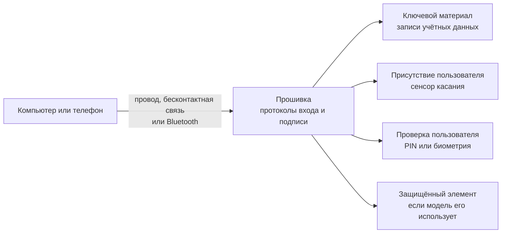
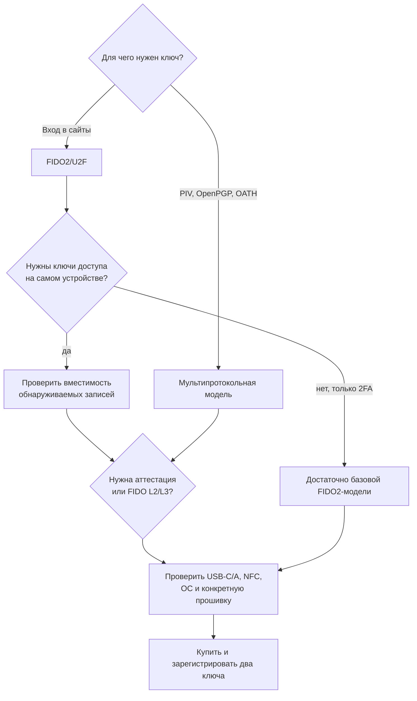

# 🔑 Физические ключи безопасности: YubiKey, открытые ключи и другие типы

> [!info] О чём заметка
> Что такое аппаратный ключ безопасности, как он защищает аккаунты от поддельных страниц, то есть фишинга, и перехвата кодов, чем устройства с открытым исходным кодом отличаются от закрытых, и как выбрать ключ под свои задачи. В заметке также разобраны дополнительные режимы, лимиты памяти, обновления и риски покупки.

## Что такое физический ключ и от чего он защищает

Физический ключ безопасности — маленькое устройство, обычно в виде USB-брелка. При регистрации на сайте оно создаёт пару ключей: закрытый остаётся внутри корпуса и подписывает запросы, открытый уходит серверу и позволяет проверять подпись. Устройство с такой ролью называют аутентификатором (authenticator), а отдельный брелок — внешним аутентификатором (roaming authenticator).

Для каждого входа сервер посылает свежую случайную задачу. В стандартах её называют challenge. Ключ подписывает задачу вместе с данными, которые привязывают ответ к сайту: браузер фиксирует точный адрес страницы (origin), а аутентификатор — доменную область сервиса (RP ID). Подписанный ответ называют assertion. Поэтому ответ, запрошенный на поддельном домене, не подходит настоящему сервису; полная схема challenge-response разобрана в [[FIDO/fido-protocols|заметке о протоколах FIDO]].

Эти правила входят в семейство открытых стандартов FIDO (Fast IDentity Online, «быстрая идентификация в сети»). В обычном сценарии ключ требует физического касания. Если сайт хочет проверить владельца, устройство дополнительно просит локальный цифровой код (PIN) или биометрию. Первый признак называют присутствием пользователя (User Presence, UP), второй — проверкой пользователя (User Verification, UV).

Пароль можно подсмотреть, украсть из утёкшей базы или выманить фишингом, а SMS-код — перехватить или выпросить у жертвы ([[SMS]]). Аппаратный ключ убирает переносимый секрет из основного входа, но не мешает вредоносной программе использовать уже открытую сессию и не усиливает слабое восстановление аккаунта.

## Что находится внутри ключа

Корпус и USB-разъём не определяют уровень защиты. Команды принимает программа внутри микроконтроллера; её называют прошивкой (firmware). Некоторые модели дополнительно используют отдельную микросхему, которая изолирует ключевой материал и выполняет защищённые операции. Это защищённый элемент (secure element), но сам логотип FIDO не гарантирует его наличие.

Часть ключей умеет сама найти сохранённую запись по сайту и показать аккаунт без заранее введённого логина. Такую запись называют обнаруживаемыми учётными данными (discoverable credential); именно их количество производители указывают как вместимость ключей доступа. Другие регистрации не занимают такой слот, потому что сайт заранее передаёт ключу идентификатор нужной записи.

Ключ подключается проводом USB или через бесконтактный канал NFC. Отдельные сценарии используют Bluetooth Low Energy (BLE), экономичный режим Bluetooth. Способ подключения доставляет команды, но не меняет криптографическую проверку.

Совместимость FIDO2 отвечает на вопрос «понимает ли устройство протокол». Отдельная сертификация проверяет дополнительные свойства защиты конкретной модели и версии. В каталоге её уровень называют Authenticator Security Level; обозначения L1, L2, L3 и L3+ соответствуют последовательно более строгим наборам требований. Логотип бренда не заменяет поиск точной модели в [каталоге FIDO Certified Products](https://fidoalliance.org/certification/fido-certified-products/).

> [!important] От чего ключ НЕ защищает
> Ключ подтверждает вход, но не лечит заражённую систему: если на компьютере троян, он может работать в уже открытой сессии. Ключ также не спасёт от восстановления доступа через слабый резервный канал — если к аккаунту привязана SMS-«запаска», атакующий пойдёт через неё. После привязки ключа отключайте слабые методы восстановления.

## Протоколы: что умеют ключи

Базовой модели достаточно для входа на сайты. Старый вариант добавляет подпись ключа вторым шагом после пароля и называется U2F (Universal 2nd Factor, «универсальный второй фактор»). Современный FIDO2 также поддерживает вход без пароля. В нём страница обращается к браузеру через WebAuthn, а браузер или операционная система передаёт команды внешнему ключу по CTAP. Подробная механика этих протоколов разобрана в [[FIDO/fido-protocols|отдельной заметке]].

Более дорогие модели решают дополнительные задачи. Они могут хранить секреты для одноразовых кодов, которые меняются по времени или счётчику; семейство таких режимов обозначают OATH-TOTP/HOTP. Другие модели работают как корпоративная смарт-карта по стандарту PIV или хранят ключи шифрования и электронной подписи в формате OpenPGP. Фирменный режим Yubico OTP печатает одноразовый код как клавиатура. Именно этот дополнительный набор, а не качество FIDO-входа само по себе, часто объясняет разницу в цене.

| Протокол | Что делает | Где встречается |
|---|---|---|
| **[[FIDO/u2f\|FIDO U2F]]** (CTAP1) | Второй фактор к паролю: сайт проверяет подпись токена после ввода пароля | Большинство FIDO2-ключей ради совместимости; существуют U2F-only и специализированные CTAP2-only устройства |
| **FIDO2** ([[FIDO/webauthn\|WebAuthn]] + [[FIDO/ctap\|CTAP2]]) | Регистрация и вход с discoverable или non-discoverable credentials, опциональными PIN/биометрией | Модели с заявленной поддержкой CTAP2; наличие passkeys и лимит памяти проверяют отдельно |
| **OATH-TOTP/HOTP** | Хранение секретов для одноразовых кодов (как Google Authenticator, но секреты — в железе) | YubiKey 5, Nitrokey 3, OnlyKey |
| **PIV** (смарт-карта) | Корпоративный стандарт смарт-карт: вход в Windows/macOS, подпись документов, клиентские TLS-сертификаты | YubiKey 5, YubiKey Bio Multi-protocol, Nitrokey 3 |
| **OpenPGP card** | Хранение GPG-ключей: подпись коммитов, шифрование почты, SSH-аутентификация через gpg-agent | YubiKey 5, Nitrokey 3, OnlyKey |
| **Yubico OTP** | Фирменные одноразовые пароли Yubico: ключ «печатает» код как клавиатура | Только YubiKey |

Обнаруживаемые учётные данные получили в интерфейсах название «ключи доступа», или passkeys. В физическом ключе такая запись обычно остаётся на одном аутентификаторе и не допускает резервной копии; в спецификациях это свойство называют single-device credential. Для выбора железа важен лимит памяти: YubiKey 5 с прошивкой 5.7.4+ хранит до 100 обнаруживаемых записей, Titan Security Key поколения 2023 года — более 250, Token2 PIN+ Release 2/3 — до 300. Nitrokey 3 вмещает примерно 30 в NFC-вариантах и около 100 в Mini, а Nitrokey Passkey — более 100. Все числа относятся к конкретным версиям производителя.

## YubiKey — ключи Yubico

**Yubico** — шведско-американская компания, основанная в 2007 году; вместе с Google она разработала стандарт U2F и фактически создала рынок таких устройств. «YubiKey» стал нарицательным именем для аппаратных ключей примерно как «ксерокс» для копиров.

Актуальные линейки и стартовые цены по каталогу Yubico на август 2026 года:

- **Security Key Series** (синие) — FIDO2/U2F, от $29. Для входа в сайты этого достаточно; старшая серия нужна только при необходимости других протоколов.
- **YubiKey 5 Series** — мультипротокольные (FIDO2, U2F, PIV, OpenPGP, OATH, Yubico OTP), от $58. Есть USB-A/USB-C, NFC и nano-варианты; точный набор зависит от модели.
- **YubiKey Bio** — использует отпечаток или PIN. FIDO Edition поддерживает FIDO2/U2F, Multi-protocol Edition добавляет PIV.
- **FIPS-серия** — модели для регулируемых сред. YubiKey 5 FIPS 5.7.4 получил сертификат FIPS 140-3 № 5291 в мае 2026 года; старые сертификаты FIPS 140-2 постепенно переходят в Sunset List.

Прошивка YubiKey **закрыта и принципиально не обновляется**: Yubico считает, что невозможность перепрошивки — защита от подмены прошивки атакующим. Обратная сторона — найденную уязвимость нельзя закрыть на уже проданных ключах, только заменить ключ.

Исследователи назвали EUCLEAK атаку по побочному каналу, которая при физическом доступе позволяет извлекать секреты из уязвимой криптографической библиотеки микроконтроллера. Для обычного удалённого взлома она не подходит, но показывает цену неизменяемой прошивки.

> [!warning] EUCLEAK — показательный случай (сентябрь 2024)
> YSA-2024-03 затрагивает YubiKey 5 и Security Key версий ранее 5.7.0, YubiKey Bio ранее 5.7.2 и YubiHSM 2 ранее 2.4.0; версии 5.7.0, 5.7.2 и 2.4.0 соответственно не затронуты. В предупреждении производителя также перечислены отдельные FIPS- и CSPN-линейки. Для атаки нужны физический доступ, знание целевого аккаунта и специализированное оборудование. Основной риск относится к FIDO, а PIV/OpenPGP затрагиваются при определённых алгоритмах. Уязвимость нельзя закрыть обновлением уже проданного YubiKey из-за неизменяемой прошивки; новые версии перешли на другую криптографическую библиотеку.

## «Открытые» ключи: open-source прошивки и железо

> [!note] Не путать с «открытым ключом» из криптографии
> В русской криптографической терминологии «открытый ключ» — это public key, открытая половина ключевой пары. Здесь же речь о другом: об аппаратных ключах с **открытым исходным кодом** (open-source) прошивки и/или схемотехники. В английском их называют open-source security keys.

Зачем вообще открытость? Ключ — это чёрный ящик, которому вы доверяете самое ценное. У закрытого ключа приходится верить производителю на слово: что нет бэкдора, что генератор случайных чисел честный, что закрытые ключи действительно не извлекаются. Открытая прошивка позволяет проверить это независимым аудитом — или хотя бы знать, что проверка возможна. Плата за открытость: обычно меньше протоколов, меньше сертификаций и менее «вылизанное» железо.

### OpenSK — открытая прошивка от Google

**OpenSK** — исследовательский проект Google, опубликованный в январе 2020 года. Это реализация FIDO2/CTAP2 на языке Rust поверх операционной системы TockOS для совместимых плат, например Nordic nRF52840, а не готовый массовый продукт. Ветка CTAP 2.0 проходила FIDO-сертификацию, но текущая ветка разработки `develop` не наследует её автоматически. Файл с основным описанием проекта README называет OpenSK экспериментальным прототипом, или proof of concept, и не рекомендует его для повседневной защиты. Код: [github.com/google/OpenSK](https://github.com/google/OpenSK).

### SoloKeys — первый открытый FIDO2-ключ

**Solo** (проект SoloKeys) собрал деньги через краудфандинговую площадку Kickstarter в 2018 году как ранний FIDO2-ключ с открытыми прошивкой и схемотехникой. Второе поколение **Solo 2** получило прошивку на языке Rust и NFC. В 2026 году репозиторий снова активно обновляется; команда различает Solo 2 Secure с подписанной прошивкой и Hacker с разблокированной. Статус FIDO2-сертификации конкретной модели нужно проверять перед покупкой, а прошлое затишье проекта остаётся аргументом оценить поддержку и поставки.

### Nitrokey — немецкие открытые ключи

**Nitrokey** (Берлин) развивает открытые ключи с подписанными обновлениями. **Nitrokey 3** (3A NFC, 3C NFC и Mini) построен на программной основе Trussed, написанной на языке Rust, и поддерживает FIDO2, OATH, OpenPGP и PIV в актуальных прошивках. SE050 используется для OpenPGP/PIV и дополнительной случайности, но учётные данные FIDO хранятся как зашифрованные данные во флеш-памяти, поэтому фраза «FIDO-ключи лежат в SE050» неверна. **Nitrokey Passkey** поддерживает FIDO2/U2F без OpenPGP; производитель поставляет одну прошивку и не требует обновления. Сертификацию проверяют по модели: Nitrokey 3A Mini получил FIDO L1, это не распространяется автоматически на всю линейку.

### OnlyKey — ключ с PIN-клавиатурой

**OnlyKey** сочетает FIDO2/U2F с менеджером паролей, OATH и дополнительными криптографическими функциями. Шестикнопочная модель требует вводить PIN на самом ключе; OnlyKey DUO имеет три кнопки и допускает ввод через приложение. Документация описывает два профиля и 24 слота, а прошивка проверяется подписью CryptoTrust. Такой гибрид функциональнее простого FIDO-ключа, но увеличивает число режимов и сложность эксплуатации.

## Другие производители и типы

- **Google Titan Security Key** — актуальные модели USB-A/NFC и USB-C/NFC поколения 2023 года хранят более 250 passkeys. В 2019 году Google заменяла затронутые BLE-модели T1/T2 из-за ошибки сопряжения; USB/NFC-модели этой проблемой не затрагивались. В 2021 году компания прекратила продавать Bluetooth-вариант и оставила USB+NFC.
- **Token2** — возможности зависят от версии устройства. PIN+ Release 1 хранит до 50 passkeys, Release 2/3 — до 300; Release 3 поддерживает OpenPGP, а Release 3.3 добавляет PIV. Серия получила FIDO Level 2 в январе 2025 года, но уровень и прошивку конкретной модели всё равно проверяют отдельно.
- **Feitian** — линейки ePass и BioPass включают множество моделей с разными наборами NFC, BLE, PIV, OTP и биометрии. Например, BioPass K26 заявляет максимум 128 учётных записей. Название производителя не гарантирует одинаковые возможности: нужен точный K-номер и запись в каталоге сертификации.
- **Thetis, Kensington VeriMark, Hideez и др.** — бюджетные и нишевые ключи; VeriMark ориентирован в первую очередь на встроенную проверку Windows Hello.
- **Смарт-карты** (OpenPGP card, PIV-карты) — отдельный форм-фактор и набор приложений, обычно требующий считывателя. Это не обязательно «тот же чип», что в FIDO-брелоке.
- **HSM** — серверный аппаратный модуль со стандартным программным интерфейсом PKCS#11, политиками доступа, аудитом и резервированием. Он решает другую задачу и не является персональным ключом входа.
- **Телефон как ключ** — Android и iOS хранят ключи для собственных приложений во встроенном аутентификаторе, а на другом компьютере телефон может подтвердить вход по QR-коду и проверке близости. Учётные данные телефона могут допускать синхронизацию между устройствами (multi-device) или оставаться на одном аутентификаторе (single-device); облачная копия не обязательна.

## Как выбрать: чек-лист

Сначала выберите угрозу и рабочий сценарий, затем бренд. Простой FIDO2-ключ может защищать веб-вход лучше дорогой мультипротокольной модели, если дополнительные функции не используются. И наоборот, корпоративный PIV или OpenPGP требует конкретного протокола, которого нет в дешёвой Security Key Series.

| Угроза | Что даёт ключ | Чего не даёт |
|---|---|---|
| Фишинг логина | привязка к origin и RP ID, подпись одноразового вызова | не защищает слабый запасной вход по паролю или SMS |
| Утечка базы сервиса | закрытый ключ не лежит на сервере | метаданные аккаунта всё равно могут утечь |
| Кража токена | PIN/биометрия могут дать UV и лимит попыток | U2F-only касание не идентифицирует владельца |
| Вредонос на компьютере | не извлекает закрытый ключ через обычный программный интерфейс | может использовать открытую сессию и подменять действия |
| Подмена товара | аттестация и фирменная проверка подлинности иногда помогают | сертификация не контролирует конкретного продавца и логистику |

- [ ] **Определите задачу.** Только вход в сайты (Google, GitHub, соцсети, криптобиржи) → достаточно FIDO2-ключа: Yubico Security Key, Token2 PIN+, Nitrokey Passkey. GPG-подписи, SSH-ключи, корпоративные смарт-карты → мультипротокольный: YubiKey 5, Nitrokey 3, OnlyKey.
- [ ] **Разъёмы и NFC.** Ключ должен физически втыкаться в ваши устройства; для входа со смартфона берите версию с NFC (iPhone поддерживает NFC-ключи с iOS 13.3).
- [ ] **Открытость или сертификация.** Максимальная проверяемость → Nitrokey (или OpenSK для энтузиастов). Максимальная «промышленная» зрелость и совместимость → YubiKey.
- [ ] **Купите два ключа сразу** и зарегистрируйте оба до удаления старого метода. Резервный храните отдельно; коды восстановления — в месте без сетевого доступа.
- [ ] **Проверьте восстановление.** Убедитесь, что второй ключ и коды восстановления работают. После этого уберите SMS/почту или защитите их не слабее основного входа, если сервис позволяет. В Google строгий режим включается программой усиленной защиты Advanced Protection (см. также [[Privacy Google]]).
- [ ] **Покупка в России.** Доступность официальной доставки и авторизованных каналов в РФ меняется; проверяйте актуальные условия у производителя и продавца. Посредник или маркетплейс добавляет риск подмены, поэтому выбирайте запечатанный товар из прослеживаемого источника и используйте фирменную проверку подлинности (у Yubico — сервис yubico.com/genuine).

> [!warning] Сертификация не проверяет всю цепочку поставок
> FIDO certification подтверждает совместимость и заявленный Authenticator Security Level конкретной модели и версии. Она не гарантирует безопасность продавца, доставки или упаковки вашего экземпляра. Покупайте у производителя или авторизованного продавца, сверяйте модель и прошивку, а для YubiKey используйте [официальную проверку подлинности](https://www.yubico.com/genuine/).

## 📚 См. также

- [[FIDO/00-overview|Обзор раздела FIDO]] — оглавление всех заметок об аппаратных ключах
- [[FIDO/fido-protocols|Протоколы FIDO]] — механика U2F, FIDO2/WebAuthn, CTAP и passkeys
- [[FIDO/fido-history|Что такое FIDO и его история]] — альянс и хронология стандартов
- [[FIDO/passkeys|Passkeys]] — беспарольный вход: синхронизация, гибридный транспорт, критика
- [[Cybersecurity|Кибербезопасность]] — подборка материалов по кибербезопасности
- [[SMS]] — почему SMS — слабый канал для кодов и восстановления доступа
- [[Privacy Google]] — приватность и настройки аккаунта Google
- 🔗 [Спецификации FIDO Alliance](https://fidoalliance.org/specifications/) — первоисточник по U2F/FIDO2/WebAuthn
- 🔗 [Документация Yubico](https://docs.yubico.com/) — протоколы и линейки YubiKey
- 🔗 [google/OpenSK](https://github.com/google/OpenSK) — открытая FIDO2-прошивка
- 🔗 [Nitrokey Docs](https://docs.nitrokey.com/) — документация Nitrokey 3
- 🔗 [FIDO Certified Products](https://fidoalliance.org/certification/fido-certified-products/) — проверка модели, версии и уровня сертификации
- 🔗 [Yubico YSA-2024-03](https://www.yubico.com/support/security-advisories/ysa-2024-03/) — точный список версий, затронутых EUCLEAK

---

> [!quote] 🤖 Эти статьи открыты — можно обучать на них ИИ
> При желании вы можете натренировать ИИ на наших статьях. Исходное форматирование и скачивание всего репозитория одним zip-архивом доступны в Forgejo: [исходник этой заметки](https://git.zapret.moe/zapretdiscordyoutube/todo/src/branch/main/FIDO/hardware-security-keys.md) · [весь репозиторий](https://git.zapret.moe/zapretdiscordyoutube/todo/src/branch/main).
