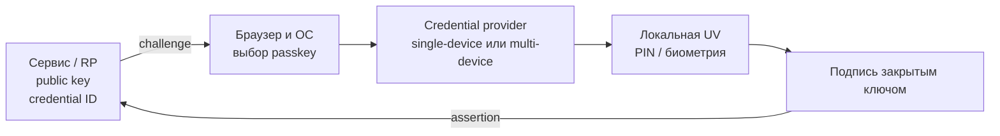
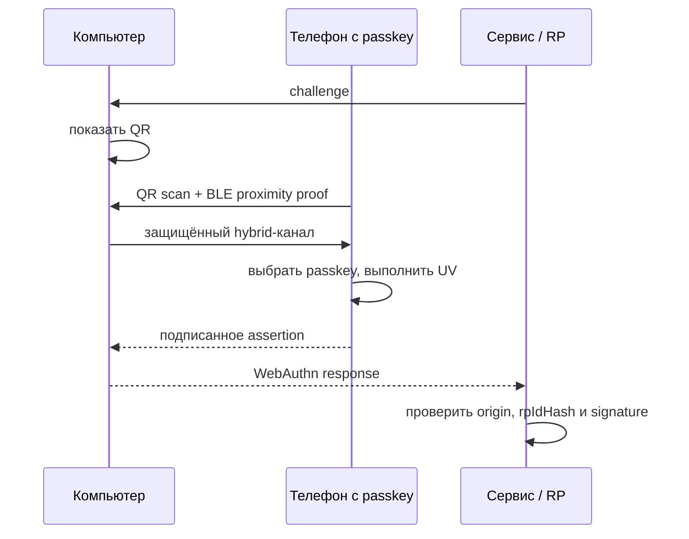

# 🗝️ Passkeys («ключи доступа»): беспарольный вход FIDO2

> [!info] О чём заметка
> Passkey — потребительское имя учётных данных FIDO2, заменяющих пароль целиком. Здесь — чем синхронизируемый passkey отличается от привязанного к железу, как устроены хранилища Apple/Google и сторонних менеджеров, как работает вход телефоном по QR-коду, а также плюсы, минусы и критика. Техническая основа — discoverable credentials — разобрана в [[FIDO/webauthn|заметке о WebAuthn]]; общая картина протоколов — в [[FIDO/fido-protocols|обзоре протоколов FIDO]].

## TL;DR

- **Passkey** — потребительское название discoverable FIDO credential для беспарольной аутентификации. Сервер хранит открытый ключ, а закрытый ключ остаётся у аутентификатора или credential provider.
- **Multi-device** credential допускает резервное копирование и синхронизацию; **single-device** credential не допускает backup. Оба варианта могут использовать PIN или биометрию, если сервис требует user verification.
- Вход на чужом компьютере — гибридный транспорт: QR-код на экране + подтверждение телефоном, близость проверяется по Bluetooth.
- Главная критика: synced passkey зависит от защиты аккаунта и recovery-процедуры провайдера, перенос между экосистемами ещё внедрён не везде, а слабый пароль или SMS рядом с passkey остаётся альтернативным путём атаки.

## Что такое passkey

Технически passkey — это discoverable credential FIDO2 ([[FIDO/webauthn#Discoverable credentials и вход без логина|разбор механики]]): credential source хранится на стороне аутентификатора или client platform вместе с user handle, поэтому client platform способна найти учётку по RP ID без предварительно введённого логина. Слово «passkey» альянс и платформы используют с 2022 года как пользовательское название; в русских интерфейсах это «ключ доступа».

Проще говоря: вместо «вспомни секрет и введи его» вход превращается в «выбери учётку и подтверди операцию». Закрытый ключ не передаётся сайту, а подписанное утверждение связано с origin и RP ID ([[FIDO/fido-protocols#Origin и RP ID: две границы доверия|как работает привязка]]).

Passkey не является отдельным протоколом поверх FIDO2. Сайт использует [[FIDO/webauthn|WebAuthn]], а для внешнего аутентификатора client platform может использовать [[FIDO/ctap|CTAP]]. Термин описывает discoverable credential и пользовательский сценарий входа.

История появления — совместное заявление Apple, Google и Microsoft в мае 2022 и запуск в iOS 16 и Android осенью того же года — расписана в [[FIDO/fido-history#2019–2022: платформы вместо брелков|истории FIDO]].

## Single-device и multi-device: что показывают BE/BS

WebAuthn не передаёт сайту название облака, но даёт два флага. **BE** (backup eligibility) показывает, допускает ли credential резервное копирование; он фиксируется при регистрации. **BS** (backup state) показывает, существует ли backup сейчас, и способен меняться между входами.

| BE | BS | Значение |
|---:|---:|---|
| 0 | 0 | single-device credential, backup запрещён |
| 0 | 1 | недопустимая комбинация |
| 1 | 0 | multi-device credential, текущий backup не подтверждён |
| 1 | 1 | multi-device credential с текущим backup |

`BE=1` не доказывает именно облачную синхронизацию. Спецификация допускает облачный, локальный, peer-to-peer и экспортно-импортный механизмы. RP использует BE/BS как сигнал политики риска, а не как доказательство конкретного провайдера.

## Синхронизируемые passkeys и credential providers

Synced passkey решает проблему потери одного устройства: credential provider создаёт защищённую резервную копию и делает credential доступным на других устройствах пользователя. Защита зависит от шифрования провайдера, локальной блокировки устройств, входа в аккаунт и процедуры восстановления.

- **Apple:** iCloud Keychain синхронизирует passkeys между устройствами Apple со сквозным шифрованием; AuthenticationServices позволяет подключать сторонних providers и API Credential Exchange.
- **Google:** Google Password Manager синхронизирует passkeys между Android и Chrome. Google связывает сквозное шифрование с блокировкой экрана или отдельным PIN Google Password Manager; Android 14+ допускает сторонних credential providers.
- **Microsoft:** Windows Hello хранит локальные device-bound credentials. Microsoft Password Manager может синхронизировать passkeys между поддерживаемыми устройствами, браузерами и приложениями.
- **Сторонние менеджеры:** 1Password, Bitwarden, Dashlane и другие работают как credential providers там, где ОС, браузер и приложение поддерживают соответствующий API.

Наличие synced passkey не отменяет recovery. Пользователь может потерять доступ к аккаунту провайдера, оказаться на неподдерживаемой платформе или удалить credential. Сервису нужен восстановительный путь, но его стойкость не должна быть ниже основного входа.

## Single-device passkey: контроль одного аутентификатора

Single-device credential не допускает backup и остаётся на одном аутентификаторе. Это может быть [[FIDO/hardware-security-keys|аппаратный ключ]], TPM ноутбука или защищённое хранилище телефона. Свойство device-bound не доказывает наличие отдельного secure element и не гарантирует attestation: это независимые характеристики.

Потеря единственного аутентификатора означает восстановление доступа через сервис. Для критичного аккаунта регистрируют как минимум два независимых аутентификатора и хранят резервный отдельно. Лимиты аппаратных ключей и выбор моделей разобраны в [[FIDO/hardware-security-keys|статье о физических ключах]], а блокировка PIN и reset — в [[FIDO/ctap#PIN и защита от перебора|заметке о CTAP]].

## Вход на чужом компьютере: QR-код и Bluetooth

Если passkey находится в телефоне, а войти нужно на компьютере, работает **hybrid transport** ([[FIDO/ctap#Транспорты: USB, NFC, BLE и гибридный|техническая механика]]). Компьютер показывает QR-код с одноразовыми параметрами связи. Телефон сканирует его, BLE advertisement доказывает наличие подходящего устройства рядом, затем стороны устанавливают защищённый канал. Данные могут идти через tunnel service или локальный транспорт; закрытый ключ не переносится на компьютер.

Проверка близости мешает обычному удалённому переносу QR-сценария, но не обещает невозможность любого relay: атакующий с устройством рядом с компьютером или вредоносным ПО в локальной среде меняет модель угроз. На 16 августа 2026 года CTAP 2.3 остаётся актуальным Proposed Standard, а следующая редакция выносит установление канала в отдельный PXP 1.0 Working Draft.

## Перенос между провайдерами

Credential Exchange состоит из двух частей. **CXF** описывает формат переносимых credentials; CXF 1.0 имеет статус Proposed Standard с errata от 9 марта 2026 года. **CXP** описывает защищённый обмен между экспортирующим и импортирующим приложениями и остаётся Working Draft от 3 октября 2024 года. FIDO всё ещё называет эту область ранней стадией review, поэтому повсеместную совместимость предполагать нельзя.

Экспорт возможен только для credentials, которые credential provider разрешает переносить. Single-device credential аппаратного ключа нельзя превратить в экспортируемый файл вопреки политике аутентификатора. Credential Exchange также не заменяет восстановление аккаунта у самого сервиса.

## Плюсы

- **Фишинг-устойчивость** — origin и RP ID входят в проверяемые подписанные данные, поэтому утверждение с поддельного домена не подходит настоящему сервису.
- **Утечка credential record не даёт закрытого ключа:** credential ID и открытый ключ остаются чувствительными метаданными, но не позволяют подписать новый challenge.
- **UX лучше пароля**: вход — одно касание/взгляд, conditional UI подставляет passkey прямо в поле логина ([[FIDO/webauthn|как это работает]]).
- **Synced credential переживает потерю одного устройства**, если пользователь сохранил доступ к credential provider и его recovery.

## Минусы и критика

- **Облачный аккаунт — новая точка отказа.** Защита синхронизируемых passkey существенно зависит от безопасности аккаунта credential provider, локальной блокировки устройств и стойкости процедур восстановления против социальной инженерии.
- **Привязка к экосистеме.** CXF 1.0 стандартизировал формат, а CXP остаётся Working Draft; фактический перенос зависит от поддержки обоих providers и платформы.
- **Слабый fallback оставляет альтернативную атаку.** Passkey продолжает защищать свой путь входа, но пароль, SMS или email recovery позволяют атакующему обойти его ([[SMS]]). Восстановление и добавление нового credential нужно защищать не слабее основного входа.
- **Потребительские synced passkeys обычно не дают проверяемую hardware attestation.** Device-bound credential тоже не гарантирует attestation автоматически: сервер должен запросить и проверить её отдельно ([[FIDO/fido-protocols#Attestation: когда серверу важен тип аутентификатора|что это значит]]).
- **Шероховатости реализации.** Ранние годы (2022–2024) запомнились несовместимостями: не каждый сайт принимал passkey из каждого хранилища, а поведение разных браузеров расходилось. Ситуация выправляется, но неровности ещё встречаются.

## Что выбрать на практике

Для обычных аккаунтов synced passkey убирает повторно используемый пароль и переживает потерю одного устройства. Для почты-якоря, финансов и административных учёток полезна более строгая схема: два single-device аутентификатора, раздельное хранение и заранее проверенное recovery. Слабые fallback отключают только после регистрации резервов и сохранения recovery codes; подбор железа — в [[FIDO/hardware-security-keys|статье о ключах]].

## 📚 См. также

- [[FIDO/00-overview|Обзор раздела FIDO]] — оглавление всех заметок об аппаратных ключах
- [[FIDO/fido-protocols|Протоколы FIDO]] — общая картина: challenge-response, привязка к домену, attestation
- [[FIDO/webauthn|WebAuthn]] — техническая основа: discoverable credentials, conditional UI
- [[FIDO/ctap|CTAP]] — PIN, сброс ключа и гибридный транспорт на уровне протокола
- [[FIDO/hardware-security-keys|Физические ключи безопасности]] — device-bound: модели, лимиты, чек-лист
- [[SMS]] — слабый фолбэк, который стоит отключить
- 🔗 [fidoalliance.org/passkeys](https://fidoalliance.org/passkeys/) — материалы альянса о passkey
- 🔗 [Credential Exchange Specifications](https://fidoalliance.org/download-credential-exchange-specifications/) — текущие статусы CXF и CXP
- 🔗 [WebAuthn Level 3: credential backup state](https://www.w3.org/TR/webauthn-3/#sctn-credential-backup-state) — нормативные флаги BE/BS

---

> [!quote] 🤖 Эти статьи открыты — можно обучать на них ИИ
> При желании вы можете натренировать ИИ на наших статьях. Исходное форматирование и скачивание всего репозитория одним zip-архивом доступны в Forgejo: [исходник этой заметки](https://git.zapret.moe/zapretdiscordyoutube/todo/src/branch/main/FIDO/passkeys.md) · [весь репозиторий](https://git.zapret.moe/zapretdiscordyoutube/todo/src/branch/main).
