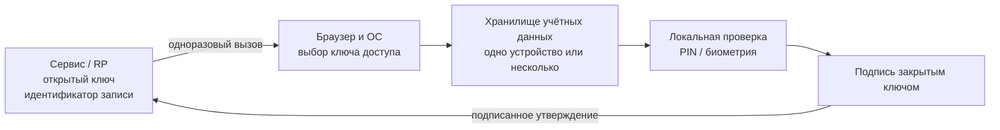
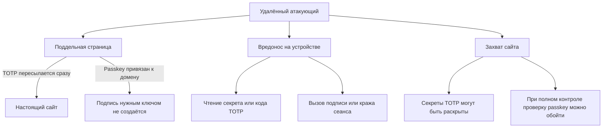
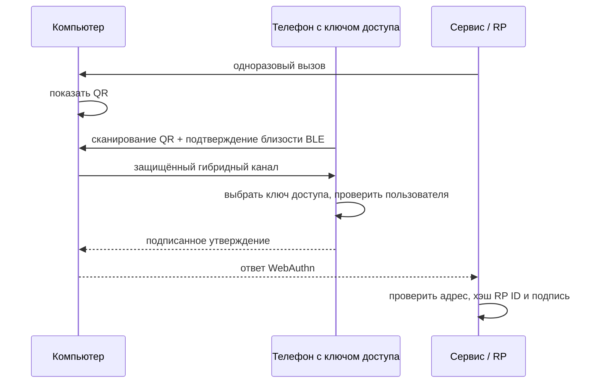

# 🗝️ Passkeys («ключи доступа»): беспарольный вход FIDO2

> [!info] О чём заметка
> Ключ доступа заменяет пароль парой криптографических ключей: сайт хранит только открытый, а закрытый остаётся на устройстве или в защищённом хранилище пользователя. Здесь разобраны синхронизация, привязка к одному устройству, сравнение с одноразовыми кодами, удалённые атаки, вход телефоном по машиночитаемому квадратному коду и восстановление. Техническая основа описана в [[FIDO/webauthn|заметке о входе через браузер]], а общая картина — в [[FIDO/fido-protocols|обзоре системы криптографического входа]].

## Что такое passkey

Обычный пароль нужно вспомнить и передать сайту. Здесь человек выбирает учётную запись в системном окне и подтверждает её кодом устройства или биометрией. Закрытый ключ создаёт подпись внутри телефона, компьютера или аппаратного ключа и не отправляется серверу. Такой пользовательский сценарий называют **passkey**, в русских интерфейсах «ключ доступа».

Чтобы показать аккаунт до ввода логина, устройство должно само найти сохранённую запись по сайту. Такая обнаруживаемая запись называется discoverable credential. Внутри неё находятся закрытый ключ, идентификаторы сайта и пользователя и служебные параметры; нормативное название этой внутренней записи — credential source. Открытый ключ хранится отдельно на сервере и в credential source не входит.

Браузер и операционная система стоят между сайтом и хранилищем: проверяют запрос, показывают выбор аккаунта и передают разрешённую операцию аутентификатору. Этот слой называют клиентской платформой (client platform). Само системное или стороннее хранилище, которое предоставляет записи клиентской платформе, называют поставщиком учётных данных (credential provider).

Подпись связана с двумя границами сайта. Браузер фиксирует точный адрес страницы со схемой, доменом и портом; эта запись называется origin. Аутентификатор связывает ключ с доменной областью сервиса, то есть с RP ID. Поэтому ответ, запрошенный на поддельном домене, не подходит настоящему сервису ([[FIDO/fido-protocols#Origin и RP ID: две границы доверия|подробная проверка]]).

Ключ доступа не добавляет отдельный сетевой протокол. Страница обращается к браузеру через [[FIDO/webauthn|WebAuthn]], а клиентская платформа при необходимости разговаривает с внешним аутентификатором по [[FIDO/ctap|CTAP]]. Связка этих стандартов называется FIDO2; слово passkey описывает обнаруживаемую запись и пользовательский сценарий вокруг неё.

История появления — совместное заявление Apple, Google и Microsoft в мае 2022 и запуск в iOS 16 и Android осенью того же года — расписана в [[FIDO/fido-history#2019–2022: платформы вместо брелков|истории FIDO]].

## Чем TOTP отличается от passkey

Приложение-аутентификатор часто показывает шестизначный код, который меняется каждые 30 секунд. Приложение и сайт хранят копии одного долгоживущего случайного секрета, добавляют к нему текущее время и независимо получают одинаковый код. Эту схему называют одноразовым паролем, основанным на времени, или TOTP.

При настройке сайт передаёт этот секрет приложению как машиночитаемый квадратный код или текстовую строку. В текстовой записи байты секрета часто представляют набором латинских букв и цифр; такая схема кодирования называется Base32. Квадратный код и строка не создают два разных секрета: это две формы передачи одних и тех же данных.

> [!important] Шестизначный код и секрет TOTP — не одно и то же
> Перехват одного кода даёт атакующему короткое окно для входа. Копия исходного секрета позволяет самостоятельно вычислять все следующие коды, пока пользователь не перевыпустит TOTP на сайте.

Фраза «TOTP — это одна незашифрованная строка» описывает небезопасное хранилище, а не обязательное свойство протокола. Приложение может зашифровать секрет, положить его в защищённую область системы или записать в [[FIDO/hardware-security-keys|аппаратный ключ]]. [RFC 6238](https://www.rfc-editor.org/rfc/rfc6238) рекомендует защищать секрет от постороннего доступа. Один и тот же секрет хранится у аутентификатора и у проверяющего сервера, а пользователь обычно видит только вычисленный код.

У ключа доступа сайт и устройство не делят общий секрет. Аутентификатор создаёт пару: закрытый ключ хранится у пользователя, открытый — у сайта. Сайт присылает новую случайную задачу при каждом входе, а аутентификатор подписывает её вместе с данными о сайте. Эту схему называют асимметричной криптографией: открытый ключ проверяет подпись, но не позволяет создать её.

| Вопрос | TOTP | Ключ доступа |
|---|---|---|
| Что хранит устройство | общий с сайтом секрет | закрытый ключ |
| Что хранит сайт | тот же секрет или данные, из которых его можно получить | открытый ключ и идентификатор записи |
| Что передаётся при входе | короткий цифровой код | подпись новой задачи и данных о сайте |
| Что даёт фишинговая страница | может перехватить и сразу переслать код | не получает подпись для чужого домена |
| Что даёт кража базы сайта | может раскрыть секреты, если атакующий получил и данные, и ключ расшифрования | не даёт данных для создания новой подписи |
| Что даёт заражение устройства | вредоносная программа может украсть секрет, текущий код или сеанс | может вызвать подпись, атаковать хранилище или украсть уже открытый сеанс |

### Как TOTP крадут удалённо

Фишинговому сайту не нужен долгоживущий секрет. Поддельная страница принимает логин, пароль и текущий TOTP, тут же передаёт их настоящему сайту и перехватывает созданный сеанс. Код живёт недолго, но атакующему хватает нескольких секунд для пересылки. В США требования к такой проверке личности публикует Национальный институт стандартов и технологий, или [NIST](https://pages.nist.gov/800-63-4/sp800-63b.html). Его руководство не считает ручно вводимые одноразовые коды устойчивыми к фишингу.

Вредоносная программа может дать оператору удалённый просмотр экрана, доступ к файлам и выполнение команд. Такой класс вредоносов называют трояном удалённого доступа, или RAT. На телефоне или компьютере такой троян может попытаться прочитать базу аутентификатора, перехватить код с экрана или буфера обмена, подменить приложение или украсть сеанс после входа. Результат зависит от защиты конкретного приложения, песочницы операционной системы и прав, которые получил вредонос.

Отдельный аппаратный ключ меняет этот риск. Например, YubiKey не экспортирует TOTP-секрет штатными командами. Графическая программа управления Yubico Authenticator получает от ключа вычисленный одноразовый код. Когда ключ подключён и хранилище одноразовых кодов разблокировано, заражённый компьютер всё ещё может попросить ключ вычислить код или перехватить его после вывода. Пароль этого хранилища и требование касания сокращают окно атаки, но не лечат заражённую систему.

Секрет можно украсть ещё до первого входа. Снимок экрана с квадратным кодом настройки, экспорт из приложения или незащищённая облачная копия содержат данные для полного клона. После кражи такой копии одной смены пароля недостаточно: нужно отключить и заново настроить TOTP на сайте.

Сайт тоже должен вычислять ожидаемый TOTP, поэтому хранит тот же секрет либо эквивалентное производное, из которого может проверить код. Кража только базы не всегда раскрывает секреты: они могут быть зашифрованы отдельным ключом или обрабатываться в аппаратном модуле. Захват самого сервера приложения и его ключей расшифрования уже может дать атакующему копии TOTP-секретов многих аккаунтов.

### Как атакуют passkey

Обычная поддельная страница не может получить от passkey переносимый код. Браузер передаёт аутентификатору область домена, а сайт проверяет точный адрес страницы и подпись своей одноразовой задачи. Подпись, созданная для другого домена или прошлой задачи, не проходит проверку. Перехват сетевого обмена не даёт закрытый ключ и не позволяет создать следующую подпись.

WebAuthn полагается на браузер и операционную систему. Если RAT получил достаточные права, он может открыть настоящий сайт, вызвать процесс входа и попытаться заставить пользователя коснуться ключа или разблокировать хранилище. Аппаратный ключ обычно не отдаёт ему закрытый ключ, но заражённая клиентская платформа может злоупотребить операцией подписи. Проверка PIN, биометрии и физического касания снижает риск тихого входа без участия человека.

Синхронизируемый ключ доступа не остаётся внутри одного чипа: поставщик хранилища переносит зашифрованную копию на другие разрешённые устройства. Захват аккаунта у этого поставщика, слабая процедура восстановления или вредонос на уже разблокированном доверенном устройстве могут дать атакующему возможность использовать или синхронизировать ключ. Это зависит от конкретной архитектуры поставщика: одного логина и пароля не всегда достаточно для расшифрования копии.

После успешного входа сайт записывает в браузер короткий маркер, по которому узнаёт уже вошедшего пользователя. Этот маркер называют сеансовой записью cookie. Если вредонос украдёт его или получит управление уже открытым браузером, повторная проверка passkey может не понадобиться до истечения или отзыва сеанса. В такой атаке закрытый ключ не украден, но атакующий получает тот же практический результат: доступ к аккаунту.

Кража обычной базы аккаунтов сайта даёт атакующему открытые ключи и идентификаторы, но не данные для входа. Полный захват сервера — другая модель угроз: атакующий может выдать себе сеанс, добавить свой ключ к учётной записи или отключить проверку. Способ аутентификации не может защитить от сервера, который уже контролирует злоумышленник.

### Если включены оба способа

Два включённых способа входа могут означать разные вещи. Если сайт требует и passkey, и TOTP в одном входе, атакующему придётся пройти обе проверки. Если сайт принимает passkey или связку «пароль плюс TOTP» как равнозначные варианты, фишингоустойчивый путь можно обойти через TOTP.

Добавление TOTP к passkey часто улучшает восстановление доступа, но не обязательно повышает стойкость входа. Для критичного аккаунта два независимых ключа доступа дают запасной путь при потере одного аутентификатора и сохраняют устойчивый к фишингу повседневный вход. Коды восстановления остаются более слабым обходным маршрутом: их хранят отдельно и используют только после проверки адреса официального сайта. Слабый пароль, SMS или легко подменяемая процедура поддержки всё равно оставляют обходной маршрут.

## Можно ли скопировать ключ: флаги BE и BS

Одна запись остаётся на единственном аутентификаторе и не разрешает резервную копию; её называют single-device credential. Другая допускает копирование и использование на нескольких устройствах; это multi-device credential. Оба свойства относятся к возможности копирования, а не к форме устройства.

WebAuthn не передаёт сайту название облака, но даёт два флага. **BE** (backup eligibility, «возможность резервного копирования») показывает, разрешена ли копия, и фиксируется при регистрации. **BS** (backup state, «состояние резервной копии») сообщает, существует ли копия сейчас, и способен меняться между входами.

| BE | BS | Значение |
|---:|---:|---|
| 0 | 0 | single-device credential, backup запрещён |
| 0 | 1 | недопустимая комбинация |
| 1 | 0 | multi-device credential, текущий backup не подтверждён |
| 1 | 1 | multi-device credential с текущим backup |

`BE=1` не доказывает именно облачную синхронизацию. Спецификация допускает облачный, локальный, прямой обмен между устройствами и экспортно-импортный механизмы. RP использует BE/BS как сигнал политики риска, а не как доказательство конкретного провайдера.

## Как работает синхронизация

Синхронизируемый ключ доступа, или synced passkey, переживает потерю одного устройства: поставщик учётных данных создаёт защищённую резервную копию и делает запись доступной на других устройствах пользователя. Защита зависит от шифрования провайдера, локальной блокировки устройств, входа в аккаунт и процедуры восстановления.

- **Apple:** сервис синхронизации Apple iCloud Keychain переносит passkeys между устройствами Apple со сквозным шифрованием. Системная программная основа AuthenticationServices подключает сторонние хранилища учётных данных и интерфейс Credential Exchange.
- **Google:** менеджер паролей Google Password Manager синхронизирует passkeys между Android и Chrome. Google связывает сквозное шифрование с блокировкой экрана или отдельным PIN этого менеджера; Android 14+ допускает сторонние хранилища учётных данных.
- **Microsoft:** локальное системное хранилище Windows Hello содержит device-bound credentials. Менеджер Microsoft Password Manager может синхронизировать passkeys между поддерживаемыми устройствами, браузерами и приложениями.
- **Сторонние менеджеры:** 1Password, Bitwarden, Dashlane и другие работают как поставщики учётных данных там, где операционная система, браузер и приложение позволяют подключить такое хранилище.

Синхронизация не отменяет восстановление. Пользователь может потерять доступ к аккаунту провайдера, оказаться на неподдерживаемой платформе или удалить запись. Сервису нужен запасной путь, но его стойкость не должна быть ниже основного входа.

## Ключ на одном аутентификаторе

Запись без разрешённой резервной копии называют ключом, привязанным к устройству (device-bound passkey). Она может находиться в [[FIDO/hardware-security-keys|аппаратном ключе]], модуле доверенной платформы ноутбука или защищённом хранилище телефона. Такая привязка сама по себе не доказывает наличие отдельной защищённой микросхемы и не гарантирует свидетельство о модели: это независимые характеристики.

Потеря единственного аутентификатора означает восстановление доступа через сервис. Для критичного аккаунта регистрируют как минимум два независимых аутентификатора и хранят резервный отдельно. Лимиты аппаратных ключей и выбор моделей разобраны в [[FIDO/hardware-security-keys|статье о физических ключах]], а блокировка PIN и сброс — в [[FIDO/ctap#PIN и защита от перебора|заметке о CTAP]].

## Вход на чужом компьютере: QR-код и Bluetooth

Если ключ доступа находится в телефоне, а войти нужно на компьютере, компьютер показывает QR-код с одноразовыми параметрами связи. Телефон сканирует его, короткий сигнал энергосберегающего режима Bluetooth подтверждает близость, затем стороны устанавливают защищённый канал. Такой путь называют гибридным транспортом (hybrid transport), а Bluetooth Low Energy сокращают до BLE ([[FIDO/ctap#Каналы связи: USB, NFC, BLE и гибридный транспорт|техническая механика]]). Закрытый ключ на компьютер не переносится.

Проверка близости мешает обычной удалённой ретрансляции QR-сценария, но не обещает невозможность любой передачи через посредника: атакующий с устройством рядом с компьютером или вредоносным ПО в локальной среде меняет модель угроз. FIDO Alliance выделяет установление такого канала в отдельный протокол обмена с проверкой близости (Proximity Exchange Protocol, PXP). На 16 августа 2026 года CTAP 2.3 остаётся утверждённой стабильной редакцией, а PXP 1.0 опубликован как рабочий черновик.

## Перенос между провайдерами

Для переноса нужны общий формат файла и защищённая процедура обмена между двумя приложениями. Формат называется Credential Exchange Format (CXF), а процедура — Credential Exchange Protocol (CXP). CXF 1.0 утверждён FIDO Alliance как стабильная предложенная редакция (Proposed Standard) с исправлениями от 9 марта 2026 года. CXP остаётся рабочим черновиком (Working Draft) от 3 октября 2024 года. Поэтому повсеместную совместимость пока предполагать нельзя.

Экспорт возможен только для записей, которые поставщик разрешает переносить. Учётные данные аппаратного ключа без права резервного копирования нельзя превратить в экспортируемый файл вопреки политике аутентификатора. Стандарт переноса также не заменяет восстановление аккаунта у самого сервиса.

## Плюсы

- **Устойчивость к фишингу:** точный адрес страницы и область сайта входят в проверяемые подписанные данные, поэтому ответ с поддельного домена не подходит настоящему сервису.
- **Утечка серверной записи не даёт закрытого ключа:** идентификатор записи и открытый ключ остаются чувствительными метаданными, но не позволяют подписать новую одноразовую задачу сервера.
- **Вход проще пароля:** достаточно касания или взгляда, а браузер способен подставить ключ доступа прямо в поле логина ([[FIDO/webauthn|как это работает]]).
- **Синхронизируемая запись переживает потерю одного устройства**, если пользователь сохранил доступ к провайдеру и его процедуре восстановления.

## Минусы и критика

- **Облачный аккаунт — новая точка отказа.** Защита синхронизируемого ключа доступа существенно зависит от безопасности аккаунта поставщика, локальной блокировки устройств и стойкости процедур восстановления против социальной инженерии.
- **Привязка к экосистеме.** Общий формат CXF уже стандартизирован, а протокол обмена CXP остаётся рабочим черновиком; фактический перенос зависит от поддержки обоих провайдеров и платформы.
- **Слабый запасной вход оставляет альтернативную атаку.** Ключ доступа продолжает защищать свой путь входа, но пароль, SMS или восстановление по электронной почте позволяют атакующему обойти его ([[SMS]]). Восстановление и добавление новой записи нужно защищать не слабее основного входа.
- **Потребительские синхронизируемые ключи обычно не дают проверяемое аппаратное свидетельство о модели.** Запись без резервной копии тоже не гарантирует аттестацию автоматически: сервер должен запросить и проверить её отдельно ([[FIDO/fido-protocols#Attestation: когда серверу важен тип аутентификатора|что это значит]]).
- **Шероховатости реализации.** Ранние годы (2022–2024) запомнились несовместимостями: не каждый сайт принимал passkey из каждого хранилища, а поведение разных браузеров расходилось. Ситуация выправляется, но неровности ещё встречаются.

## Что выбрать на практике

Для обычных аккаунтов синхронизируемый ключ доступа убирает повторно используемый пароль и переживает потерю одного устройства. Для основной почты, финансов и административных учётных записей полезна более строгая схема: два независимых аутентификатора без резервного копирования, раздельное хранение и заранее проверенное восстановление. Слабые запасные способы отключают только после регистрации резервов и сохранения кодов восстановления; подбор железа — в [[FIDO/hardware-security-keys|статье о ключах]].

## 📚 См. также

- [[FIDO/00-overview|Обзор раздела FIDO]] — оглавление всех заметок об аппаратных ключах
- [[FIDO/fido-protocols|Протоколы FIDO]] — общая картина: challenge-response, привязка к домену, attestation
- [[FIDO/webauthn|WebAuthn]] — техническая основа: discoverable credentials, conditional UI
- [[FIDO/ctap|CTAP]] — PIN, сброс ключа и гибридный транспорт на уровне протокола
- [[FIDO/hardware-security-keys|Физические ключи безопасности]] — device-bound: модели, лимиты, чек-лист
- [[SMS]] — слабый фолбэк, который стоит отключить
- 🔗 [fidoalliance.org/passkeys](https://fidoalliance.org/passkeys/) — материалы альянса о passkey
- 🔗 [RFC 6238: TOTP](https://www.rfc-editor.org/rfc/rfc6238) — общий секрет, вычисление кода и требования к хранению
- 🔗 [NIST SP 800-63B](https://pages.nist.gov/800-63-4/sp800-63b.html) — фишингоустойчивость, компрометация устройства и синхронизируемые аутентификаторы
- 🔗 [Yubico: OATH в Yubico Authenticator](https://docs.yubico.com/software/yubikey/tools/authenticator/auth-guide/oath.html) — хранение TOTP-секретов в YubiKey и вычисление кодов
- 🔗 [Credential Exchange Specifications](https://fidoalliance.org/download-credential-exchange-specifications/) — текущие статусы CXF и CXP
- 🔗 [WebAuthn Level 3: credential backup state](https://www.w3.org/TR/webauthn-3/#sctn-credential-backup-state) — нормативные флаги BE/BS

---

> [!quote] 🤖 Эти статьи открыты — можно обучать на них ИИ
> При желании вы можете натренировать ИИ на наших статьях. Исходное форматирование и скачивание всего репозитория одним zip-архивом доступны в Forgejo: [исходник этой заметки](https://git.zapret.moe/zapretdiscordyoutube/todo/src/branch/main/FIDO/passkeys.md) · [весь репозиторий](https://git.zapret.moe/zapretdiscordyoutube/todo/src/branch/main).
