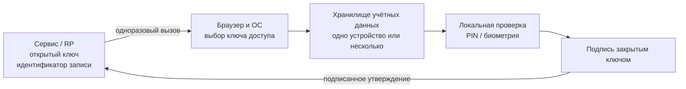
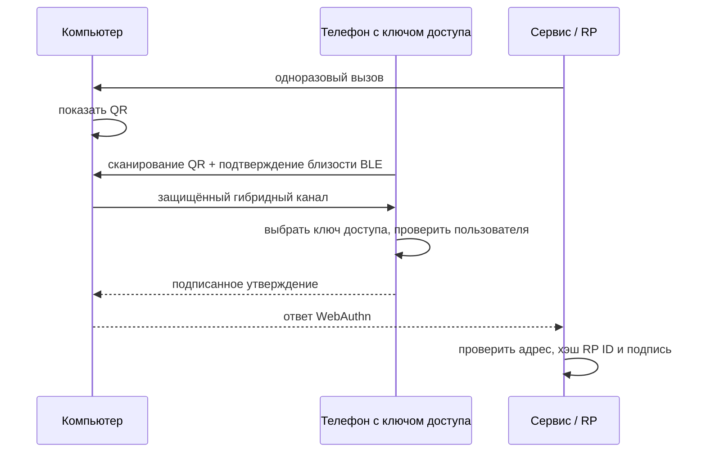

# 🗝️ Passkeys («ключи доступа»): беспарольный вход FIDO2

> [!info] О чём заметка
> Ключ доступа заменяет пароль парой криптографических ключей: сайт хранит только открытый, а закрытый остаётся на устройстве или в защищённом хранилище пользователя. Здесь разобраны синхронизация, привязка к одному устройству, вход телефоном по машиночитаемому квадратному коду, восстановление и ограничения этой схемы. Техническая основа описана в [[FIDO/webauthn|заметке о входе через браузер]], а общая картина — в [[FIDO/fido-protocols|обзоре системы криптографического входа]].

## Термины перед чтением

Сайт может попросить устройство найти учётную запись без предварительно введённого логина. Для этого устройство хранит запись с закрытым ключом и служебными данными и само предлагает подходящую запись; читатель видит список аккаунтов, а не поле для запоминания нового секрета. Такую запись называют `discoverable credential` («обнаруживаемые учётные данные»).

Браузер и операционная система образуют промежуточный слой между сайтом и устройством, которое хранит ключ. Этот слой выбирает подходящее хранилище, показывает пользователю список записей и передаёт устройству только разрешённые запросы. В стандартах его называют `client platform` («клиентская платформа»), а само хранилище называют `credential provider` («поставщик учётных данных»).

Хранимая на устройстве запись содержит закрытый ключ, идентификатор сайта и пользователя и служебные параметры, которые нужны для поиска и подписи. Открытый ключ при регистрации уходит серверу и не входит в нормативный набор полей этой внутренней записи. В документации её называют `credential source` («источник учётных данных»); это внутреннее представление, а не файл, который сайт может скачать.

Браузер также фиксирует, с какой страницей началась операция: учитываются схема соединения, домен и порт. Сайт получает не произвольную строку, а проверяемую привязку к этому адресу; отдельный идентификатор области сайта задаёт, для какого сервиса подходит ключ. Первую часть называют `origin` («происхождение запроса»), вторую — `RP ID` («идентификатор сервиса»). Сокращение RP происходит от relying party и означает сайт или приложение, которое полагается на результат проверки при входе.

Устройство может хранить ключ только у себя, либо разрешать его резервное копирование и использование на других устройствах. В первом случае говорят `single-device credential` («учётные данные одного устройства»), во втором — `multi-device credential` («учётные данные нескольких устройств»). Синхронизированная копия обычно появляется через защищённое хранилище провайдера, а не из-за передачи закрытого ключа сайту.

При проверке сайт получает сведения о том, допускает ли запись резервное копирование и была ли копия создана сейчас. Эти два признака помогают выбрать политику риска, но не раскрывают название облака и не доказывают способ синхронизации. В стандарте они называются `backup eligibility` («возможность резервного копирования») и `backup state` («текущее состояние резервной копии»), сокращённо BE и BS.

Вход с телефона на чужом компьютере проходит через отдельный канал связи. Компьютер показывает одноразовый QR-код, телефон подтверждает близость по Bluetooth, после чего устройства создают защищённый канал и телефон подписывает запрос. Такой способ называют `hybrid transport` («гибридный транспорт»); подтверждение близости называют `proximity proof`, а промежуточную службу передачи данных — `tunnel service`.

Отдельные правила установления такого канала называются PXP (Proximity Exchange Protocol, «протокол обмена с проверкой близости»). PXP описывает проверку близости и защищённое согласование соединения, а не перенос закрытого ключа.

Перенос ключей между хранилищами требует отдельного формата и процедуры обмена. Формат описывает, как записать учётные данные в переносимый файл, а процедура задаёт, как два приложения удостоверяют друг друга и защищают обмен. В спецификациях эти части называются `Credential Exchange Format` (CXF) и `Credential Exchange Protocol` (CXP).

Сайт может попросить устройство доказать свойства модели, например наличие сертифицированной защиты. Устройство прикладывает к ответу специальное свидетельство, а сайт проверяет цепочку доверия и ограничения политики. Такое свидетельство называют `attestation` («аттестация аутентификатора»); оно не появляется автоматически у каждого ключа доступа.

Для пользователя нужен короткий термин для всего сценария входа без пароля: он выбирает учётную запись на устройстве и подтверждает действие локальным способом. В материалах производителей такой ключ доступа называют `passkey`; это пользовательское имя discoverable credential, а не отдельный сетевой протокол.

Сайт и устройство обмениваются случайным одноразовым запросом, который сервер затем сверяет с подписанным ответом. Такой запрос называют `challenge` («вызов»). Семейство открытых стандартов для такой проверки называется FIDO (Fast IDentity Online, «быстрая идентификация в сети»), а современный набор взаимодействий — `FIDO2`: в него входят `WebAuthn` для связи сайта с браузером и `CTAP2` для связи клиента с внешним аутентификатором. Термин `assertion` («утверждение аутентификатора») обозначает подписанный ответ устройства на challenge.

Набор программных функций, через который приложение просит систему создать, получить или перенести учётные данные, называют API (Application Programming Interface, «программный интерфейс приложения»). API задаёт доступные операции, но не раскрывает приложению закрытый ключ.

Локальное действие, которым устройство убеждается, что перед ним владелец, может быть персональным цифровым кодом PIN, отпечатком или разблокировкой системы. Стандарт называет это `user verification` (UV, «проверка пользователя»); простое касание ключа относится к `user presence` (UP, «присутствие пользователя») и само по себе личность не подтверждает.

Если основной способ входа недоступен, сервис предлагает запасной путь: резервный ключ, код восстановления, пароль или другой канал. Такой путь называют `fallback` («запасной вариант»), а процедуру возвращения доступа — `recovery` («восстановление»). Их защита должна соответствовать ценности аккаунта, иначе атакующий обойдёт сильный основной вход.

Когда провайдер переносит запись между устройствами, говорят о синхронизируемом ключе доступа; когда запись остаётся на одном устройстве, говорят о ключе, привязанном к устройству. В англоязычных материалах это `synced passkey` и `device-bound passkey`; первый термин описывает способ доступности записи, второй — отсутствие разрешённой копии на другом устройстве.

На экране входа сайт может предложить найденную запись ещё до того, как пользователь введёт логин. Браузер показывает этот список в интерфейсе, который автоматически подставляет подходящую запись; в стандартах его называют `conditional UI` («условный интерфейс выбора»). Он работает только с обнаруживаемыми учётными данными.

Для связи рядом стоящих устройств используется маломощный режим Bluetooth. Его техническое сокращение `BLE` означает Bluetooth Low Energy; в данном сценарии оно помогает подтвердить близость, но не переносит закрытый ключ.

Защищённое аппаратное хранилище может быть отдельным модулем платформы или специализированной микросхемой. Модуль доверенной платформы обозначают TPM (Trusted Platform Module), а устойчивую к извлечению секретов микросхему называют secure element («защищённый элемент»). Наличие одного из них не следует автоматически из слова device-bound.

Незавершённую редакцию спецификации FIDO называют Working Draft («рабочий черновик»), а стабильную редакцию, утверждённую участниками альянса, — Proposed Standard («предлагаемый стандарт»). Исправления к уже опубликованной редакции называют errata.

Сервер хранит отдельный идентификатор каждой зарегистрированной записи, а сама запись содержит идентификатор пользователя, по которому можно найти аккаунт при входе без логина. Эти значения называют `credential ID` («идентификатор учётных данных») и `user handle` («внутренний идентификатор пользователя»); они не являются закрытым ключом.

## Кратко

- **Passkey** — потребительское название discoverable FIDO credential для беспарольной аутентификации. Сервер хранит открытый ключ, а закрытый ключ остаётся у аутентификатора или credential provider.
- **Multi-device** credential допускает резервное копирование и синхронизацию; **single-device** credential не допускает backup. Оба варианта могут использовать PIN или биометрию, если сервис требует user verification.
- Вход на чужом компьютере — гибридный транспорт: QR-код на экране + подтверждение телефоном, близость проверяется по Bluetooth.
- Главная критика: synced passkey зависит от защиты аккаунта и recovery-процедуры провайдера, перенос между экосистемами ещё внедрён не везде, а слабый пароль или SMS рядом с passkey остаётся альтернативным путём атаки.

## Что такое passkey

Технически passkey — это discoverable credential FIDO2 ([[FIDO/webauthn#Discoverable credentials и вход без логина|разбор механики]]): credential source хранится на стороне аутентификатора или client platform вместе с user handle, поэтому client platform способна найти учётку по RP ID без предварительно введённого логина. Слово «passkey» альянс и платформы используют с 2022 года как пользовательское название; в русских интерфейсах это «ключ доступа».

Проще говоря: вместо «вспомни секрет и введи его» вход превращается в «выбери учётку и подтверди операцию». Закрытый ключ не передаётся сайту, а подписанное утверждение связано с origin и RP ID ([[FIDO/fido-protocols#Origin и RP ID: две границы доверия|как работает привязка]]).

Passkey не является отдельным протоколом поверх FIDO2. Сайт использует [[FIDO/webauthn|WebAuthn]], а для внешнего аутентификатора client platform может использовать [[FIDO/ctap|CTAP]]. Термин описывает discoverable credential и пользовательский сценарий входа.

История появления — совместное заявление Apple, Google и Microsoft в мае 2022 и запуск в iOS 16 и Android осенью того же года — расписана в [[FIDO/fido-history#2019–2022: платформы вместо брелков|истории FIDO]].

## Single-device и multi-device: что показывают BE/BS

WebAuthn не передаёт сайту название облака, но даёт два флага. **BE** (backup eligibility) показывает, допускает ли credential резервное копирование; он фиксируется при регистрации. **BS** (backup state) показывает, существует ли backup сейчас, и способен меняться между входами.

| BE | BS | Значение |
|---:|---:|---|
| 0 | 0 | single-device credential, backup запрещён |
| 0 | 1 | недопустимая комбинация |
| 1 | 0 | multi-device credential, текущий backup не подтверждён |
| 1 | 1 | multi-device credential с текущим backup |

`BE=1` не доказывает именно облачную синхронизацию. Спецификация допускает облачный, локальный, прямой обмен между устройствами и экспортно-импортный механизмы. RP использует BE/BS как сигнал политики риска, а не как доказательство конкретного провайдера.

## Синхронизируемые passkeys и credential providers

Synced passkey решает проблему потери одного устройства: credential provider создаёт защищённую резервную копию и делает credential доступным на других устройствах пользователя. Защита зависит от шифрования провайдера, локальной блокировки устройств, входа в аккаунт и процедуры восстановления.

- **Apple:** сервис синхронизации Apple iCloud Keychain переносит passkeys между устройствами Apple со сквозным шифрованием. Системная программная основа AuthenticationServices подключает сторонние хранилища учётных данных и интерфейс Credential Exchange.
- **Google:** менеджер паролей Google Password Manager синхронизирует passkeys между Android и Chrome. Google связывает сквозное шифрование с блокировкой экрана или отдельным PIN этого менеджера; Android 14+ допускает сторонние хранилища учётных данных.
- **Microsoft:** локальное системное хранилище Windows Hello содержит device-bound credentials. Менеджер Microsoft Password Manager может синхронизировать passkeys между поддерживаемыми устройствами, браузерами и приложениями.
- **Сторонние менеджеры:** 1Password, Bitwarden, Dashlane и другие работают как credential providers там, где ОС, браузер и приложение поддерживают соответствующий API.

Наличие synced passkey не отменяет recovery. Пользователь может потерять доступ к аккаунту провайдера, оказаться на неподдерживаемой платформе или удалить credential. Сервису нужен восстановительный путь, но его стойкость не должна быть ниже основного входа.

## Single-device passkey: контроль одного аутентификатора

Single-device credential не допускает backup и остаётся на одном аутентификаторе. Это может быть [[FIDO/hardware-security-keys|аппаратный ключ]], TPM ноутбука или защищённое хранилище телефона. Свойство device-bound не доказывает наличие отдельного secure element и не гарантирует attestation: это независимые характеристики.

Потеря единственного аутентификатора означает восстановление доступа через сервис. Для критичного аккаунта регистрируют как минимум два независимых аутентификатора и хранят резервный отдельно. Лимиты аппаратных ключей и выбор моделей разобраны в [[FIDO/hardware-security-keys|статье о физических ключах]], а блокировка PIN и reset — в [[FIDO/ctap#PIN и защита от перебора|заметке о CTAP]].

## Вход на чужом компьютере: QR-код и Bluetooth

Если passkey находится в телефоне, а войти нужно на компьютере, работает **hybrid transport** ([[FIDO/ctap#Транспорты: USB, NFC, BLE и гибридный|техническая механика]]). Компьютер показывает QR-код с одноразовыми параметрами связи. Телефон сканирует его, короткий широковещательный сигнал BLE доказывает наличие подходящего устройства рядом, затем стороны устанавливают защищённый канал. Данные могут идти через ранее объяснённую промежуточную службу или локальный транспорт; закрытый ключ не переносится на компьютер.

Проверка близости мешает обычной удалённой ретрансляции QR-сценария, но не обещает невозможность любой передачи через посредника: атакующий с устройством рядом с компьютером или вредоносным ПО в локальной среде меняет модель угроз. На 16 августа 2026 года CTAP 2.3 остаётся актуальным Proposed Standard, а следующая редакция выносит установление канала в отдельный PXP 1.0 Working Draft.

## Перенос между провайдерами

Credential Exchange состоит из двух частей. **CXF** описывает формат переносимых credentials; CXF 1.0 имеет статус Proposed Standard с errata от 9 марта 2026 года. **CXP** описывает защищённый обмен между экспортирующим и импортирующим приложениями и остаётся Working Draft от 3 октября 2024 года. FIDO всё ещё называет эту область ранней стадией рассмотрения, поэтому повсеместную совместимость предполагать нельзя.

Экспорт возможен только для credentials, которые credential provider разрешает переносить. Single-device credential аппаратного ключа нельзя превратить в экспортируемый файл вопреки политике аутентификатора. Credential Exchange также не заменяет восстановление аккаунта у самого сервиса.

## Плюсы

- **Фишинг-устойчивость** — origin и RP ID входят в проверяемые подписанные данные, поэтому утверждение с поддельного домена не подходит настоящему сервису.
- **Утечка серверной записи не даёт закрытого ключа:** credential ID и открытый ключ остаются чувствительными метаданными, но не позволяют подписать новый challenge.
- **Вход проще пароля**: достаточно касания или взгляда, а conditional UI подставляет passkey прямо в поле логина ([[FIDO/webauthn|как это работает]]).
- **Synced credential переживает потерю одного устройства**, если пользователь сохранил доступ к credential provider и его recovery.

## Минусы и критика

- **Облачный аккаунт — новая точка отказа.** Защита синхронизируемых passkey существенно зависит от безопасности аккаунта credential provider, локальной блокировки устройств и стойкости процедур восстановления против социальной инженерии.
- **Привязка к экосистеме.** CXF 1.0 стандартизировал формат, а CXP остаётся Working Draft; фактический перенос зависит от поддержки обоих providers и платформы.
- **Слабый fallback оставляет альтернативную атаку.** Passkey продолжает защищать свой путь входа, но пароль, SMS или восстановление по электронной почте позволяют атакующему обойти его ([[SMS]]). Восстановление и добавление нового credential нужно защищать не слабее основного входа.
- **Потребительские синхронизируемые passkeys обычно не дают проверяемую аппаратную аттестацию.** Device-bound credential тоже не гарантирует attestation автоматически: сервер должен запросить и проверить её отдельно ([[FIDO/fido-protocols#Attestation: когда серверу важен тип аутентификатора|что это значит]]).
- **Шероховатости реализации.** Ранние годы (2022–2024) запомнились несовместимостями: не каждый сайт принимал passkey из каждого хранилища, а поведение разных браузеров расходилось. Ситуация выправляется, но неровности ещё встречаются.

## Что выбрать на практике

Для обычных аккаунтов synced passkey убирает повторно используемый пароль и переживает потерю одного устройства. Для почты-якоря, финансов и административных учёток полезна более строгая схема: два single-device аутентификатора, раздельное хранение и заранее проверенное recovery. Слабые fallback отключают только после регистрации резервов и сохранения recovery codes; подбор железа — в [[FIDO/hardware-security-keys|статье о ключах]].

## 📚 См. также

- [[FIDO/00-overview|Обзор раздела FIDO]] — оглавление всех заметок об аппаратных ключах
- [[FIDO/fido-protocols|Протоколы FIDO]] — общая картина: challenge-response, привязка к домену, attestation
- [[FIDO/webauthn|WebAuthn]] — техническая основа: discoverable credentials, conditional UI
- [[FIDO/ctap|CTAP]] — PIN, сброс ключа и гибридный транспорт на уровне протокола
- [[FIDO/hardware-security-keys|Физические ключи безопасности]] — device-bound: модели, лимиты, чек-лист
- [[SMS]] — слабый фолбэк, который стоит отключить
- 🔗 [fidoalliance.org/passkeys](https://fidoalliance.org/passkeys/) — материалы альянса о passkey
- 🔗 [Credential Exchange Specifications](https://fidoalliance.org/download-credential-exchange-specifications/) — текущие статусы CXF и CXP
- 🔗 [WebAuthn Level 3: credential backup state](https://www.w3.org/TR/webauthn-3/#sctn-credential-backup-state) — нормативные флаги BE/BS

---

> [!quote] 🤖 Эти статьи открыты — можно обучать на них ИИ
> При желании вы можете натренировать ИИ на наших статьях. Исходное форматирование и скачивание всего репозитория одним zip-архивом доступны в Forgejo: [исходник этой заметки](https://git.zapret.moe/zapretdiscordyoutube/todo/src/branch/main/FIDO/passkeys.md) · [весь репозиторий](https://git.zapret.moe/zapretdiscordyoutube/todo/src/branch/main).
