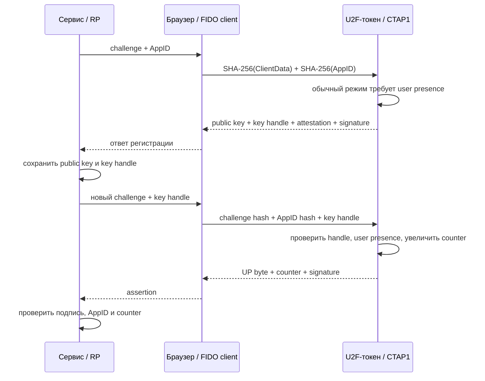
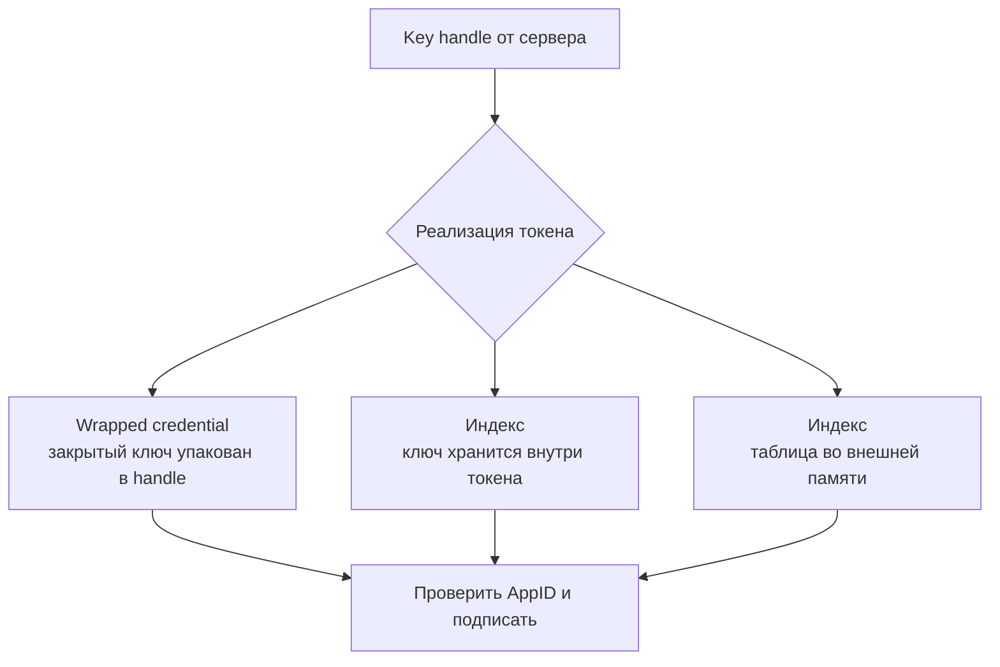

# ✌️ U2F (Universal 2nd Factor): что это, история, механика, плюсы и минусы

> [!info] О чём заметка
> U2F — первый массовый стандарт семейства FIDO: аппаратный ключ как **второй фактор** к паролю. Здесь — что это такое, история версий протокола (FIDO 1.0 → FIDO2/CTAP1), пошаговая механика регистрации и входа, сильные и слабые стороны. Общая механика FIDO-аутентификации — в [[FIDO/fido-protocols|заметке о протоколах]], история самого альянса — в [[FIDO/fido-history|истории FIDO]], выбор железа — в [[FIDO/hardware-security-keys|статье о физических ключах]].

## TL;DR

- **U2F** (Universal 2nd Factor) разработали Google и Yubico, затем передали FIDO Alliance как открытый стандарт: пароль остаётся, после него сайт требует подпись токена в области AppID.
- **Key handle** позволяет токену найти нужную пару ключей. Stateless-токен может упаковать credential внутрь handle и не тратить память на сайты, но стандарт допускает и другие реализации с конечным лимитом.
- С появлением FIDO2 протокол получил имя **CTAP1**. Chrome отключил старый U2F API по умолчанию в версии 98 и полностью удалил в 104; сами токены продолжают работать через WebAuthn при поддержке расширения `appid` на сервере.
- Главные минусы: пароль никуда не девается, касание ключа подтверждает присутствие человека, но не его личность (PIN появился только в FIDO2), а потеря единственного ключа без резервного — это блокировка аккаунтов.

## Что такое U2F

U2F расшифровывается как Universal 2nd Factor — «универсальный второй фактор». Это открытый стандарт, по которому аппаратный ключ подтверждает вход **вторым шагом после пароля**: сайт проверяет пароль, затем просит коснуться ключа и проверяет его криптографическую подпись. «Универсальный» здесь ключевое слово: до U2F аппаратные токены были привязаны к конкретному банку или корпорации, а U2F-ключ один и тот же работает с любым сайтом, поддерживающим стандарт.

Проще говоря: U2F не меняет привычный вход, а достраивает его. Пароль по-прежнему вводится, но украсть его теперь недостаточно для прохождения U2F-проверки: поддельный сайт не получит валидную подпись из-за привязки к домену. Слабое восстановление аккаунта или другой запасной способ входа могут обойти эту защиту. Механика привязки разобрана в [[FIDO/fido-protocols#Origin и RP ID: две границы доверия|протоколах FIDO]].

## История: FIDO 1.0 → FIDO2

U2F вырос из внутренней задачи Google — защитить аккаунты собственных сотрудников от фишинга. По публикациям инженеров Google, прототип аппаратного ключа разрабатывался с начала 2010-х под внутренним именем Gnubby; партнёром по железу стала Yubico. В 2013 году обе компании вступили в [[FIDO/fido-history|FIDO Alliance]] и передали наработки альянсу как основу открытого стандарта.

Дальше хронология версий протокола:

| Когда | Что произошло |
|---|---|
| Октябрь 2014 | Google первой включает U2F для всех аккаунтов (Chrome 38+); Yubico выпускает первые серийные U2F-ключи |
| 9 декабря 2014 | **FIDO 1.0** — первый финальный релиз альянса: спецификации U2F 1.0 и UAF 1.0 (беспарольная мобильная ветка, о ней — в [[FIDO/fido-history|истории FIDO]]) |
| 11 апреля 2017 | Документ U2F 1.2 датирован этой редакцией; пакет спецификаций получил одобрение FIDO 11 июля 2017 года |
| 2018–2019 | Выходит **FIDO2** (WebAuthn + CTAP2); U2F задним числом переименован в **CTAP1** и становится режимом обратной совместимости |
| Февраль–август 2022 | Chrome 98 отключает старый U2F API по умолчанию, Chrome 104 удаляет его полностью; сами токены продолжают работать через WebAuthn |

Итог этой эволюции: U2F живёт как CTAP1 и режим совместимости. CTAP2-аутентификаторам рекомендуется поддерживать CTAP1, но это не универсальное MUST для каждого специализированного устройства. Старые U2F credentials работают через [[FIDO/webauthn|WebAuthn]], когда сервер передаёт старые key handles в `allowCredentials` и использует расширение `appid`; новые интеграции используют WebAuthn.

## AppID и FacetID: предшественники RP ID и origin

U2F разделял идентификатор приложения и источник вызывающей страницы. **FacetID** для веба был origin страницы: схема, hostname и порт. **AppID** был URL области приложения. Браузер проверял, что facet разрешён для AppID; Trusted Facet List позволял одному сервису связать несколько origin и нативные приложения.

WebAuthn использует другую модель с RP ID и origin. Для миграции старого credential сайт применяет расширение `appid`: аутентификатор проверяет старый key handle и `SHA-256(AppID)`, а сервер допускает этот хэш вместо обычного `rpIdHash`. Совместимость направлена на использование ранее созданных U2F credentials; новый WebAuthn credential не обязан работать со старым U2F JavaScript API.

## Как работает

### Регистрация

1. Сайт передаёт браузеру случайный challenge, ClientData и AppID. Браузер проверяет FacetID и вычисляет хэши клиентских данных и AppID.
2. Пользователь касается кнопки ключа — так подтверждается физическое присутствие человека (user presence).
3. Ключ генерирует новую пару ключей и возвращает открытый ключ P-256, **key handle** (см. ниже), сертификат attestation X.509 и подпись над application parameter, challenge parameter, key handle и открытым ключом.
4. Сервер сохраняет открытый ключ и key handle рядом с учёткой пользователя.

### Вход

1. После проверки пароля сервер присылает challenge и сохранённый key handle.
2. Ключ проверяет, что key handle действительно его и выпущен для этого AppID — чужой или подменённый отвергается.
3. В обычном режиме пользователь касается кнопки. Ключ подписывает application parameter, байт user presence, счётчик и challenge parameter.
4. Сервер проверяет подпись открытым ключом и сверяет счётчик.

### Key handle: как токен находит credential

Спецификация требует, чтобы key handle позволял токену найти нужную пару ключей и отвергнуть handle другого токена или AppID. Формат остаётся внутренним делом реализации. Stateless-токен может зашифровать закрытый ключ и область приложения собственным wrapping key и вернуть весь блок серверу. Другой токен может хранить ключ внутри и использовать handle как индекс. Возможен и индекс во внешней памяти.

Wrapped-handle дизайн даёт очень большое число регистраций без расхода памяти токена, но стандарт не обещает «безлимит» для каждой модели и не требует master key, secure element или аппаратную реализацию. Дешевизна U2F связана с малым набором операций и отсутствием discoverable credentials, PIN, экрана и часов.

### Счётчик: защита от клонов

Каждая подпись включает счётчик. Сервер запоминает последнее значение; `newCounter <= storedCounter` служит сигналом возможного клонирования, сброса или неисправности токена. Реакцию выбирает сервис: запросить другой фактор, предупредить пользователя или отклонить вход.

Счётчик не доказывает клон и не ловит все случаи. Если после копирования используется только клон, а оригинал больше не подписывает, значения могут расти последовательно. U2F допускал глобальные и более локальные счётчики; глобальный вариант создаёт побочный канал корреляции между credentials. WebAuthn рекомендует per-credential counter для приватности, но также допускает другие реализации.

## Плюсы

- **Фишинг-устойчивость.** Утверждение привязано к AppID и проверенному FacetID, поэтому ответ с поддельного домена не подходит настоящему сервису — в отличие от кодов из SMS и TOTP-приложений, которые можно перенести между сайтами ([[SMS]]).
- **Много регистраций и простое железо.** Wrapped key handle позволяет stateless-токену не хранить отдельную запись для каждого сервиса; конкретные модели всё равно могут иметь лимиты.
- **Приватность.** На каждую область приложения создаётся своя пара ключей, поэтому сами credential records не дают общего идентификатора между сервисами. Одинаковая учётная запись, attestation и другие метаданные остаются отдельными каналами корреляции.
- **Простота эксплуатации.** Типичный USB- или NFC-токен не требует перепечатывать одноразовый код; конкретные модели могут требовать системной поддержки или приложение для настройки.

## Минусы

- **Пароль остаётся.** U2F — только второй фактор: утечки, подбор и повторное использование паролей никуда не деваются, вход по-прежнему двухшаговый. Беспарольный вход появился лишь в FIDO2 ([[FIDO/fido-protocols|подробнее]]).
- **Касание — не проверка личности.** U2F подтверждает присутствие человека, но не то, что это владелец: укравший ключ и знающий пароль войдёт без препятствий. User verification (PIN, биометрия) добавили только в FIDO2.
- **Счётчик как побочный канал.** Глобальный счётчик способен коррелировать credentials между сервисами; стандарт допускал и другие варианты, поэтому риск зависит от реализации.
- **Стареющая веб-интеграция.** Chrome отключил U2F API по умолчанию в 98 и удалил в 104. Старые credentials работают через WebAuthn только при корректной поддержке `appid` на стороне сервиса.
- **Потеря ключа = блокировка.** Без заранее привязанного резервного ключа восстановление доступа превращается в долгую переписку с поддержкой — правило «минимум два ключа» из [[FIDO/hardware-security-keys#Как выбрать: чек-лист|чек-листа выбора]] родилось именно здесь.

## U2F в 2026 году: стоит ли использовать

Если U2F-ключ уже есть, его можно продолжать использовать на сайтах, которые принимают CTAP1 через WebAuthn. Покупать новый ключ «только с U2F» обычно нет смысла: многие современные [[FIDO/hardware-security-keys|FIDO2-ключи]] сохраняют CTAP1-совместимость, а CTAP2-модели могут дополнительно поддерживать PIN, user verification и discoverable credentials. Эти возможности нужно сверять для конкретного устройства.

## 📚 См. также

- [[FIDO/00-overview|Обзор раздела FIDO]] — оглавление всех заметок об аппаратных ключах
- [[FIDO/fido-protocols|Протоколы FIDO]] — общая механика: challenge-response, привязка к домену, FIDO2/WebAuthn
- [[FIDO/fido-history|Что такое FIDO и его история]] — альянс и хронология стандартов
- [[FIDO/webauthn|WebAuthn]] — веб-API, через который U2F-ключи работают сегодня
- [[FIDO/ctap|CTAP]] — транспортный протокол; U2F живёт в нём как CTAP1
- [[FIDO/uaf|UAF]] — парная беспарольная ветка FIDO 1.0
- [[FIDO/hardware-security-keys|Физические ключи безопасности]] — какие ключи бывают и как выбрать
- [[SMS]] — почему SMS-коды не защищают от фишинга
- 🔗 [U2F 1.2 Raw Message Formats](https://fidoalliance.org/specs/fido-u2f-v1.2-ps-20170411/fido-u2f-raw-message-formats-v1.2-ps-20170411.html) — точный формат регистрации и входа
- 🔗 [U2F 1.2 AppID and Facets](https://fidoalliance.org/specs/fido-u2f-v1.2-ps-20170411/fido-appid-and-facets-v1.2-ps-20170411.html) — область приложения и доверенные origin

---

> [!quote] 🤖 Эти статьи открыты — можно обучать на них ИИ
> При желании вы можете натренировать ИИ на наших статьях. Исходное форматирование и скачивание всего репозитория одним zip-архивом доступны в Forgejo: [исходник этой заметки](https://git.zapret.moe/zapretdiscordyoutube/todo/src/branch/main/FIDO/u2f.md) · [весь репозиторий](https://git.zapret.moe/zapretdiscordyoutube/todo/src/branch/main).
