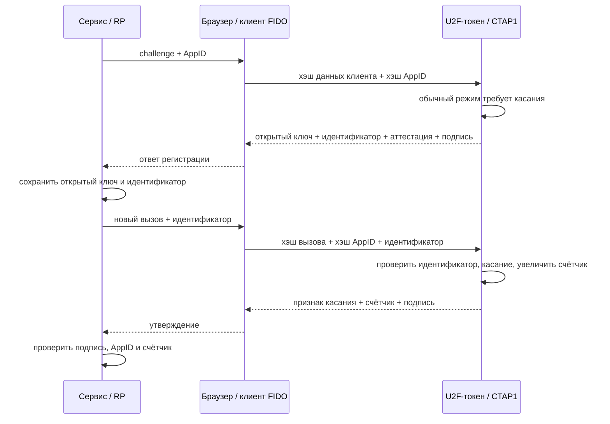
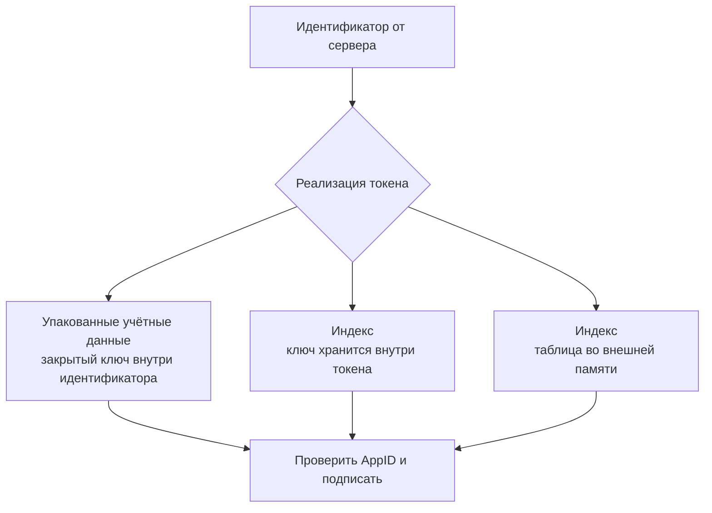

# ✌️ U2F (Universal 2nd Factor): что это, история, механика, плюсы и минусы

> [!info] О чём заметка
> Первый массовый стандарт криптографического входа с универсальным аппаратным ключом использует его как **второй фактор** после пароля. Здесь разобраны регистрация, вход, привязка к сайту, счётчик подписей и совместимость со следующим поколением протоколов. Общая механика — в [[FIDO/fido-protocols|заметке о протоколах]], история отраслевого альянса — в [[FIDO/fido-history|истории FIDO]], выбор железа — в [[FIDO/hardware-security-keys|статье о физических ключах]].

До U2F сайт обычно проверял пароль и больше не мог отличить владельца аккаунта от человека, который этот пароль украл. Аппаратный ключ добавляет второй шаг: он создаёт для каждого сервиса отдельную пару математически связанных ключей, оставляет закрытую часть внутри устройства, а сервер проверяет подпись открытой частью. Такой второй фактор и называют U2F, Universal 2nd Factor, «универсальным вторым фактором».

U2F стал частью семейства открытых стандартов FIDO, Fast IDentity Online, «быстрая идентификация в сети». Эти правила должны были работать одинаково на разных сайтах и с разными ключами. Стандарты развивали компании, объединившиеся в отраслевой альянс FIDO Alliance. Альянс публикует спецификации и организует проверку совместимости, поэтому разработчики сервиса могут опираться на общий протокол, а не на отдельный ключ конкретного банка.

## От второго фактора к стандарту

Идея U2F выросла из внутренней задачи Google защитить аккаунты собственных сотрудников от фишинга. По публикациям инженеров Google, прототип аппаратного ключа разрабатывался с начала 2010-х под внутренним именем Gnubby, а партнёром по железу стала Yubico. В 2013 году компании вступили в FIDO Alliance и передали наработки альянсу как основу открытого стандарта.

Дальше хронология версий протокола:

| Когда | Что произошло |
|---|---|
| Октябрь 2014 | Google запускает поддержку U2F для Google Accounts в Chrome 38+; Yubico в тот же день представляет Security Key |
| 8 декабря 2014 | **FIDO 1.0** — первый финальный релиз альянса: спецификации U2F 1.0 и UAF 1.0 (беспарольная мобильная ветка, о ней — в [[FIDO/fido-history|истории FIDO]]) |
| 11 апреля 2017 | Документ U2F 1.2 датирован этой редакцией; пакет спецификаций получил одобрение FIDO 11 июля 2017 года |
| 2018–2019 | Появляются ранние редакции WebAuthn и CTAP2, а в марте 2019 года FIDO Alliance объявляет FIDO2; U2F получает имя **CTAP1** и становится режимом обратной совместимости |
| Февраль–август 2022 | Chrome 98 отключает старый U2F API по умолчанию, Chrome 104 удаляет его полностью; сами токены продолжают работать через WebAuthn |

Итог этой эволюции: U2F живёт как CTAP1 и режим совместимости. Аутентификаторам CTAP2 рекомендуется поддерживать CTAP1, но для каждого специализированного устройства это не безусловное требование. Старые регистрации U2F работают через [[FIDO/webauthn|WebAuthn]], когда сервер передаёт прежние идентификаторы записей в `allowCredentials` и использует расширение `appid`; новые интеграции используют WebAuthn напрямую.

Совместимость нужна для ранее созданных записей U2F. Новая запись WebAuthn не обязана работать со старым программным интерфейсом U2F в браузере, даже если тот же сайт принимает старые записи через расширение `appid`.

## Что именно проверяет U2F

U2F не заменяет пароль. Сайт сначала проверяет пароль, затем просит коснуться ключа и проверяет его криптографическую подпись. Один и тот же ключ подходит разным сайтам, но для каждого сервиса создаёт отдельную пару, поэтому поддельная страница не может использовать подпись, предназначенную настоящему домену.

Каждый вход начинается со случайного одноразового запроса сервера. Устройство включает этот запрос в подпись; такой запрос называют `challenge` («вызов»). Браузер собирает сведения о странице и способе вызова в `ClientData` («данные клиента»), а сервер принимает ответ только в той области сайта, для которой создавался ключ.

Ранняя схема задавала область сайта полным веб-адресом. Веб-адрес называют URL (Uniform Resource Locator); он включает схему, имя узла и порт. Идентификатор всей области приложения называют `AppID`, адрес разрешённой части приложения — `FacetID`, а список таких адресов — `Trusted Facet List` («список доверенных частей»). Браузер проверял, что конкретная страница входит в этот список.

Современная схема отдельно фиксирует адрес страницы, с которой началась операция, и идентификатор сайта, которому разрешено принимать ключ. Адрес страницы называют `origin` («происхождение запроса»), а идентификатор сайта — `RP ID` («идентификатор сервиса»). RP происходит от relying party и означает сайт или приложение, которое полагается на результат проверки при входе.

Привязка к странице и сервису не даёт поддельному домену использовать подпись настоящего сайта; подробное сравнение `origin` и RP ID разобрано в [[FIDO/fido-protocols#Origin и RP ID: две границы доверия|протоколах FIDO]].

Серверу нужно сохранить открытый ключ и короткую запись, по которой устройство найдёт соответствующую закрытую часть. Такую запись называют `key handle` («идентификатор ключа»), а саму учётную запись — `credential` («учётные данные»). Формат key handle стандарт оставляет производителю.

Устройство сообщает о двух разных фактах. Человек физически коснулся ключа, а пользователь мог дополнительно пройти локальную проверку PIN-кодом или биометрией. Первый факт называют `user presence` (UP, «присутствие пользователя»), второй — `user verification` (UV, «проверка пользователя»). Старый U2F обычно требовал только UP, поэтому касание не доказывало личность владельца.

При регистрации устройство может приложить подписанное свидетельство о происхождении и свойствах модели. Такое свидетельство называют `attestation` («аттестация»). Подписанный ответ на запрос входа называют `assertion` («утверждение аутентификатора»), а часть ключевой пары, которой сервер проверяет подпись, — `public key` («открытый ключ»). Распространённый формат сертификата аттестации — `X.509`.

## От U2F к FIDO2

В следующем поколении внешний ключ общается с браузером или операционной системой через отдельный канал, а сайт работает через стандартный веб-интерфейс. Канал связи с внешним устройством называют `CTAP1`, веб-интерфейс — `WebAuthn`; вместе с более новым CTAP2 они образуют семейство FIDO2. Слово `API` означает программный интерфейс, через который одна программа вызывает функции другой.

Для совместимости WebAuthn передаёт старые идентификаторы ключей в поле `allowCredentials` («разрешённые учётные данные») и включает расширение `appid`, которое сообщает прежний AppID. Хэш, то есть короткий результат криптографического преобразования, обозначают `SHA-256`; поле `rpIdHash` содержит такой результат для RP ID или, в режиме совместимости, для AppID.

U2F передаёт два 32-байтных хэша. Хэш AppID называют `application parameter` («параметр приложения»), а хэш структуры ClientData — `challenge parameter` («параметр вызова»). Оба входят в подписываемые данные и не являются открытым текстом пароля.

Тексты стандартов различают обязательное требование и рекомендацию. Слово `MUST` означает безусловное требование спецификации, а `SHOULD` означает рекомендацию, от которой реализация может отступить при обоснованной причине.

Одноразовый код, который приложение рассчитывает из общего секрета и текущего времени, называют TOTP (Time-based One-Time Password). Такой код можно перенести на поддельную страницу, тогда как подпись U2F привязана к области сайта.

Для создания ключей и подписей U2F задаёт конкретную математическую эллиптическую кривую. Она называется `P-256`, определяет совместимый формат ключа и позволяет серверу проверить подпись тем же алгоритмом. При регистрации устройство может вернуть сертификат формата `X.509`, который связывает ключ аттестации с изготовителем; это не сертификат пользовательского аккаунта.

## Как работает

### Регистрация

1. Сайт передаёт браузеру случайный challenge, ClientData и AppID. Браузер проверяет FacetID и вычисляет хэши клиентских данных и AppID.
2. Пользователь касается кнопки ключа, подтверждая физическое присутствие человека (user presence).
3. Ключ генерирует новую пару ключей и возвращает открытый ключ P-256, **key handle**, сертификат attestation X.509 и подпись над application parameter, challenge parameter, key handle и открытым ключом.
4. Сервер сохраняет открытый ключ и key handle рядом с учёткой пользователя.

### Вход

1. После проверки пароля сервер присылает challenge и сохранённый key handle.
2. Ключ проверяет, что key handle действительно его и выпущен для этого AppID. Чужой или подменённый идентификатор устройство отвергает.
3. В обычном режиме пользователь касается кнопки. Ключ подписывает application parameter, байт user presence, счётчик и challenge parameter.
4. Сервер проверяет подпись открытым ключом и сверяет счётчик.

## Key handle: как токен находит credential

Спецификация требует, чтобы key handle позволял токену найти нужную пару ключей и отвергнуть handle другого токена или AppID. Формат остаётся внутренним делом реализации. Stateless-токен может зашифровать закрытый ключ и область приложения собственным wrapping key и вернуть весь блок серверу. Другой токен может хранить ключ внутри и использовать handle как индекс. Возможен и индекс во внешней памяти.

Некоторые устройства не хранят отдельную запись для каждого сайта. Они упаковывают закрытый ключ и служебные данные внутрь key handle. Такую реализацию называют `stateless` («без хранения состояния»), а ключ, которым устройство защищает упаковку, — `wrapping key`. `Master key` («главный ключ») и `secure element` («защищённый элемент») возможны в отдельных моделях, но стандарт U2F их не требует.

Такая схема даёт очень большое число регистраций без расхода памяти токена. Стандарт не обещает «безлимит» для каждой модели и не требует master key, secure element или аппаратной реализации. Дешевизна U2F связана с малым набором операций и отсутствием `discoverable credential`, PIN, экрана и часов.

Старый ключ не умеет сам предложить учётную запись: сервер сначала присылает ему key handle. Такой режим называют `non-discoverable credential` («учётные данные, которые нельзя обнаружить без идентификатора»). Обратный режим с самостоятельным поиском записи появился в FIDO2 и называется `discoverable credential`.

## Счётчик: защита от клонов

Каждая подпись включает счётчик. Сервер запоминает последнее значение; `newCounter <= storedCounter` служит сигналом возможного клонирования, сброса или неисправности токена. Реакцию выбирает сервис: запросить другой фактор, предупредить пользователя или отклонить вход.

Счётчик называют `counter`; отдельный счётчик для каждой записи называют `per-credential counter`. U2F допускал один общий счётчик для всего устройства и отдельные счётчики для областей или записей.

Счётчик не доказывает клон и не ловит все случаи. Если после копирования используется только клон, а оригинал больше не подписывает, значения могут расти последовательно. Общий счётчик создаёт побочный канал корреляции между credentials. WebAuthn рекомендует отдельный счётчик каждой записи для приватности, но также допускает другие реализации.

## Плюсы

- **Фишинг-устойчивость.** Утверждение привязано к AppID и проверенному FacetID, поэтому ответ с поддельного домена не подходит настоящему сервису, в отличие от кодов из SMS и TOTP-приложений, которые можно перенести между сайтами ([[SMS]]).
- **Много регистраций и простое железо.** Wrapped key handle позволяет stateless-токену не хранить отдельную запись для каждого сервиса; конкретные модели всё равно могут иметь лимиты.
- **Приватность.** На каждую область приложения создаётся своя пара ключей, поэтому серверные записи учётных данных не дают общего идентификатора между сервисами. Одинаковая учётная запись, attestation и другие метаданные остаются отдельными каналами корреляции.
- **Простота эксплуатации.** Типичный USB- или NFC-токен не требует перепечатывать одноразовый код; конкретные модели могут требовать системной поддержки или приложения для настройки.

## Минусы

- **Пароль остаётся.** U2F работает только как второй фактор: утечки, подбор и повторное использование паролей никуда не деваются, вход по-прежнему двухшаговый. Беспарольный вход появился лишь в FIDO2 ([[FIDO/fido-protocols|подробнее]]).
- **Касание не проверяет личность.** U2F подтверждает присутствие человека, но не то, что это владелец: укравший ключ и знающий пароль войдёт без препятствий. User verification (PIN, биометрия) добавили только в FIDO2.
- **Счётчик создаёт побочный канал.** Глобальный счётчик способен коррелировать credentials между сервисами; стандарт допускал и другие варианты, поэтому риск зависит от реализации.
- **Веб-интеграция стареет.** Chrome отключил U2F API по умолчанию в 98 и удалил в 104. Старые credentials работают через WebAuthn только при корректной поддержке `appid` на стороне сервиса.
- **Потеря ключа блокирует аккаунт.** Без заранее привязанного резервного ключа восстановление доступа превращается в долгую переписку с поддержкой. Правило «минимум два ключа» из [[FIDO/hardware-security-keys#Как выбрать: чек-лист|чек-листа выбора]] родилось именно здесь.

## U2F в 2026 году: стоит ли использовать

Если U2F-ключ уже есть, его можно продолжать использовать на сайтах, которые принимают CTAP1 через WebAuthn. Покупать новый ключ «только с U2F» обычно нет смысла: многие современные [[FIDO/hardware-security-keys|FIDO2-ключи]] сохраняют CTAP1-совместимость, а CTAP2-модели могут дополнительно поддерживать PIN, user verification и discoverable credentials. Эти возможности нужно сверять для конкретного устройства.

## 📚 См. также

- [[FIDO/00-overview|Обзор раздела FIDO]] — оглавление всех заметок об аппаратных ключах
- [[FIDO/fido-protocols|Протоколы FIDO]] — общая механика: challenge-response, привязка к домену, FIDO2/WebAuthn
- [[FIDO/fido-history|Что такое FIDO и его история]] — альянс и хронология стандартов
- [[FIDO/webauthn|WebAuthn]] — веб-API, через который U2F-ключи работают сегодня
- [[FIDO/ctap|CTAP]] — транспортный протокол; U2F живёт в нём как CTAP1
- [[FIDO/uaf|UAF]] — парная беспарольная ветка FIDO 1.0
- [[FIDO/hardware-security-keys|Физические ключи безопасности]] — какие ключи бывают и как выбрать
- [[SMS]] — почему SMS-коды не защищают от фишинга
- 🔗 [U2F 1.2 Raw Message Formats](https://fidoalliance.org/specs/fido-u2f-v1.2-ps-20170411/fido-u2f-raw-message-formats-v1.2-ps-20170411.html) — точный формат регистрации и входа
- 🔗 [U2F 1.2 AppID and Facets](https://fidoalliance.org/specs/fido-u2f-v1.2-ps-20170411/fido-appid-and-facets-v1.2-ps-20170411.html) — область приложения и доверенные origin

---

> [!quote] 🤖 Эти статьи открыты — можно обучать на них ИИ
> При желании вы можете натренировать ИИ на наших статьях. Исходное форматирование и скачивание всего репозитория одним zip-архивом доступны в Forgejo: [исходник этой заметки](https://git.zapret.moe/zapretdiscordyoutube/todo/src/branch/main/FIDO/u2f.md) · [весь репозиторий](https://git.zapret.moe/zapretdiscordyoutube/todo/src/branch/main).
