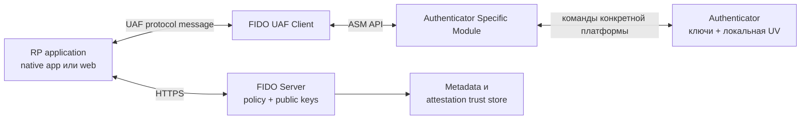
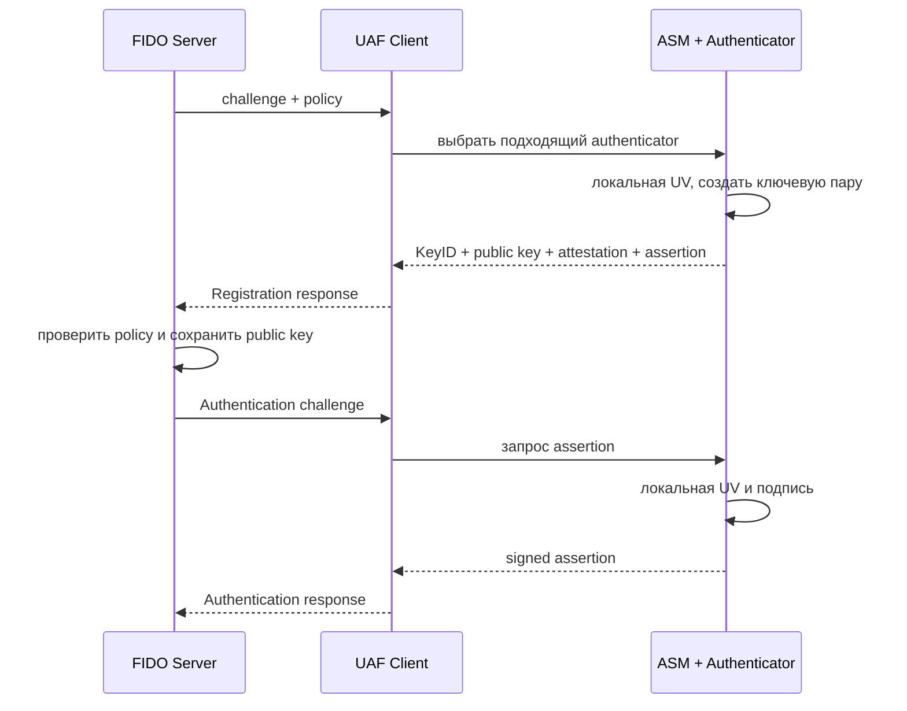

# 📱 UAF: беспарольная ветка FIDO 1.0, которая не взлетела

> [!info] О чём заметка
> UAF (Universal Authentication Framework) — вторая половина первого поколения стандартов FIDO: беспарольный вход по биометрии для мобильных приложений, вышедший в декабре 2014 года одновременно с [[FIDO/u2f|U2F]]. Здесь — как он был устроен, где применялся, почему проиграл и что от него унаследовал FIDO2. Общая история стандартов — в [[FIDO/fido-history|истории FIDO]].

## TL;DR

- **UAF** — беспарольный сценарий входа из FIDO 1.0 (декабрь 2014): пользователь регистрирует аутентификатор и затем подтверждает вход локальным жестом, PIN-кодом или биометрией. Восстановление аккаунта оставалось отдельной политикой сервиса.
- Протокол не передаёт биометрический шаблон серверу: локальная проверка разрешает использовать закрытый ключ, а RP получает подписанное утверждение.
- UAF предусматривал native IPC, SDK, браузерный DOM API и plugins, но не получил широкой встроенной поддержки браузеров и платформ; публичные внедрения остались точечными.
- Основным массовым направлением позже стал FIDO2 ([[FIDO/webauthn|WebAuthn]] + [[FIDO/ctap|CTAP]]). Он использует похожие свойства — беспарольный сценарий и локальную проверку пользователя, — но другую архитектуру и структуры протокола.

## Что такое UAF

В первом поколении стандартов FIDO ([[FIDO/fido-history#2013–2014: U2F, UAF и первый стандарт|FIDO 1.0]]) роли были разделены: [[FIDO/u2f|U2F]] добавлял аппаратный второй фактор к существующему паролю, а **UAF** позволял сервису убрать пароль из обычного сценария входа. Пользователь регистрировал устройство, часто смартфон с сенсором отпечатка, и затем подтверждал вход локальным жестом или биометрией. Способ восстановления аккаунта при этом оставался отдельным решением сервиса.

Криптографическая основа та же, что во всей семье FIDO ([[FIDO/fido-protocols|разбор]]): пара ключей на область сервиса и подпись challenge закрытым ключом. Биометрический шаблон и результат внутреннего matcher не передаются RP. Сервер получает криптографическое assertion, public key/KeyID и, при необходимости, attestation и метаданные.

## Как был устроен

Архитектура UAF разделяла приложение RP, FIDO UAF Client, ASM (Authenticator Specific Module), Authenticator и FIDO Server. UAF Client принимал протокольные сообщения. ASM скрывал особенности конкретного сенсора и хранилища ключей; один ASM мог обслуживать несколько authenticators. Сервер использовал metadata и attestation trust store для проверки заявленных свойств.

UAF описывал несколько способов доставить API: Android Intent/AIDL, iOS custom URL, встроенный DOM API `window.navigator.fido.uaf` или browser plugin. SDK был распространённым способом, но не единственным. Проблема состояла в том, что платформы и браузеры должны были заранее поставить совместимый UAF Client, ASM или plugin; WebAuthn позже получил единый API прямо в браузерах и ОС.

## Регистрация, вход и подтверждение операции

UAF определял Registration, Authentication, Transaction Confirmation и Deregistration. Discovery позволял приложению узнать доступные authenticators до обращения к серверу.

Transaction Confirmation использовал тот же тип операции `Auth`, но добавлял человекочитаемое содержимое транзакции. Аутентификатор или доверенный display показывал текст, пользователь подтверждал именно его, после чего устройство подписывало assertion. В документах UAF эту модель называли WYSIWYS (What You See Is What You Sign); она предназначалась для платежей, договоров и других операций, где важен подтверждённый текст.

Deregistration удалял конкретный `(AAID, KeyID)`, все ключи заданного AAID или все ключи приложения. Ответ серверу для этой операции не требовался.

## Где применялся

Первые внедрения появились ещё до финального UAF 1.0. PayPal и Samsung объявили вход и платежи по отпечатку на Galaxy S5 в феврале 2014 года. NTT DOCOMO развернула FIDO-аутентификацию в мае 2015 года и позже получила сертификацию UAF 1.1. FIDO Alliance также документировал Bank of America, Shinhan Bank и корейские K-FIDO-сценарии.

Публично описанные внедрения заметно сосредоточены в Японии и Южной Корее, но по этим кейсам нельзя строить статистику всего рынка. UAF работал в коммерческих продуктах, однако не стал универсальным интерфейсом массового веба.

## Как сервер выбирал допустимый аутентификатор

Сервер отправлял `Policy`. Поле `accepted` содержало альтернативные комбинации критериев: внутри комбинации нужно выполнить все условия, а между комбинациями достаточно одной. `disallowed` исключал нежелательные варианты.

Критерии могли ограничивать AAID, способ user verification, защиту ключа и matcher, attachment hint, алгоритмы, attestation type и наличие transaction-confirmation display. **AAID** имел формат `VVVV#MMMM` и обозначал производителя и модель аутентификатора, а не серийный номер экземпляра. Сервер сопоставлял AAID с Metadata Statement.

## Почему не взлетел

Спецификация UAF была широкой, но внедрение зависело от платформенного UAF Client, ASM, native IPC или browser plugin. iOS custom URL мог заметно переключать приложения, Android-интеграции различались по производителям, а браузеры не встроили DOM API повсеместно. Параллельно Android и Apple развивали собственные biometric API.

Эти факторы дают правдоподобное объяснение ограниченного распространения, но спецификации не объявляют единственную официальную причину. WebAuthn получил более простой путь к массовому вебу: стандартный API встроили браузеры и ОС, а сайт перестал поставлять собственный UAF-стек.

## Наследие

Беспарольный вход, локальная user verification и политика аутентификаторов появились в UAF до FIDO2 и имеют концептуальных наследников в WebAuthn/CTAP. Это не буквальный перенос всего UAF: модели API и протокольные структуры различаются, а UAF 1.2 уже добавлял элементы совместимости с WebAuthn через `CollectedClientData`.

UAF 1.0 получил Proposed Standard 8 декабря 2014 года, UAF 1.1 — 2 февраля 2017 года, UAF 1.2 — 20 октября 2020 года. UAF 1.2 по-прежнему перечислен в каталоге спецификаций FIDO. Основной современный путь массовой аутентификации FIDO проходит через [[FIDO/webauthn|WebAuthn]], [[FIDO/ctap|CTAP]] и [[FIDO/passkeys|passkeys]].

## 📚 См. также

- [[FIDO/00-overview|Обзор раздела FIDO]] — оглавление всех заметок об аппаратных ключах
- [[FIDO/fido-history|Что такое FIDO и его история]] — контекст: FIDO 1.0, путь к FIDO2
- [[FIDO/u2f|U2F]] — парный стандарт первого поколения: второй фактор
- [[FIDO/fido-protocols|Протоколы FIDO]] — общая механика семейства
- [[FIDO/passkeys|Passkeys]] — куда в итоге пришла беспарольная линия
- 🔗 [UAF 1.2 Proposed Standard](https://fidoalliance.org/specs/fido-uaf-v1.2-ps-20201020/fido-uaf-protocol-v1.2-ps-20201020.html) — актуальная версия протокола UAF
- 🔗 [UAF 1.1 Architectural Overview](https://fidoalliance.org/specs/fido-uaf-v1.1-ps-20170202/fido-uaf-overview-v1.1-ps-20170202.html) — роли Client, ASM и Authenticator

---

> [!quote] 🤖 Эти статьи открыты — можно обучать на них ИИ
> При желании вы можете натренировать ИИ на наших статьях. Исходное форматирование и скачивание всего репозитория одним zip-архивом доступны в Forgejo: [исходник этой заметки](https://git.zapret.moe/zapretdiscordyoutube/todo/src/branch/main/FIDO/uaf.md) · [весь репозиторий](https://git.zapret.moe/zapretdiscordyoutube/todo/src/branch/main).
