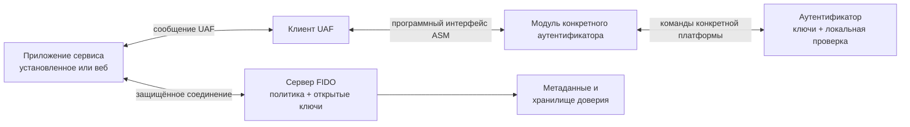
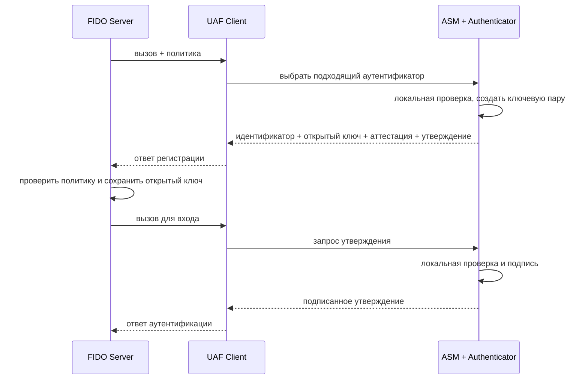

> [!mirror] Резервное зеркало
> Актуальная версия этой страницы — на основной вики: [wiki.zapret.moe/FIDO/uaf](https://wiki.zapret.moe/FIDO/uaf)

# 📱 UAF: беспарольная ветка FIDO 1.0, которая не взлетела

> [!info] О чём заметка
> Второй стандарт раннего семейства криптографической аутентификации описывал беспарольный вход по локальному жесту, цифровому коду или биометрии в мобильных приложениях. Здесь разобраны его архитектура, операции, причины ограниченного распространения и связь с современными протоколами. Общая история стандартов — в [[FIDO/fido-history|истории FIDO]].

Мобильное приложение может попросить телефон подтвердить вход отпечатком, PIN-кодом или другим локальным жестом. Телефон не отправляет серверу биометрический шаблон: он разрешает закрытому ключу подписать запрос, а сервис проверяет подпись открытым ключом. Такой беспарольный сценарий раннего поколения FIDO называли UAF, Universal Authentication Framework, «универсальной платформой аутентификации».

FIDO, Fast IDentity Online, «быстрая идентификация в сети», объединяет открытые правила криптографического входа. В первом поколении правила разделяли два сценария: аппаратный ключ добавлял второй фактор к паролю, а мобильное устройство могло заменить пароль локальным подтверждением. Спецификации развивали компании, объединившиеся в отраслевой альянс FIDO Alliance. Альянс утверждает документы, поддерживает общие требования и ведёт каталог совместимых решений.

## UAF родился как мобильный сценарий

В первом поколении FIDO ([[FIDO/fido-history#2013–2014: U2F, UAF и первый стандарт|FIDO 1.0]]) роли были разделены: [[FIDO/u2f|U2F]] добавлял аппаратный второй фактор к существующему паролю, а **UAF** позволял сервису убрать пароль из обычного сценария входа. Пользователь регистрировал устройство, часто смартфон с сенсором отпечатка, и затем подтверждал вход локальным жестом или биометрией. Способ восстановления аккаунта оставался отдельным решением сервиса.

UAF 1.0 вошёл в первый финальный пакет FIDO 1.0 в декабре 2014 года. Криптографическая основа совпадала с другими протоколами FIDO ([[FIDO/fido-protocols|разбор]]): устройство создавало пару ключей для области сервиса, а закрытым ключом подписывало случайный запрос. Биометрический шаблон и результат внутренней проверки не передавались серверу.

## Роли в архитектуре

Приложение пользователя отправляет запрос на сервер, промежуточная программа выбирает подходящее устройство, а устройство создаёт подпись закрытым ключом. Сервис, который принимает вход и полагается на результат криптографической проверки, называют RP, relying party, «полагающаяся сторона». Сервер этого сервиса называют `FIDO Server`, а устройство, которое хранит ключ и выполняет локальную проверку, — `Authenticator` («аутентификатор»).

Между приложением и устройством работает слой, который понимает сообщения протокола и скрывает различия платформ. Этот программный компонент на телефоне называют `FIDO UAF Client`; слово `Client` здесь означает посредника между приложением и аутентификатором, а не пользователя.

Разные производители используют разные сенсоры, хранилища и способы разблокировки. Специальный модуль-посредник переводит единый запрос в команды конкретного устройства. Его называют `ASM`, Authenticator Specific Module, «модуль для конкретного аутентификатора». Один ASM может обслуживать несколько доступных устройств.

Серверу нужны сведения о возможностях и сертификации моделей, чтобы не принимать неподходящий способ разблокировки. Описание свойств модели называют `metadata` («метаданные»), а доверенный набор сертификатов и правил проверки — `attestation trust store` («хранилище доверия к аттестациям»).

Схема связывает приложение сервиса, UAF Client, ASM, Authenticator и FIDO Server. UAF Client принимает протокольные сообщения, ASM скрывает особенности конкретного сенсора и хранилища ключей, а сервер использует metadata и attestation trust store для проверки заявленных свойств.

## Как приложение добиралось до устройства

Сайт или приложение должно передать запрос в установленный компонент телефона. UAF допускал системный обмен сообщениями, встроенный интерфейс страницы и отдельное расширение браузера. Набор программных функций, через который один компонент вызывает другой, называют API, Application Programming Interface, «программный интерфейс приложения».

На Android запрос можно было передать системным сообщением `Intent` или через интерфейс межпроцессного вызова `AIDL`. В iOS приложение могло открыть другое приложение по специальной ссылке, которую называют `custom URL`. Другими вариантами были встроенный интерфейс страницы `window.navigator.fido.uaf` и подключаемый модуль браузера `plugin`. Набор библиотек производителя `SDK` был распространённым способом подключения, но не единственным; `native IPC` обозначает межпроцессное взаимодействие на уровне платформы, а `DOM API` предоставляет странице функции браузера.

Проблема такой схемы проявлялась при установке: платформа и браузер должны были заранее получить совместимый UAF Client, ASM или подключаемый модуль. Веб-ветка позже получила единый API прямо в браузерах и операционных системах, поэтому сайту больше не требовалось поставлять собственный набор компонентов.

## Регистрация, вход и подтверждение операции

Во время регистрации устройство создаёт ключевую пару и связывает её с учётной записью. При входе оно проверяет локальный жест и подписывает новый запрос. В спецификации эти две операции называют `Registration` («регистрация») и `Authentication` («аутентификация»), а подписанный ответ устройства — `assertion` («утверждение аутентификатора»).

Для платежа или подписания документа устройство может показать человеку точный текст операции и попросить подтвердить именно его. Такой режим называют `Transaction Confirmation` («подтверждение транзакции»), а принцип «что видишь, то и подписываешь» — `WYSIWYS`, What You See Is What You Sign. Transaction Confirmation использует тот же тип операции аутентификации, сокращённо `Auth`, но добавляет человекочитаемое содержимое транзакции. Аутентификатор или доверенный экран показывает текст, пользователь подтверждает его, после чего устройство подписывает assertion.

Когда пользователь удаляет ключ для конкретного приложения, сервер должен удалить соответствующую запись. Операцию называют `Deregistration` («отмена регистрации»), а запрос списка доступных устройств перед началом работы — `Discovery` («обнаружение возможностей»). В документах UAF `Transaction Confirmation` предназначен для платежей, договоров и других операций, где важен подтверждённый текст.

`Deregistration` удаляет конкретную пару `(AAID, KeyID)`, все ключи заданного AAID или все ключи приложения. Ответ серверу для этой операции не требуется.

## Какие сведения сервер принимает

Случайный одноразовый запрос сервера устройство включает в подпись. Такой запрос называют `challenge` («вызов»), открытый ключ для проверки подписи — `public key`, а короткий идентификатор созданной записи — `KeyID`. Сервер получает криптографическое assertion, public key и KeyID, а при необходимости также attestation и метаданные. При регистрации устройство может добавить свидетельство о происхождении и свойствах модели. Такое свидетельство называют `attestation`; подписанный ответ на регистрацию или вход уже введён выше как assertion.

Сервер передаёт правила, по которым устройство считается подходящим: разрешённые модели, способы проверки пользователя, алгоритмы и наличие экрана. Такой набор правил называют `Policy` («политика»); список допустимых сочетаний — `accepted`, а список исключений — `disallowed`.

Каждая модель аутентификатора имеет короткий идентификатор производителя и модели. Его называют `AAID`, Authenticator Attestation ID; это не серийный номер конкретного экземпляра. Сервер сопоставляет AAID с `Metadata Statement` («описанием метаданных»).

Для локальной проверки пользователь прикладывает палец, вводит PIN или выполняет другой разрешённый жест. Стандарт называет это `user verification` (UV, «проверка пользователя»), а устройство, которое распознаёт жест или биометрию, — `matcher` («модуль сопоставления»). `Attachment hint` («признак способа подключения») сообщает, встроен ли аутентификатор в телефон, подключён извне или доступен по сети.

## Связь с вебом и статус стандарта

Современная веб-ветка FIDO использует интерфейс браузера и отдельный протокол связи с внешним устройством. Интерфейс сайта с браузером называется `WebAuthn`, Web Authentication, «веб-аутентификация», протокол клиента с аутентификатором — `CTAP`, Client to Authenticator Protocol, «протокол связи клиента с аутентификатором», а их современную связку называют `FIDO2`. Эти названия относятся к другой архитектуре и не являются новыми версиями сообщений UAF.

Для совместимости с веб-веткой UAF 1.2 мог использовать общую структуру клиентских данных, куда входят тип операции, challenge и origin страницы. В спецификации эту структуру называют `CollectedClientData` («собранные данные клиента»). Здесь `origin` означает адрес страницы, с которой началась операция.

FIDO Alliance называет стабильную редакцию, утверждённую участниками альянса, Proposed Standard («предлагаемый стандарт»). Такой статус не означает черновик отдельного производителя: документ прошёл процедуру утверждения FIDO.

## Где применялся

Первые внедрения появились ещё до финального UAF 1.0. PayPal и Samsung объявили вход и платежи по отпечатку на Galaxy S5 в феврале 2014 года. NTT DOCOMO развернула FIDO-аутентификацию в мае 2015 года и позже получила сертификацию UAF 1.1. FIDO Alliance также документировал Bank of America, Shinhan Bank и корейские отраслевые сценарии под общим названием K-FIDO.

Публично описанные внедрения заметно сосредоточены в Японии и Южной Корее, но по этим кейсам нельзя строить статистику всего рынка. UAF работал в коммерческих продуктах, однако не стал универсальным интерфейсом массового веба.

## Как сервер выбирал допустимый аутентификатор

Сервер отправлял `Policy`. Поле `accepted` содержало альтернативные комбинации критериев: внутри комбинации нужно выполнить все условия, а между комбинациями достаточно одной. `disallowed` исключал нежелательные варианты.

Критерии могли ограничивать AAID, способ user verification, защиту ключа и matcher, способ подключения, алгоритмы, вид аттестации и наличие доверенного экрана подтверждения транзакции. **AAID** имел формат `VVVV#MMMM` и обозначал производителя и модель аутентификатора, а не серийный номер экземпляра. Сервер сопоставлял AAID с Metadata Statement.

## Почему не взлетел

Спецификация UAF была широкой, но внедрение зависело от платформенного UAF Client, ASM, системного межпроцессного обмена или подключаемого модуля браузера. Специальная ссылка iOS могла заметно переключать приложения, Android-интеграции различались по производителям, а браузеры не встроили DOM API повсеместно. Параллельно Android и Apple развивали собственные программные интерфейсы биометрии.

Эти факторы дают правдоподобное объяснение ограниченного распространения, но спецификации не объявляют единственную официальную причину. WebAuthn получил более простой путь к массовому вебу: стандартный API встроили браузеры и ОС, а сайт перестал поставлять собственный UAF-стек.

## Наследие

Беспарольный вход, локальная user verification и политика аутентификаторов появились в UAF до FIDO2 и имеют концептуальных наследников в WebAuthn и CTAP. Это не буквальный перенос всего UAF: модели API и протокольные структуры различаются, а UAF 1.2 уже добавлял элементы совместимости с WebAuthn через ранее описанную структуру `CollectedClientData`.

UAF 1.0 получил Proposed Standard 8 декабря 2014 года, UAF 1.1 — 2 февраля 2017 года, UAF 1.2 — 20 октября 2020 года. Сама спецификация UAF 1.1 прямо называет редакцию от 2 февраля стабильным Proposed Standard, поэтому дата относится к публикации документа, а не к отдельному испытанию продукта. UAF 1.2 по-прежнему перечислен в каталоге спецификаций FIDO. Основной современный путь массовой аутентификации FIDO проходит через [[FIDO/webauthn|WebAuthn]], [[FIDO/ctap|CTAP]] и [[FIDO/passkeys|passkeys]].

## 📚 См. также

- [[FIDO/00-overview|Обзор раздела FIDO]] — оглавление всех заметок об аппаратных ключах
- [[FIDO/fido-history|Что такое FIDO и его история]] — контекст: FIDO 1.0, путь к FIDO2
- [[FIDO/u2f|U2F]] — парный стандарт первого поколения: второй фактор
- [[FIDO/fido-protocols|Протоколы FIDO]] — общая механика семейства
- [[FIDO/passkeys|Passkeys]] — куда в итоге пришла беспарольная линия
- 🔗 [UAF 1.2 Proposed Standard](https://fidoalliance.org/specs/fido-uaf-v1.2-ps-20201020/fido-uaf-protocol-v1.2-ps-20201020.html) — актуальная версия протокола UAF
- 🔗 [UAF 1.1 Architectural Overview](https://fidoalliance.org/specs/fido-uaf-v1.1-ps-20170202/fido-uaf-overview-v1.1-ps-20170202.html) — роли Client, ASM и Authenticator

---

> [!quote] 🤖 Эти статьи открыты — можно обучать на них ИИ
> При желании вы можете натренировать ИИ на наших статьях. Исходное форматирование и скачивание всего репозитория одним zip-архивом доступны в Forgejo: [исходник этой заметки](https://git.zapret.moe/zapretdiscordyoutube/todo/src/branch/main/FIDO/uaf.md) · [весь репозиторий](https://git.zapret.moe/zapretdiscordyoutube/todo/src/branch/main).
