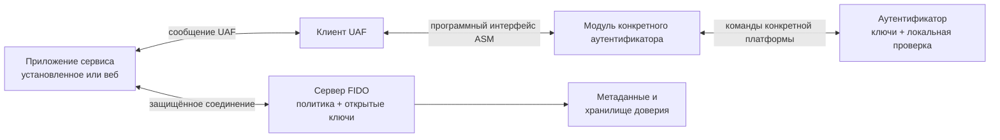
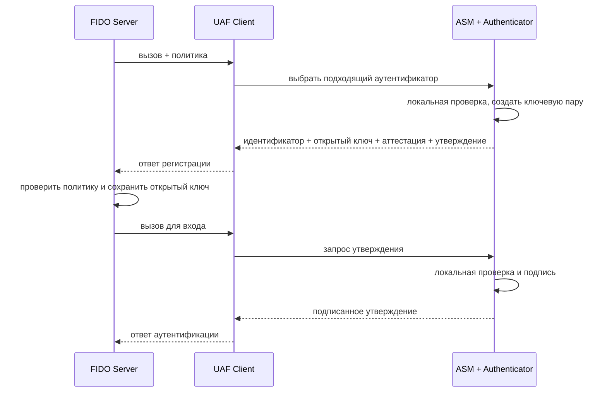

# 📱 UAF: беспарольная ветка FIDO 1.0, которая не взлетела

> [!info] О чём заметка
> Второй стандарт раннего семейства криптографической аутентификации описывал беспарольный вход по локальному жесту, цифровому коду или биометрии в мобильных приложениях. Здесь разобраны его архитектура, операции, причины ограниченного распространения и связь с современными протоколами. Общая история стандартов — в [[FIDO/fido-history|истории FIDO]].

## Термины перед чтением

Семейство открытых стандартов сильной онлайн-аутентификации называют FIDO (Fast IDentity Online, «быстрая идентификация в сети»). Его первое поколение разделяло два сценария: аппаратный ключ добавлял второй фактор к паролю, а мобильное устройство могло заменить пароль локальным подтверждением. Беспарольную ветку этого поколения называют `UAF` (Universal Authentication Framework, «универсальная платформа аутентификации»).

Отраслевой FIDO Alliance объединяет компании, которые разрабатывают, утверждают и поддерживают эти спецификации. Платформы, приложения и изготовители аутентификаторов используют опубликованные альянсом правила для совместимости.

В схеме UAF приложение пользователя отправляет запрос на сервер, промежуточная программа выбирает подходящий аутентификатор, а тот создаёт подпись закрытым ключом. Сервис, который принимает вход, называют `RP` (relying party, «полагающаяся сторона»): он полагается на результат криптографической проверки. Сервер этого сервиса называется `FIDO Server`, а устройство, которое хранит ключ и выполняет локальную проверку, — `Authenticator` («аутентификатор»).

Между приложением и устройством работает отдельный слой, который понимает сообщения протокола и скрывает различия платформ. Этот слой называют `FIDO UAF Client`; слово `Client` здесь означает программный компонент на телефоне, а не пользователя.

Разные производители используют разные сенсоры, хранилища и способы разблокировки. Специальный модуль-посредник переводит единый запрос в команды конкретного устройства; его называют `ASM` (Authenticator Specific Module, «модуль для конкретного аутентификатора»). Один такой модуль может обслуживать несколько доступных устройств.

Серверу нужны сведения о возможностях и сертификации моделей, чтобы не принимать неподходящий способ разблокировки. Описание этих свойств называют `metadata` («метаданные»), а доверенный набор сертификатов и правил проверки — `attestation trust store` («хранилище доверия к аттестациям»).

Сайт или приложение должно передать запрос в установленный компонент телефона. Варианты связи включали системный обмен сообщениями, встроенный интерфейс страницы и отдельное расширение браузера. Набор программных функций, через который один компонент вызывает другой, называют API (Application Programming Interface, «программный интерфейс приложения»). Межпроцессное взаимодействие называют `native IPC`, набор библиотек производителя — `SDK`, интерфейс страницы — `DOM API`, а подключаемый модуль браузера — `plugin`.

Во время регистрации устройство создаёт ключевую пару и связывает её с учётной записью. При входе оно проверяет локальный жест и подписывает новый запрос. Эти операции в спецификации называются `Registration` («регистрация») и `Authentication` («аутентификация»); подписанный ответ устройства называют `assertion` («утверждение аутентификатора»).

Для платежа или подписания документа устройство может показать человеку точный текст операции и попросить подтвердить именно его. Такой режим называют `Transaction Confirmation` («подтверждение транзакции»), а принцип «что видишь, то и подписываешь» — `WYSIWYS` (What You See Is What You Sign).

Когда пользователь удаляет ключ для конкретного приложения, сервер должен удалить соответствующую запись. Операцию удаления называют `Deregistration` («отмена регистрации»), а запрос списка доступных устройств перед началом работы — `Discovery` («обнаружение возможностей»).

Сервер передаёт правила, по которым устройство считается подходящим: разрешённые модели, способы проверки пользователя, алгоритмы и наличие экрана. Такой набор правил называют `Policy` («политика»); список допустимых сочетаний — `accepted`, а список исключений — `disallowed`.

Каждая модель аутентификатора имеет короткий идентификатор производителя и модели. Его называют `AAID` (Authenticator Attestation ID); это не серийный номер конкретного экземпляра. Сервер сопоставляет AAID с описанием модели в `Metadata Statement` («описании метаданных»).

Для локальной проверки пользователь прикладывает палец, вводит персональный цифровой код PIN или выполняет другой разрешённый жест. Стандарт называет это `user verification` (UV, «проверка пользователя»), а устройство, которое распознаёт жест или биометрию, — `matcher` («модуль сопоставления»). `Attachment hint` («признак способа подключения») сообщает, встроен ли аутентификатор в телефон, подключён извне или доступен по сети.

Каждая операция начинается со случайного одноразового запроса сервера, который устройство включает в подпись. Такой запрос называют `challenge` («вызов»), открытый ключ для проверки подписи — `public key`, а короткий идентификатор созданной записи — `KeyID`.

При регистрации устройство может добавить свидетельство о происхождении и свойствах модели. Такое свидетельство называют `attestation` («аттестация»); подписанный ответ на регистрацию или вход уже введён выше как assertion.

Современная веб-ветка FIDO использует интерфейс браузера и отдельный протокол связи с внешним устройством. Интерфейс сайта с браузером называется `WebAuthn`, протокол клиента с аутентификатором — `CTAP`, а их современную связку называют `FIDO2`. Эти названия относятся к другой архитектуре и не являются новыми версиями сообщений UAF.

Для совместимости с веб-веткой UAF 1.2 мог использовать общую структуру клиентских данных, куда входят тип операции, challenge и origin страницы. В спецификации эта структура называется `CollectedClientData` («собранные данные клиента»).

FIDO Alliance называет стабильную редакцию, утверждённую участниками альянса, Proposed Standard («предлагаемый стандарт»). Этот статус не означает черновик отдельного производителя: документ прошёл процедуру утверждения FIDO.

## Кратко

- **UAF** — беспарольный сценарий входа из FIDO 1.0 (декабрь 2014): пользователь регистрирует аутентификатор и затем подтверждает вход локальным жестом, PIN-кодом или биометрией. Восстановление аккаунта оставалось отдельной политикой сервиса.
- Протокол не передаёт биометрический шаблон серверу: локальная проверка разрешает использовать закрытый ключ, а RP получает подписанное утверждение.
- UAF предусматривал native IPC, SDK, браузерный DOM API и plugins, но не получил широкой встроенной поддержки браузеров и платформ; публичные внедрения остались точечными.
- Основным массовым направлением позже стал FIDO2 ([[FIDO/webauthn|WebAuthn]] + [[FIDO/ctap|CTAP]]). Он использует похожие свойства — беспарольный сценарий и локальную проверку пользователя, — но другую архитектуру и структуры протокола.

## Что такое UAF

В первом поколении стандартов FIDO ([[FIDO/fido-history#2013–2014: U2F, UAF и первый стандарт|FIDO 1.0]]) роли были разделены: [[FIDO/u2f|U2F]] добавлял аппаратный второй фактор к существующему паролю, а **UAF** позволял сервису убрать пароль из обычного сценария входа. Пользователь регистрировал устройство, часто смартфон с сенсором отпечатка, и затем подтверждал вход локальным жестом или биометрией. Способ восстановления аккаунта при этом оставался отдельным решением сервиса.

Криптографическая основа та же, что во всей семье FIDO ([[FIDO/fido-protocols|разбор]]): пара ключей на область сервиса и подпись challenge закрытым ключом. Биометрический шаблон и результат внутреннего matcher не передаются RP. Сервер получает криптографическое assertion, public key/KeyID и, при необходимости, attestation и метаданные.

## Как был устроен

Архитектура UAF разделяла приложение RP, FIDO UAF Client, ASM (Authenticator Specific Module), Authenticator и FIDO Server. UAF Client принимал протокольные сообщения. ASM скрывал особенности конкретного сенсора и хранилища ключей; один ASM мог обслуживать несколько authenticators. Сервер использовал metadata и attestation trust store для проверки заявленных свойств.

UAF описывал несколько способов доставить программный интерфейс. В Android запрос можно было передать системным сообщением Intent или через интерфейс межпроцессного вызова AIDL. В iOS приложение могло открывать другое приложение по специальной ссылке, называемой custom URL. Другими вариантами были встроенный интерфейс страницы `window.navigator.fido.uaf` и подключаемый модуль браузера. Набор библиотек производителя SDK был распространённым способом, но не единственным. Проблема состояла в том, что платформы и браузеры должны были заранее поставить совместимый UAF Client, ASM или подключаемый модуль; WebAuthn позже получил единый API прямо в браузерах и ОС.

## Регистрация, вход и подтверждение операции

UAF определял Registration, Authentication, Transaction Confirmation и Deregistration. Discovery позволял приложению узнать доступные authenticators до обращения к серверу.

Transaction Confirmation использовал тот же тип операции аутентификации, сокращённо `Auth`, но добавлял человекочитаемое содержимое транзакции. Аутентификатор или доверенный экран показывал текст, пользователь подтверждал именно его, после чего устройство подписывало assertion. В документах UAF эту модель называли WYSIWYS (What You See Is What You Sign); она предназначалась для платежей, договоров и других операций, где важен подтверждённый текст.

Deregistration удалял конкретный `(AAID, KeyID)`, все ключи заданного AAID или все ключи приложения. Ответ серверу для этой операции не требовался.

## Где применялся

Первые внедрения появились ещё до финального UAF 1.0. PayPal и Samsung объявили вход и платежи по отпечатку на Galaxy S5 в феврале 2014 года. NTT DOCOMO развернула FIDO-аутентификацию в мае 2015 года и позже получила сертификацию UAF 1.1. FIDO Alliance также документировал Bank of America, Shinhan Bank и корейские отраслевые сценарии под общим названием K-FIDO.

Публично описанные внедрения заметно сосредоточены в Японии и Южной Корее, но по этим кейсам нельзя строить статистику всего рынка. UAF работал в коммерческих продуктах, однако не стал универсальным интерфейсом массового веба.

## Как сервер выбирал допустимый аутентификатор

Сервер отправлял `Policy`. Поле `accepted` содержало альтернативные комбинации критериев: внутри комбинации нужно выполнить все условия, а между комбинациями достаточно одной. `disallowed` исключал нежелательные варианты.

Критерии могли ограничивать AAID, способ user verification, защиту ключа и matcher, способ подключения, алгоритмы, вид аттестации и наличие доверенного экрана подтверждения транзакции. **AAID** имел формат `VVVV#MMMM` и обозначал производителя и модель аутентификатора, а не серийный номер экземпляра. Сервер сопоставлял AAID с Metadata Statement.

## Почему не взлетел

Спецификация UAF была широкой, но внедрение зависело от платформенного UAF Client, ASM, системного межпроцессного обмена или подключаемого модуля браузера. Специальная ссылка iOS могла заметно переключать приложения, Android-интеграции различались по производителям, а браузеры не встроили DOM API повсеместно. Параллельно Android и Apple развивали собственные программные интерфейсы биометрии.

Эти факторы дают правдоподобное объяснение ограниченного распространения, но спецификации не объявляют единственную официальную причину. WebAuthn получил более простой путь к массовому вебу: стандартный API встроили браузеры и ОС, а сайт перестал поставлять собственный UAF-стек.

## Наследие

Беспарольный вход, локальная user verification и политика аутентификаторов появились в UAF до FIDO2 и имеют концептуальных наследников в WebAuthn/CTAP. Это не буквальный перенос всего UAF: модели API и протокольные структуры различаются, а UAF 1.2 уже добавлял элементы совместимости с WebAuthn через ранее описанную структуру `CollectedClientData`.

UAF 1.0 получил Proposed Standard 8 декабря 2014 года, UAF 1.1 — 2 февраля 2017 года, UAF 1.2 — 20 октября 2020 года. UAF 1.2 по-прежнему перечислен в каталоге спецификаций FIDO. Основной современный путь массовой аутентификации FIDO проходит через [[FIDO/webauthn|WebAuthn]], [[FIDO/ctap|CTAP]] и [[FIDO/passkeys|passkeys]].

## 📚 См. также

- [[FIDO/00-overview|Обзор раздела FIDO]] — оглавление всех заметок об аппаратных ключах
- [[FIDO/fido-history|Что такое FIDO и его история]] — контекст: FIDO 1.0, путь к FIDO2
- [[FIDO/u2f|U2F]] — парный стандарт первого поколения: второй фактор
- [[FIDO/fido-protocols|Протоколы FIDO]] — общая механика семейства
- [[FIDO/passkeys|Passkeys]] — куда в итоге пришла беспарольная линия
- 🔗 [UAF 1.2 Proposed Standard](https://fidoalliance.org/specs/fido-uaf-v1.2-ps-20201020/fido-uaf-protocol-v1.2-ps-20201020.html) — актуальная версия протокола UAF
- 🔗 [UAF 1.1 Architectural Overview](https://fidoalliance.org/specs/fido-uaf-v1.1-ps-20170202/fido-uaf-overview-v1.1-ps-20170202.html) — роли Client, ASM и Authenticator

---

> [!quote] 🤖 Эти статьи открыты — можно обучать на них ИИ
> При желании вы можете натренировать ИИ на наших статьях. Исходное форматирование и скачивание всего репозитория одним zip-архивом доступны в Forgejo: [исходник этой заметки](https://git.zapret.moe/zapretdiscordyoutube/todo/src/branch/main/FIDO/uaf.md) · [весь репозиторий](https://git.zapret.moe/zapretdiscordyoutube/todo/src/branch/main).
