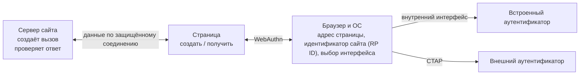
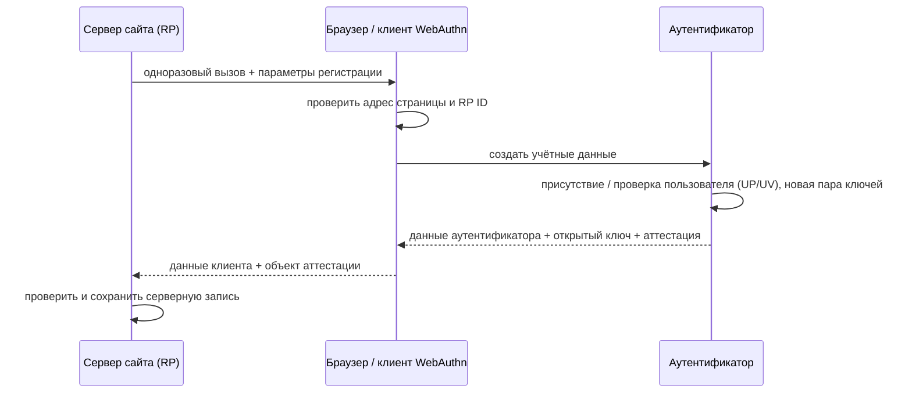
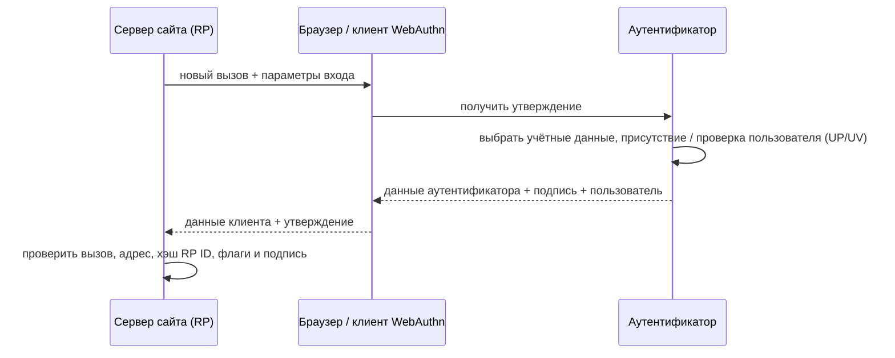

> [!mirror] Резервное зеркало
> Актуальная версия этой страницы — на основной вики: [wiki.zapret.moe/FIDO/webauthn](https://wiki.zapret.moe/FIDO/webauthn)

# 🌐 WebAuthn: браузерный API аутентификации FIDO2

> [!info] О чём заметка
> Сайт может попросить браузер создать для него отдельную пару ключей и потом проверять подписи этой пары при входе. Такой веб-интерфейс называется WebAuthn (Web Authentication) и образует веб-половину современного набора открытых стандартов криптографического входа. Здесь разобраны регистрация, вход, параметры интерфейса, обнаруживаемые учётные данные и версии стандарта; обмен с внешним устройством описан в [[FIDO/ctap|заметке о связи браузера с ключом]], общая картина — в [[FIDO/fido-protocols|обзоре всей системы]].

## Что такое WebAuthn

WebAuthn — это спецификация W3C (World Wide Web Consortium, консорциума, который выпускает стандарты Всемирной паутины), определяющая, как веб-сайт взаимодействует с аутентификаторами через браузер. Она родилась из черновиков «FIDO 2.0», которые альянс передал в W3C в 2015 году (хронология — в [[FIDO/fido-history|истории FIDO]]), и вместе с протоколом [[FIDO/ctap|CTAP]] составляет стандарт FIDO2. В семействе FIDO (Fast IDentity Online, «быстрая идентификация в сети») WebAuthn отвечает за уровень «сайт ↔ браузер», а CTAP — за уровень «браузер ↔ внешнее устройство».

Проще говоря: WebAuthn — это общий язык, на котором любой сайт может попросить «создай мне ключ» или «подпиши этот вызов», не зная и не выбирая, чем именно пользователь подпишет — отпечатком на ноутбуке, телефоном или [[FIDO/hardware-security-keys|аппаратным ключом]]. Выбор аутентификатора — забота браузера и ОС.

Сайт, который принимает результат входа, хранит открытый ключ и проверяет подпись, в терминах стандарта называется **relying party** (RP, «полагающаяся сторона»). Регистрация и вход называются «церемониями» (ceremony): это последовательности шагов, часть которых выполняет человек.

## Где заканчивается WebAuthn

Страница обращается к браузеру через стандартный набор программных функций. Такой набор называют программным интерфейсом приложения (API); в веб-странице его вызывает код JavaScript. WebAuthn начинается с этого вызова и заканчивается объектом, который браузер возвращает странице.

Браузер и операционная система работают посредником между сайтом и устройством: проверяют адрес страницы, выбирают способ подтверждения и не передают сайту закрытый ключ, PIN или биометрический шаблон. Этот слой называется **client platform** («клиентская платформа»). Если выбран внешний ключ или телефон, то есть **roaming authenticator** («внешний аутентификатор»), клиентская платформа переводит WebAuthn-запрос в [[FIDO/ctap|CTAP]]. Встроенный датчик ноутбука или телефона называют **platform authenticator** («платформенный аутентификатор»); он может использовать внутренний интерфейс операционной системы.



Страница задаёт политику, а client platform решает, какой интерфейс показать. Параметр `authenticatorAttachment` или новые `hints` выражают предпочтение, но сайт не получает прямой доступ к USB, NFC, Touch ID или телефону.

Внешний аутентификатор может подключаться по USB (проводной интерфейс), NFC (Near Field Communication, связь на коротком расстоянии) или BLE (Bluetooth Low Energy, Bluetooth с низким энергопотреблением). Эти транспорты меняют способ доставки запроса, но не саму проверку подписи.

## Церемония регистрации

Регистрация связывает новый открытый ключ с аккаунтом и сайтом. Сервер начинает её со свежей случайной задачи, пригодной только для этой попытки; стандарт называет её challenge. Доменную область, для которой создаётся ключ, задаёт RP ID. Точный адрес страницы со схемой, именем узла и портом браузер фиксирует отдельно как origin.

Устройство различает физическое действие и проверку владельца. Касание подтверждает присутствие пользователя (User Presence, UP). Ввод локального PIN-кода или биометрия дают проверку пользователя (User Verification, UV). Сайт указывает, какой из этих признаков ему нужен.

1. Сервер генерирует случайный **challenge** («одноразовый вызов») и передаёт странице параметры: свой идентификатор (RP ID, доменное имя без схемы и порта), данные пользователя, допустимые алгоритмы подписи и требования к аутентификатору.
2. Страница вызывает `navigator.credentials.create({publicKey: ...})`. Браузер показывает системный диалог: выбрать аутентификатор, коснуться ключа, ввести PIN или приложить палец.
3. Аутентификатор создаёт новую ключевую пару для этого RP ID и возвращает открытый ключ плюс **attestation** — опциональное свидетельство о происхождении и свойствах устройства ([[FIDO/fido-protocols#Attestation: когда серверу важен тип аутентификатора|зачем оно]]). Закрытый ключ остаётся во внутренней записи устройства, которую спецификация называет **credential source** («источник учётных данных»).
4. Браузер дополняет ответ структурой `clientDataJSON`, куда сам вписывает challenge и сериализованный **origin** страницы: схему, имя узла и порт. Подделать это поле сайт не может: его заполняет браузер.
5. Сервер сверяет challenge, origin, `rpIdHash`, флаги и структуру ответа, проверяет attestation по своей политике и сохраняет открытый ключ вместе с идентификатором **credential** («учётных данных»). На устройстве соответствующий credential source хранит закрытый ключ и служебные параметры; открытый ключ на сервере не является частью credential source.



## Церемония входа

1. Сервер присылает свежий challenge (и, при классическом входе по логину, список идентификаторов учётных данных пользователя — `allowCredentials`).
2. Страница вызывает `navigator.credentials.get({publicKey: ...})`; браузер будит аутентификатор, человек подтверждает участие касанием/PIN/биометрией.
3. Аутентификатор возвращает подписанное утверждение (**assertion**) над связкой «данные аутентификатора + хэш clientDataJSON». В данные входят хэш RP ID, **счётчик подписей** и флаги: UP (user presence, «присутствие пользователя», например касание) и UV (user verification, «проверка пользователя» PIN-кодом или биометрией).
4. Сервер проверяет подпись открытым ключом, сверяет challenge, origin, RP ID и счётчик (защита от клонов — тот же приём, что в [[FIDO/u2f#Счётчик: защита от клонов|U2F]]).



## Что лежит внутри ответа

`clientDataJSON` создаёт клиент WebAuthn. В нём находятся `type` (`webauthn.create` или `webauthn.get`), серверный challenge, полный origin, признак вызова со страницы другого источника и при необходимости `topOrigin`. Сервер проверяет эти поля после получения ответа.

`authenticatorData` — бинарная структура длиной минимум 37 байт. Первые 32 байта содержат `rpIdHash`, затем идёт байт флагов и четырёхбайтовый `signCount`. При регистрации добавляются данные созданной учётной записи и, если есть аттестация, её дополнительные сведения. Данные расширений кодируются в компактном двоичном формате объектов **CBOR** (Concise Binary Object Representation, «компактное двоичное представление объектов»).

```text
rpIdHash (32 байта) | flags (1 байт) | signCount (4 байта) | optional data
```

В байте флагов важны UP (user presence), UV (user verification), BE (учётные данные допускают резервное копирование), BS (резервная копия сейчас существует), AT (есть данные аттестации) и ED (есть данные расширения). Комбинация `BE=0, BS=1` недопустима.

## Границы сайта: идентификатор и точный адрес (RP ID и origin)

**Origin** («происхождение страницы») — схема, хост и порт страницы. **RP ID** — доменное имя без схемы и порта. Браузер допускает RP ID, равный эффективному домену страницы или его общему регистрируемому доменному суффиксу; стандарт не пытается устанавливать юридическую принадлежность доменов одной организации. В стандарте исходную часть домена называют **effective domain**, а допустимый общий суффикс — **registrable-domain suffix**. Страница `https://login.example.com` может запросить `example.com`, но не соседний домен.

Origin попадает в `clientDataJSON`, а `SHA-256(RP ID)` — в `authenticatorData`. Аутентификатор подписывает `authenticatorData || SHA-256(clientDataJSON)`. Сервер обязан проверить оба значения; одна лишь проверка криптографической подписи без origin и `rpIdHash` оставляет реализацию небезопасной.

## Ключевые параметры API

При создании учётных данных сайт может задать:

- Для предпочтения встроенного средства или внешнего ключа служит параметр **authenticatorAttachment**. Значение `platform` означает встроенный аутентификатор, например системную проверку отпечатка или лица, а `cross-platform` — внешний ключ.
- Требование хранить обнаруживаемую учётную запись задаёт параметр **residentKey**. Его современный смысл относится к discoverable credential, несмотря на старое слово «resident» в имени.
- Необходимость локальной проверки человека задаёт параметр **userVerification**. Значение `required` требует PIN или биометрию, `preferred` просит их при наличии возможности, а `discouraged` не требует такой проверки.
- Запрос свидетельства о модели устройства задаёт параметр **attestation**. Значение `none` отказывается от него; варианты `direct` и `enterprise` запрашивают прямое или корпоративное свидетельство для сред со строгой политикой.

Расширения добавляют к обычной регистрации или входу дополнительные данные и операции. Одно из них позволяет аутентификатору детерминированно выводить секрет, пригодный как ключ шифрования, — так менеджеры паролей могут разблокировать хранилище аппаратным ключом, а не только входить по нему.

Название `prf` означает псевдослучайную функцию: при одном и том же входе она детерминированно выводит одинаковый секретный результат, но без ключа результат нельзя предсказать. Это необязательное расширение принимает один или два входа и возвращает 32-байтные результаты, связанные с конкретными учётными данными. Приложение может использовать результат как материал для ключа шифрования, но обязано уметь работать с отсутствием поддержки.

Другое расширение, `largeBlob`, связывает с учётными данными небольшой непрозрачный блок данных. При регистрации сайт запрашивает поддержку, а при входе выполняет чтение или запись. Это не общий файловый накопитель и не место для закрытого ключа.

## Вход без логина: обнаруживаемые учётные данные (discoverable credentials)

Классический второй фактор требует сначала назвать логин, чтобы сервер прислал список учётных данных. **Discoverable credential** («обнаруживаемые учётные данные», устаревший синоним — resident key) хранится у управляющего аутентификатора или системного хранилища учётных данных вместе с идентификатором пользователя. Поэтому сайт может вызвать `get()` с пустым `allowCredentials`, а client platform сама найдёт и покажет учётки для этого RP ID. Так работает вход без предварительного ввода логина и пароля, он же вход по [[FIDO/passkeys|passkey]] («ключу доступа»). У аппаратного ключа такие записи расходуют ограниченную память ([[FIDO/hardware-security-keys|лимиты по моделям]]).

С 2022 года к этому добавился **conditional UI** («условное» автозаполнение): браузер предлагает passkey в подсказках поля логина. Сайт вызывает `get()` с `mediation: "conditional"`, а client platform ищет только discoverable credentials. Запрос не открывает модальный диалог заранее; пользователь выбирает credential в обычном интерфейсе автозаполнения и затем проходит локальное подтверждение.

Пустой `allowCredentials` просит client platform искать discoverable credentials по RP ID. Непустой список ограничивает выбор заданными идентификаторами учётных данных и нужен для входа по заранее выбранной записи, включая недоступные для самостоятельного поиска учётные данные. Внутренний непрозрачный идентификатор пользователя, который сервис записывает в обнаруживаемые учётные данные, называется `userHandle`. При входе без заранее названного логина сервер использует его, находит аккаунт и дополнительно проверяет, что возвращённый идентификатор учётных данных принадлежит этому пользователю.

## Возможности клиента и подсказки в третьем уровне (Level 3)

WebAuthn Level 3 добавляет метод `PublicKeyCredential.getClientCapabilities()` для запроса возможностей клиента. Он сообщает поддержку условного создания и получения учётных данных, входа через телефон и системного аутентификатора. Отсутствующий ключ означает «неизвестно», а не обязательное `false`: браузер может скрывать часть возможностей, чтобы сайт не составлял устойчивый отпечаток браузера, то есть не использовал fingerprinting для слежения.

Сайт может подсказать браузеру желательный интерфейс: отдельный ключ безопасности, текущее устройство или телефон. Массив таких необязательных подсказок называется `hints` и принимает значения `security-key`, `client-device` или `hybrid`. Если нужен обязательный тип аутентификатора или UV, сайт задаёт нормативный параметр, а не полагается на подсказку.

Подсказка `hybrid` означает вход с телефона на другом компьютере: пользователь сканирует QR-код, телефон подтверждает близость по Bluetooth и передаёт подписанный ответ по защищённому каналу. Такой способ называется **hybrid transport** («гибридный транспорт»).

После удаления или переименования ключа доступа сайт может уведомить системное хранилище, чтобы оно не показывало устаревшую запись. Такие вызовы называются signal-методами; они передают сведения от полагающейся стороны аутентификатору и не заменяют серверное удаление учётных данных.

## Что сервер обязан проверить

Клиентская библиотека не заменяет серверную проверку. При регистрации сервер сверяет `type`, свежий challenge, разрешённый origin, `rpIdHash`, требуемые UP/UV-флаги и согласованность BE/BS. Затем он извлекает идентификатор учётных данных и открытый ключ, проверяет выбранный алгоритм, отсутствие дубликата и attestation согласно своей политике.

При входе сервер сначала находит сохранённую запись учётных данных и пользователя. После этого он проверяет `type`, challenge, origin, `rpIdHash`, флаги и подпись над точными байтами `authenticatorData || SHA-256(clientDataJSON)`. `signCount` служит сигналом возможного клонирования, сброса или гонки; несовпадение требует политики риска, но само по себе не доказывает клон.

> [!danger] Challenge нельзя генерировать в браузере
> Challenge создаёт сервер в доверенной среде, хранит до завершения церемонии и принимает один раз. W3C рекомендует не менее 16 байт энтропии. Повторно используемый или предсказуемый challenge разрушает защиту от повторного воспроизведения (replay).

## Частые ошибки API

Отмена пользователем, истечение времени ожидания и ряд внутренних отказов возвращаются под общим именем `NotAllowedError`, поэтому по одному имени нельзя диагностировать причину. Ошибка границы сайта обычно получает имя `SecurityError` и указывает на неверный домен страницы или RP ID. При создании записи невозможное обязательное требование возвращает `ConstraintError`, совпадение с запрещённым идентификатором — `InvalidStateError`, отсутствие подходящего типа или алгоритма — `NotSupportedError`, а некорректные параметры — `TypeError`.

Браузер намеренно скрывает часть подробностей, чтобы сайт не использовал ошибки для тихого определения зарегистрированных credentials и возможностей устройства. Пользовательский интерфейс должен давать безопасный повтор и понятный альтернативный путь, не раскрывая наличие чужого аккаунта.

## Версии стандарта

В терминологии W3C **Recommendation** означает утверждённую рекомендацию, **Working Draft** — рабочий черновик, а **Candidate Recommendation** — документ, для которого уже собирают опыт реализаций перед окончательным утверждением. Слово **Snapshot** указывает на зафиксированную датированную редакцию.

- **Level 1** — рекомендация W3C, март 2019: базовые церемонии.
- **Level 2** — рекомендация, апрель 2021: актуальная стабильная версия (расширения, аттестация для корпоративной среды и уточнения по resident keys).
- **Level 3** — Candidate Recommendation Snapshot от 26 мая 2026 года. Это зафиксированная датированная редакция документа, который прошёл проверку, но ещё не стал окончательной рекомендацией (Recommendation). Редакция описывает conditional mediation, hybrid transport, client capabilities, hints, BE/BS-флаги, signal-методы и PRF.

Базовый WebAuthn широко поддерживается: Chrome и Firefox — с 2018 года, Safari — с 2019–2020. Новые возможности Level 3 и интеграция с системными хранилищами passkey зависят от версии браузера и ОС.

## 📚 См. также

- [[FIDO/00-overview|Обзор раздела FIDO]] — оглавление всех заметок об аппаратных ключах
- [[FIDO/fido-protocols|Протоколы FIDO]] — общая картина: challenge-response, привязка к домену, attestation
- [[FIDO/ctap|CTAP]] — вторая половина FIDO2: как браузер говорит с внешним ключом
- [[FIDO/passkeys|Passkeys]] — потребительская надстройка над discoverable credentials
- [[FIDO/u2f|U2F]] — предшественник: второй фактор до WebAuthn
- 🔗 [WebAuthn Level 3 (W3C Candidate Recommendation)](https://www.w3.org/TR/webauthn-3/) — актуальная редакция стандарта
- 🔗 [WebAuthn Level 2 (W3C Recommendation)](https://www.w3.org/TR/webauthn-2/) — действующая рекомендация предыдущего уровня
- 🔗 [webauthn.guide](https://webauthn.guide/) — наглядное введение для разработчиков

---

> [!quote] 🤖 Эти статьи открыты — можно обучать на них ИИ
> При желании вы можете натренировать ИИ на наших статьях. Исходное форматирование и скачивание всего репозитория одним zip-архивом доступны в Forgejo: [исходник этой заметки](https://git.zapret.moe/zapretdiscordyoutube/todo/src/branch/main/FIDO/webauthn.md) · [весь репозиторий](https://git.zapret.moe/zapretdiscordyoutube/todo/src/branch/main).
