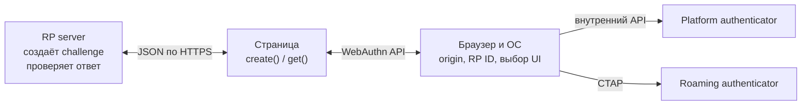
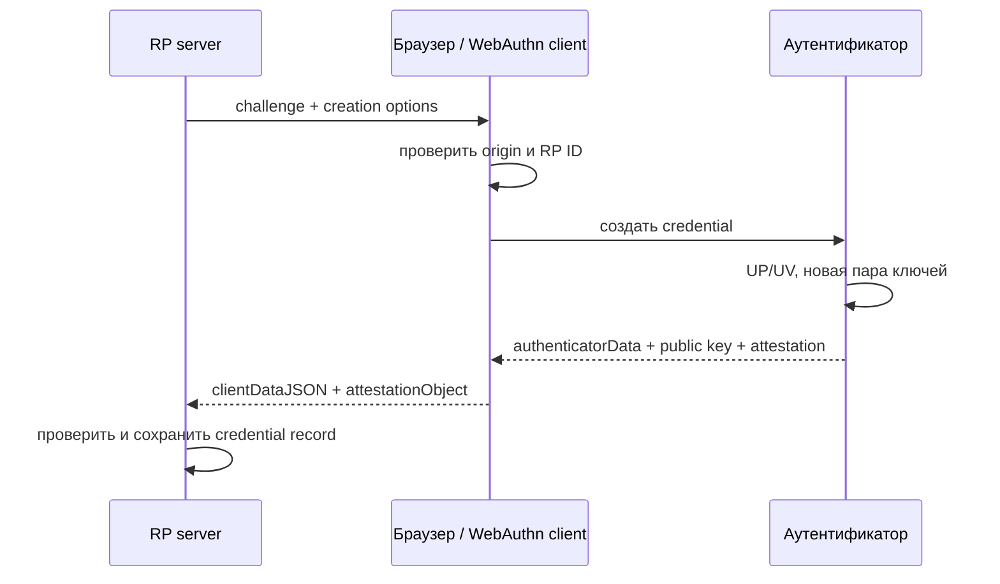
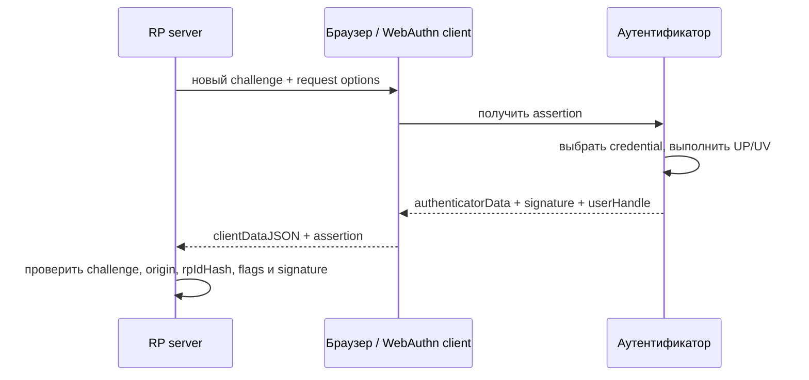

# 🌐 WebAuthn: браузерный API аутентификации FIDO2

> [!info] О чём заметка
> WebAuthn (Web Authentication) — веб-половина стандарта FIDO2: API браузера, через который сайт регистрирует ключи и проверяет вход. Здесь — как устроены церемонии регистрации и входа, ключевые параметры API, discoverable credentials и версии стандарта. Вторая половина FIDO2 — протокол общения с внешним устройством — в [[FIDO/ctap|заметке о CTAP]]; общая картина протоколов — в [[FIDO/fido-protocols|обзоре протоколов FIDO]].

## TL;DR

- **WebAuthn** — стандарт W3C (рекомендация с марта 2019): JavaScript-API `navigator.credentials.create()` / `get()`, через который сайт просит браузер создать ключевую пару или подписать вызов.
- Сайт не общается с аутентификатором напрямую: посредником выступает браузер/ОС. Сайт задаёт требования и может получить отдельные признаки, но не управляет конкретным USB-, NFC- или встроенным устройством.
- Браузер формирует `clientDataJSON` с origin и challenge, а аутентификатор формирует `authenticatorData` с `rpIdHash`, флагами и счётчиком. Сервер проверяет оба слоя и подпись.
- **Discoverable credentials** позволяют входить без ввода логина, а conditional UI (автозаполнение passkey, 2022+) встроил этот вход в привычную форму логина.

## Что такое WebAuthn

WebAuthn — это спецификация W3C, определяющая, как веб-сайт взаимодействует с аутентификаторами через браузер. Она родилась из черновиков «FIDO 2.0», которые альянс передал в W3C в 2015 году (хронология — в [[FIDO/fido-history|истории FIDO]]), и вместе с протоколом [[FIDO/ctap|CTAP]] составляет стандарт FIDO2: WebAuthn отвечает за уровень «сайт ↔ браузер», CTAP — за уровень «браузер ↔ внешнее устройство».

Проще говоря: WebAuthn — это общий язык, на котором любой сайт может попросить «создай мне ключ» или «подпиши этот вызов», не зная и не выбирая, чем именно пользователь подпишет — отпечатком на ноутбуке, телефоном или [[FIDO/hardware-security-keys|аппаратным ключом]]. Выбор аутентификатора — забота браузера и ОС.

В терминах стандарта сайт называется **relying party** (RP, «полагающаяся сторона»), а обе операции — регистрация и вход — «церемониями» (ceremony): последовательность шагов, часть которых выполняет человек.

## Где заканчивается WebAuthn

WebAuthn начинается в JavaScript API страницы и заканчивается объектом, который браузер возвращает странице. Закрытый ключ, PIN и биометрический шаблон через API не проходят. Если выбран внешний ключ, браузер и ОС переводят WebAuthn-запрос в [[FIDO/ctap|CTAP]]; если выбран встроенный аутентификатор, платформа может использовать собственный внутренний интерфейс.



Страница задаёт политику, а client platform решает, какой интерфейс показать. Параметр `authenticatorAttachment` или новые `hints` выражают предпочтение, но сайт не получает прямой доступ к USB, NFC, Touch ID или телефону.

## Церемония регистрации

1. Сервер генерирует случайный **challenge** и передаёт странице параметры: свой идентификатор (RP ID), данные пользователя, допустимые алгоритмы подписи и требования к аутентификатору.
2. Страница вызывает `navigator.credentials.create({publicKey: ...})`. Браузер показывает системный диалог: выбрать аутентификатор, коснуться ключа, ввести PIN или приложить палец.
3. Аутентификатор создаёт новую ключевую пару для этого RP ID и возвращает открытый ключ плюс **attestation** — опциональное свидетельство о происхождении и свойствах устройства ([[FIDO/fido-protocols#Attestation: когда серверу важен тип аутентификатора|зачем оно]]).
4. Браузер дополняет ответ структурой `clientDataJSON`, куда сам вписывает challenge и **origin** — реальный домен страницы. Подделать это поле сайт не может: его заполняет браузер.
5. Сервер сверяет challenge, origin, `rpIdHash`, флаги и структуру ответа, проверяет attestation по своей политике и сохраняет открытый ключ с идентификатором учётных данных.



## Церемония входа

1. Сервер присылает свежий challenge (и, при классическом входе по логину, список идентификаторов учётных данных пользователя — `allowCredentials`).
2. Страница вызывает `navigator.credentials.get({publicKey: ...})`; браузер будит аутентификатор, человек подтверждает участие касанием/PIN/биометрией.
3. Аутентификатор возвращает подпись над связкой «данные аутентификатора + хэш clientDataJSON». В данные входят хэш RP ID, **счётчик подписей** и флаги: UP (user presence — человек присутствовал) и UV (user verification — человек проверен PIN-ом или биометрией).
4. Сервер проверяет подпись открытым ключом, сверяет challenge, origin, RP ID и счётчик (защита от клонов — тот же приём, что в [[FIDO/u2f#Счётчик: защита от клонов|U2F]]).



## Что лежит внутри ответа

`clientDataJSON` создаёт WebAuthn client. В нём находятся `type` (`webauthn.create` или `webauthn.get`), серверный challenge, полный origin, признак cross-origin-вызова и при необходимости `topOrigin`. Сервер проверяет эти поля после получения ответа.

`authenticatorData` — бинарная структура длиной минимум 37 байт. Первые 32 байта содержат `rpIdHash`, затем идёт байт флагов и четырёхбайтовый `signCount`. При регистрации добавляются attested credential data, а при использовании расширений — CBOR-данные расширений.

```text
rpIdHash (32 байта) | flags (1 байт) | signCount (4 байта) | optional data
```

В байте флагов важны UP (user presence), UV (user verification), BE (credential допускает backup), BS (backup сейчас существует), AT (есть attested credential data) и ED (есть extension data). Комбинация `BE=0, BS=1` недопустима.

## RP ID и origin: границы доверия

**Origin** — схема, хост и порт страницы. **RP ID** — доменное имя без схемы и порта. По умолчанию браузер выводит RP ID из effective domain origin; явно заданное значение должно совпадать с ним или быть допустимым registrable-domain suffix. Страница `https://login.example.com` может запросить `example.com`, но не соседний домен.

Origin попадает в `clientDataJSON`, а `SHA-256(RP ID)` — в `authenticatorData`. Аутентификатор подписывает `authenticatorData || SHA-256(clientDataJSON)`. Сервер обязан проверить оба значения; одна лишь проверка криптографической подписи без origin и `rpIdHash` оставляет реализацию небезопасной.

## Ключевые параметры API

При создании учётных данных сайт может задать:

- **authenticatorAttachment** — `platform` (встроенный: Touch ID, Windows Hello) или `cross-platform` (внешний ключ).
- **residentKey** — требовать ли discoverable credential (см. ниже).
- **userVerification** — `required` / `preferred` / `discouraged`: нужна ли локальная проверка человека PIN-ом или биометрией, или достаточно касания.
- **attestation** — `none` (по умолчанию; большинству сайтов модель устройства знать незачем) или `direct`/`enterprise` для строгих сред.

Из расширений стоит знать **prf**: аутентификатор может детерминированно выводить секрет, пригодный как ключ шифрования, — так менеджеры паролей (например, Bitwarden) разблокируют хранилище аппаратным ключом, а не только входят по нему.

`prf` — необязательное расширение. Оно принимает один или два входа и возвращает 32-байтные результаты, связанные с конкретным credential. Приложение может использовать результат как материал для ключа шифрования, но обязано уметь работать с отсутствием поддержки.

Расширение `largeBlob` связывает с credential небольшой непрозрачный блок данных. При регистрации сайт запрашивает поддержку, а при входе выполняет чтение или запись. Это не общий файловый накопитель и не место для закрытого ключа.

## Discoverable credentials и вход без логина

Классический второй фактор требует сначала назвать логин, чтобы сервер прислал список учётных данных. **Discoverable credential** (устаревший синоним — resident key) хранится у управляющего аутентификатора или credential provider вместе с идентификатором пользователя. Поэтому сайт может вызвать `get()` с пустым `allowCredentials`, а client platform сама найдёт и покажет учётки для этого RP ID. Так работает вход без предварительного ввода логина и пароля, он же вход по [[FIDO/passkeys|passkey]]. У аппаратного ключа такие записи расходуют ограниченную память ([[FIDO/hardware-security-keys|лимиты по моделям]]).

С 2022 года к этому добавился **conditional UI** («условное» автозаполнение): браузер предлагает passkey в подсказках поля логина. Сайт вызывает `get()` с `mediation: "conditional"`, а client platform ищет только discoverable credentials. Запрос не открывает модальный диалог заранее; пользователь выбирает credential в обычном интерфейсе автозаполнения и затем проходит локальное подтверждение.

Пустой `allowCredentials` просит client platform искать discoverable credentials по RP ID. Непустой список ограничивает выбор заданными credential IDs и нужен для targeted-входа, включая non-discoverable credentials. При discoverable-входе сервер использует `userHandle`, находит аккаунт и дополнительно проверяет, что возвращённый credential ID принадлежит этому пользователю.

## Capabilities и hints в Level 3

WebAuthn Level 3 добавляет `PublicKeyCredential.getClientCapabilities()`. Метод сообщает известные возможности клиента: conditional create/get, hybrid transport, passkey platform authenticator и signal-методы. Отсутствующий ключ означает «неизвестно», а не обязательное `false`: браузер может скрывать часть возможностей для снижения fingerprinting.

`hints` помогают выбрать интерфейс: `security-key`, `client-device` или `hybrid`. Это предпочтения, а не жёсткие ограничения. Если нужен обязательный тип аутентификатора или UV, сайт задаёт соответствующие нормативные параметры, а не полагается на hint.

## Что сервер обязан проверить

Клиентская библиотека не заменяет серверную проверку. При регистрации сервер сверяет `type`, свежий challenge, разрешённый origin, `rpIdHash`, требуемые UP/UV-флаги и согласованность BE/BS. Затем он извлекает credential ID и открытый ключ, проверяет выбранный алгоритм, отсутствие дубликата и attestation согласно своей политике.

При входе сервер сначала находит credential record и пользователя. После этого он проверяет `type`, challenge, origin, `rpIdHash`, флаги и подпись над точными байтами `authenticatorData || SHA-256(clientDataJSON)`. `signCount` служит сигналом возможного клонирования, сброса или гонки; несовпадение требует политики риска, но само по себе не доказывает клон.

> [!danger] Challenge нельзя генерировать в браузере
> Challenge создаёт сервер в доверенной среде, хранит до завершения церемонии и принимает один раз. W3C рекомендует не менее 16 байт энтропии. Повторно используемый или предсказуемый challenge разрушает защиту от replay.

## Частые ошибки API

`NotAllowedError` объединяет отмену пользователем, timeout и ряд внутренних отказов, поэтому по одному имени нельзя диагностировать причину. `SecurityError` обычно указывает на неверный effective domain или RP ID. При `create()` встречаются `ConstraintError` из-за обязательного resident key или UV, `InvalidStateError` при совпадении с `excludeCredentials`, `NotSupportedError` при отсутствии подходящего типа или алгоритма и `TypeError` при некорректных options.

Браузер намеренно скрывает часть подробностей, чтобы сайт не использовал ошибки для тихого определения зарегистрированных credentials и возможностей устройства. Пользовательский интерфейс должен давать безопасный повтор и понятный альтернативный путь, не раскрывая наличие чужого аккаунта.

## Версии стандарта

- **Level 1** — рекомендация W3C, март 2019: базовые церемонии.
- **Level 2** — рекомендация, апрель 2021: актуальная стабильная версия (расширения, enterprise attestation, уточнения по resident keys).
- **Level 3** — Candidate Recommendation Snapshot от 26 мая 2026 года. Он находится на пути к Recommendation, но окончательный переход ещё не состоялся. Редакция описывает conditional mediation, hybrid transport, client capabilities, hints, BE/BS-флаги, signal-методы и PRF.

Базовый WebAuthn широко поддерживается: Chrome и Firefox — с 2018 года, Safari — с 2019–2020. Новые возможности Level 3 и интеграция с системными хранилищами passkey зависят от версии браузера и ОС.

## 📚 См. также

- [[FIDO/00-overview|Обзор раздела FIDO]] — оглавление всех заметок об аппаратных ключах
- [[FIDO/fido-protocols|Протоколы FIDO]] — общая картина: challenge-response, привязка к домену, attestation
- [[FIDO/ctap|CTAP]] — вторая половина FIDO2: как браузер говорит с внешним ключом
- [[FIDO/passkeys|Passkeys]] — потребительская надстройка над discoverable credentials
- [[FIDO/u2f|U2F]] — предшественник: второй фактор до WebAuthn
- 🔗 [WebAuthn Level 3 (W3C Candidate Recommendation)](https://www.w3.org/TR/webauthn-3/) — актуальная редакция стандарта
- 🔗 [WebAuthn Level 2 (W3C Recommendation)](https://www.w3.org/TR/webauthn-2/) — действующая рекомендация предыдущего уровня
- 🔗 [webauthn.guide](https://webauthn.guide/) — наглядное введение для разработчиков

---

> [!quote] 🤖 Эти статьи открыты — можно обучать на них ИИ
> При желании вы можете натренировать ИИ на наших статьях. Исходное форматирование и скачивание всего репозитория одним zip-архивом доступны в Forgejo: [исходник этой заметки](https://git.zapret.moe/zapretdiscordyoutube/todo/src/branch/main/FIDO/webauthn.md) · [весь репозиторий](https://git.zapret.moe/zapretdiscordyoutube/todo/src/branch/main).
