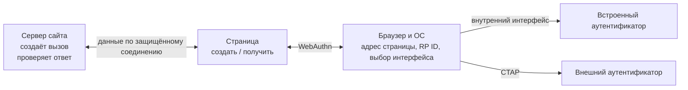
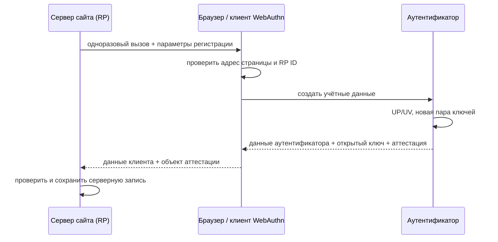
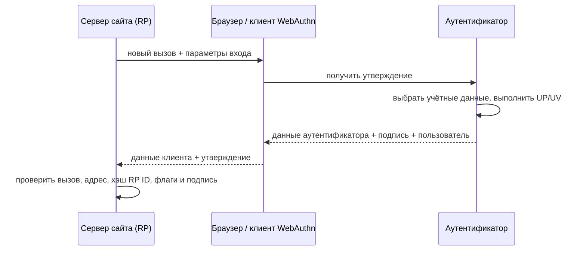

# 🌐 WebAuthn: браузерный API аутентификации FIDO2

> [!info] О чём заметка
> Сайт может попросить браузер создать для него отдельную пару ключей и потом проверять подписи этой пары при входе. Такой веб-интерфейс называется WebAuthn (Web Authentication) и образует веб-половину современного набора открытых стандартов криптографического входа. Здесь разобраны регистрация, вход, параметры интерфейса, обнаруживаемые учётные данные и версии стандарта; обмен с внешним устройством описан в [[FIDO/ctap|заметке о связи браузера с ключом]], общая картина — в [[FIDO/fido-protocols|обзоре всей системы]].

## Словарь перед схемами

Семейство открытых стандартов криптографического входа называют FIDO (Fast IDentity Online, «быстрая идентификация в сети»). Его современную веб-ветку называют FIDO2: WebAuthn связывает сайт с браузером, а CTAP связывает браузер или операционную систему с внешним аутентификатором.

Криптографическая пара состоит из закрытого и открытого ключей. Закрытый ключ создаёт подпись и остаётся у аутентификатора, а открытый ключ передаётся серверу и позволяет только проверить подпись.

Спецификацию WebAuthn публикует международный консорциум W3C (World Wide Web Consortium), который разрабатывает открытые стандарты Всемирной паутины. Статус Recommendation означает утверждённую рекомендацию W3C, Working Draft — рабочий черновик, а Candidate Recommendation — прошедший широкую проверку документ, для которого собирают опыт реализаций перед следующим этапом. Дополнение Snapshot означает зафиксированную датированную редакцию такого документа.

Сайт не разговаривает с внешним ключом или встроенным сканером отпечатка напрямую. Браузер и операционная система принимают запрос сайта, проверяют страницу, показывают системное окно и передают устройству только разрешённые данные. В стандарте этот посредник называется **client platform** («клиентская платформа»).

Ключ может подключаться к компьютеру кабелем, бесконтактным поднесением или радиоканалом. В таких описаниях USB означает проводной интерфейс, NFC (Near Field Communication) — связь на коротком расстоянии, а BLE (Bluetooth Low Energy) — экономичный режим Bluetooth.

Сайт, который принимает результат входа и отвечает за учётную запись, хранит открытый ключ пользователя и проверяет его подпись. В документации FIDO такую сторону называют **relying party**, сокращённо **RP** («полагающаяся сторона»). Идентификатор сайта для привязки ключа называется **RP ID**: это доменное имя без схемы `https://` и номера порта.

Браузер отдельно фиксирует точный адрес страницы, с которой начат вход: схему (`https`), имя узла и порт. Это значение защищает от подмены страницы другого сайта и называется **origin** («происхождение страницы»). Поэтому `https://login.example.com` и `https://example.com` имеют разные origin, даже если принадлежат одной организации.

Перед каждой регистрацией или попыткой входа сервер создаёт случайную одноразовую строку. Браузер передаёт её устройству, а сервер потом сверяет полученное значение с исходным, чтобы старый ответ нельзя было повторить. В протоколе такая строка называется **challenge** («вызов»).

При регистрации устройство создаёт пару ключей. Открытый ключ оно возвращает серверу, а у себя сохраняет закрытый ключ, идентификатор сайта, идентификатор пользователя и служебные параметры. Такую совокупность называют **credential** («учётные данные»), а конкретную внутреннюю запись с закрытым ключом на стороне аутентификатора — **credential source** («источник учётных данных»).

Иногда устройство хранит эту запись у себя так, чтобы само найти её по RP ID, даже когда сайт ещё не получил логин. Такая запись называется **discoverable credential** («обнаруживаемые учётные данные»), а старое название **resident key** («резидентный ключ»). Благодаря этому браузер может показать список подходящих учётных записей без заранее введённого имени пользователя.

Аутентификатор, встроенный в ноутбук или телефон и использующий его датчик, называют **platform authenticator** («платформенный аутентификатор»). Отдельный ключ безопасности или телефон, подключаемый к другому компьютеру, называют **roaming authenticator** («переносимый аутентификатор»). Пользователь видит первый как отпечаток или системный PIN, а второй как вставленный ключ, касание, бесконтактное поднесение или подтверждение на телефоне.

При входе устройство возвращает подписанный пакет, который доказывает серверу владение закрытым ключом и содержит сведения о выполненной проверке. Этот пакет называется **assertion** («утверждение»). Касание или иное действие, показывающее физическое участие человека, обозначают **user presence** (UP, «присутствие пользователя»). Персональный цифровой код называют PIN; его ввод или успешная биометрическая проверка дают **user verification** (UV, «проверку пользователя»). UP и UV означают разные свойства и не заменяют друг друга.

При регистрации устройство может дополнительно приложить свидетельство о типе и происхождении аутентификатора. Такое необязательное свидетельство называется **attestation** («аттестация»); обычному сайту оно чаще всего не требуется.

В обычной форме входа браузер может показать сохранённую учётную запись прямо в подсказке поля логина, не открывая отдельное окно выбора ключа. Такой режим называется **conditional UI** («условный интерфейс»): сайт заранее включает его, а пользователь выбирает предложенную запись и затем подтверждает вход. Технический режим запроса с ожиданием такого выбора называется **conditional mediation** («условное посредничество»).

Для страницы WebAuthn выглядит как несколько программных вызовов: один запускает регистрацию, другой просит подпись при входе. Такой набор функций называют **API** (Application Programming Interface, «программный интерфейс приложения»); в браузере эти функции доступны коду страницы на языке JavaScript.

Регистрация нового ключа и последующая проверка подписи образуют две связанные последовательности действий: сервер выдаёт данные, браузер обращается к аутентификатору, а пользователь подтверждает операцию. В стандарте каждую такую последовательность называют **ceremony** («церемония»).

Пользовательское название для обнаруживаемых учётных данных, рассчитанное на повседневный вход без пароля, это **passkey** («ключ доступа»). Passkey может храниться только на одном устройстве или синхронизироваться между устройствами через выбранную экосистему, но в обоих случаях опирается на те же механизмы WebAuthn и CTAP.

Браузер записывает challenge и origin в структуру `clientDataJSON`, то есть данные клиента в текстовом формате JSON. Аутентификатор возвращает бинарную структуру `authenticatorData` с хэшем RP ID, флагами проверок и счётчиком подписей. Хэш — короткий результат одностороннего преобразования; поле `rpIdHash` содержит хэш RP ID, поле `signCount` — счётчик, а алгоритм `SHA-256` создаёт 256-битный хэш.

Флаги в данных аутентификатора обозначают свойства ответа. BE (Backup Eligibility) показывает, допускает ли запись резервное копирование, BS (Backup State) — существует ли копия сейчас, AT — присутствуют ли данные аттестации, а ED — данные расширений. Комбинация BE=0 и BS=1 недопустима.

Телефон может подтвердить вход на другом компьютере через QR-код, проверку близости по Bluetooth и защищённый канал. Такой способ называют hybrid transport, или «гибридный транспорт».

Последовательные редакции WebAuthn обозначают словом Level и номером: Level 1, Level 2 и Level 3 — это уровни развития одной спецификации, а не классы надёжности ключа.

## Кратко

- **WebAuthn** — стандарт W3C (рекомендация с марта 2019): JavaScript-API `navigator.credentials.create()` / `get()`, через который сайт просит браузер создать ключевую пару или подписать вызов.
- Сайт не общается с аутентификатором напрямую: посредником выступает браузер/ОС. Сайт задаёт требования и может получить отдельные признаки, но не управляет конкретным USB-, NFC- или встроенным устройством.
- Браузер формирует `clientDataJSON` с origin и challenge, а аутентификатор формирует `authenticatorData` с `rpIdHash`, флагами и счётчиком. Сервер проверяет оба слоя и подпись.
- **Discoverable credentials** позволяют входить без ввода логина, а conditional UI (автозаполнение passkey, 2022+) встроил этот вход в привычную форму логина.

## Что такое WebAuthn

WebAuthn — это спецификация W3C, определяющая, как веб-сайт взаимодействует с аутентификаторами через браузер. Она родилась из черновиков «FIDO 2.0», которые альянс передал в W3C в 2015 году (хронология — в [[FIDO/fido-history|истории FIDO]]), и вместе с протоколом [[FIDO/ctap|CTAP]] составляет стандарт FIDO2: WebAuthn отвечает за уровень «сайт ↔ браузер», CTAP — за уровень «браузер ↔ внешнее устройство».

Проще говоря: WebAuthn — это общий язык, на котором любой сайт может попросить «создай мне ключ» или «подпиши этот вызов», не зная и не выбирая, чем именно пользователь подпишет — отпечатком на ноутбуке, телефоном или [[FIDO/hardware-security-keys|аппаратным ключом]]. Выбор аутентификатора — забота браузера и ОС.

В терминах стандарта сайт называется **relying party** (RP, «полагающаяся сторона»), а обе операции — регистрация и вход — «церемониями» (ceremony): последовательность шагов, часть которых выполняет человек.

## Где заканчивается WebAuthn

WebAuthn начинается в JavaScript API страницы и заканчивается объектом, который браузер возвращает странице. Закрытый ключ, PIN и биометрический шаблон через API не проходят. Если выбран внешний ключ, браузер и ОС переводят WebAuthn-запрос в [[FIDO/ctap|CTAP]]; если выбран встроенный аутентификатор, платформа может использовать собственный внутренний интерфейс.



Страница задаёт политику, а client platform решает, какой интерфейс показать. Параметр `authenticatorAttachment` или новые `hints` выражают предпочтение, но сайт не получает прямой доступ к USB, NFC, Touch ID или телефону.

## Церемония регистрации

1. Сервер генерирует случайный **challenge** и передаёт странице параметры: свой идентификатор (RP ID), данные пользователя, допустимые алгоритмы подписи и требования к аутентификатору.
2. Страница вызывает `navigator.credentials.create({publicKey: ...})`. Браузер показывает системный диалог: выбрать аутентификатор, коснуться ключа, ввести PIN или приложить палец.
3. Аутентификатор создаёт новую ключевую пару для этого RP ID и возвращает открытый ключ плюс **attestation** — опциональное свидетельство о происхождении и свойствах устройства ([[FIDO/fido-protocols#Attestation: когда серверу важен тип аутентификатора|зачем оно]]).
4. Браузер дополняет ответ структурой `clientDataJSON`, куда сам вписывает challenge и сериализованный **origin** страницы: схему, имя узла и порт. Подделать это поле сайт не может: его заполняет браузер.
5. Сервер сверяет challenge, origin, `rpIdHash`, флаги и структуру ответа, проверяет attestation по своей политике и сохраняет открытый ключ с идентификатором учётных данных.



## Церемония входа

1. Сервер присылает свежий challenge (и, при классическом входе по логину, список идентификаторов учётных данных пользователя — `allowCredentials`).
2. Страница вызывает `navigator.credentials.get({publicKey: ...})`; браузер будит аутентификатор, человек подтверждает участие касанием/PIN/биометрией.
3. Аутентификатор возвращает подпись над связкой «данные аутентификатора + хэш clientDataJSON». В данные входят хэш RP ID, **счётчик подписей** и флаги: UP (user presence — человек присутствовал) и UV (user verification — человек проверен PIN-ом или биометрией).
4. Сервер проверяет подпись открытым ключом, сверяет challenge, origin, RP ID и счётчик (защита от клонов — тот же приём, что в [[FIDO/u2f#Счётчик: защита от клонов|U2F]]).



## Что лежит внутри ответа

`clientDataJSON` создаёт клиент WebAuthn. В нём находятся `type` (`webauthn.create` или `webauthn.get`), серверный challenge, полный origin, признак вызова со страницы другого источника и при необходимости `topOrigin`. Сервер проверяет эти поля после получения ответа.

`authenticatorData` — бинарная структура длиной минимум 37 байт. Первые 32 байта содержат `rpIdHash`, затем идёт байт флагов и четырёхбайтовый `signCount`. При регистрации добавляются данные созданной учётной записи и, если есть аттестация, её дополнительные сведения. Данные расширений кодируются в компактном двоичном формате объектов CBOR (Concise Binary Object Representation).

```text
rpIdHash (32 байта) | flags (1 байт) | signCount (4 байта) | optional data
```

В байте флагов важны UP (user presence), UV (user verification), BE (учётные данные допускают резервное копирование), BS (резервная копия сейчас существует), AT (есть данные аттестации) и ED (есть данные расширения). Комбинация `BE=0, BS=1` недопустима.

## RP ID и origin: границы доверия

**Origin** — схема, хост и порт страницы. **RP ID** — доменное имя без схемы и порта. Браузер допускает RP ID, равный эффективному домену страницы или его общему регистрируемому доменному суффиксу; стандарт не пытается устанавливать юридическую принадлежность доменов одной организации. В стандарте исходную часть домена называют **effective domain**, а допустимый общий суффикс — **registrable-domain suffix**. Страница `https://login.example.com` может запросить `example.com`, но не соседний домен.

Origin попадает в `clientDataJSON`, а `SHA-256(RP ID)` — в `authenticatorData`. Аутентификатор подписывает `authenticatorData || SHA-256(clientDataJSON)`. Сервер обязан проверить оба значения; одна лишь проверка криптографической подписи без origin и `rpIdHash` оставляет реализацию небезопасной.

## Ключевые параметры API

При создании учётных данных сайт может задать:

- Для предпочтения встроенного средства или внешнего ключа служит параметр **authenticatorAttachment**. Значение `platform` означает встроенный аутентификатор, например системную проверку отпечатка или лица, а `cross-platform` — внешний ключ.
- Требование хранить обнаруживаемую учётную запись задаёт параметр **residentKey**. Его современный смысл относится к discoverable credential, несмотря на старое слово «resident» в имени.
- Необходимость локальной проверки человека задаёт параметр **userVerification**. Значение `required` требует PIN или биометрию, `preferred` просит их при наличии возможности, а `discouraged` не требует такой проверки.
- Запрос свидетельства о модели устройства задаёт параметр **attestation**. Значение `none` отказывается от него; варианты `direct` и `enterprise` запрашивают прямое или корпоративное свидетельство для сред со строгой политикой.

Расширения добавляют к обычной регистрации или входу дополнительные данные и операции. Одно из них позволяет аутентификатору детерминированно выводить секрет, пригодный как ключ шифрования, — так менеджеры паролей могут разблокировать хранилище аппаратным ключом, а не только входить по нему.

Название `prf` означает псевдослучайную функцию: при одном и том же входе она детерминированно выводит одинаковый секретный результат, но без ключа результат нельзя предсказать. Это необязательное расширение принимает один или два входа и возвращает 32-байтные результаты, связанные с конкретными учётными данными. Приложение может использовать результат как материал для ключа шифрования, но обязано уметь работать с отсутствием поддержки.

Другое расширение, `largeBlob`, связывает с учётными данными небольшой непрозрачный блок данных. При регистрации сайт запрашивает поддержку, а при входе выполняет чтение или запись. Это не общий файловый накопитель и не место для закрытого ключа.

## Discoverable credentials и вход без логина

Классический второй фактор требует сначала назвать логин, чтобы сервер прислал список учётных данных. **Discoverable credential** (устаревший синоним — resident key) хранится у управляющего аутентификатора или системного хранилища учётных данных вместе с идентификатором пользователя. Поэтому сайт может вызвать `get()` с пустым `allowCredentials`, а client platform сама найдёт и покажет учётки для этого RP ID. Так работает вход без предварительного ввода логина и пароля, он же вход по [[FIDO/passkeys|passkey]]. У аппаратного ключа такие записи расходуют ограниченную память ([[FIDO/hardware-security-keys|лимиты по моделям]]).

С 2022 года к этому добавился **conditional UI** («условное» автозаполнение): браузер предлагает passkey в подсказках поля логина. Сайт вызывает `get()` с `mediation: "conditional"`, а client platform ищет только discoverable credentials. Запрос не открывает модальный диалог заранее; пользователь выбирает credential в обычном интерфейсе автозаполнения и затем проходит локальное подтверждение.

Пустой `allowCredentials` просит client platform искать discoverable credentials по RP ID. Непустой список ограничивает выбор заданными идентификаторами учётных данных и нужен для входа по заранее выбранной записи, включая недоступные для самостоятельного поиска учётные данные. Внутренний непрозрачный идентификатор пользователя, который сервис записывает в обнаруживаемые учётные данные, называется `userHandle`. При входе без заранее названного логина сервер использует его, находит аккаунт и дополнительно проверяет, что возвращённый идентификатор учётных данных принадлежит этому пользователю.

## Возможности клиента и подсказки в Level 3

WebAuthn Level 3 добавляет метод `PublicKeyCredential.getClientCapabilities()` для запроса возможностей клиента. Он сообщает поддержку условного создания и получения учётных данных, входа через телефон и системного аутентификатора. Отсутствующий ключ означает «неизвестно», а не обязательное `false`: браузер может скрывать часть возможностей, чтобы сайт не составлял устойчивый отпечаток браузера, то есть не использовал fingerprinting для слежения.

Сайт может подсказать браузеру желательный интерфейс: отдельный ключ безопасности, текущее устройство или телефон. Массив таких необязательных подсказок называется `hints` и принимает значения `security-key`, `client-device` или `hybrid`. Если нужен обязательный тип аутентификатора или UV, сайт задаёт нормативный параметр, а не полагается на подсказку.

После удаления или переименования ключа доступа сайт может уведомить системное хранилище, чтобы оно не показывало устаревшую запись. Такие вызовы называются signal-методами; они передают сведения от полагающейся стороны аутентификатору и не заменяют серверное удаление учётных данных.

## Что сервер обязан проверить

Клиентская библиотека не заменяет серверную проверку. При регистрации сервер сверяет `type`, свежий challenge, разрешённый origin, `rpIdHash`, требуемые UP/UV-флаги и согласованность BE/BS. Затем он извлекает идентификатор учётных данных и открытый ключ, проверяет выбранный алгоритм, отсутствие дубликата и attestation согласно своей политике.

При входе сервер сначала находит сохранённую запись учётных данных и пользователя. После этого он проверяет `type`, challenge, origin, `rpIdHash`, флаги и подпись над точными байтами `authenticatorData || SHA-256(clientDataJSON)`. `signCount` служит сигналом возможного клонирования, сброса или гонки; несовпадение требует политики риска, но само по себе не доказывает клон.

> [!danger] Challenge нельзя генерировать в браузере
> Challenge создаёт сервер в доверенной среде, хранит до завершения церемонии и принимает один раз. W3C рекомендует не менее 16 байт энтропии. Повторно используемый или предсказуемый challenge разрушает защиту от повторного воспроизведения (replay).

## Частые ошибки API

Отмена пользователем, истечение времени ожидания и ряд внутренних отказов возвращаются под общим именем `NotAllowedError`, поэтому по одному имени нельзя диагностировать причину. Ошибка границы сайта обычно получает имя `SecurityError` и указывает на неверный домен страницы или RP ID. При создании записи невозможное обязательное требование возвращает `ConstraintError`, совпадение с запрещённым идентификатором — `InvalidStateError`, отсутствие подходящего типа или алгоритма — `NotSupportedError`, а некорректные параметры — `TypeError`.

Браузер намеренно скрывает часть подробностей, чтобы сайт не использовал ошибки для тихого определения зарегистрированных credentials и возможностей устройства. Пользовательский интерфейс должен давать безопасный повтор и понятный альтернативный путь, не раскрывая наличие чужого аккаунта.

## Версии стандарта

- **Level 1** — рекомендация W3C, март 2019: базовые церемонии.
- **Level 2** — рекомендация, апрель 2021: актуальная стабильная версия (расширения, аттестация для корпоративной среды и уточнения по resident keys).
- **Level 3** — Candidate Recommendation Snapshot от 26 мая 2026 года. Он находится на пути к Recommendation, но окончательный переход ещё не состоялся. Редакция описывает conditional mediation, hybrid transport, client capabilities, hints, BE/BS-флаги, signal-методы и PRF.

Базовый WebAuthn широко поддерживается: Chrome и Firefox — с 2018 года, Safari — с 2019–2020. Новые возможности Level 3 и интеграция с системными хранилищами passkey зависят от версии браузера и ОС.

## 📚 См. также

- [[FIDO/00-overview|Обзор раздела FIDO]] — оглавление всех заметок об аппаратных ключах
- [[FIDO/fido-protocols|Протоколы FIDO]] — общая картина: challenge-response, привязка к домену, attestation
- [[FIDO/ctap|CTAP]] — вторая половина FIDO2: как браузер говорит с внешним ключом
- [[FIDO/passkeys|Passkeys]] — потребительская надстройка над discoverable credentials
- [[FIDO/u2f|U2F]] — предшественник: второй фактор до WebAuthn
- 🔗 [WebAuthn Level 3 (W3C Candidate Recommendation)](https://www.w3.org/TR/webauthn-3/) — актуальная редакция стандарта
- 🔗 [WebAuthn Level 2 (W3C Recommendation)](https://www.w3.org/TR/webauthn-2/) — действующая рекомендация предыдущего уровня
- 🔗 [webauthn.guide](https://webauthn.guide/) — наглядное введение для разработчиков

---

> [!quote] 🤖 Эти статьи открыты — можно обучать на них ИИ
> При желании вы можете натренировать ИИ на наших статьях. Исходное форматирование и скачивание всего репозитория одним zip-архивом доступны в Forgejo: [исходник этой заметки](https://git.zapret.moe/zapretdiscordyoutube/todo/src/branch/main/FIDO/webauthn.md) · [весь репозиторий](https://git.zapret.moe/zapretdiscordyoutube/todo/src/branch/main).
