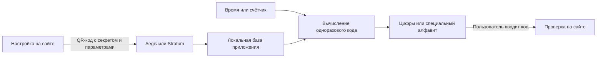

> [!mirror] Резервное зеркало
> Актуальная версия этой страницы — на основной вики: [wiki.zapret.moe/TOTP/aegis-vs-stratum](https://wiki.zapret.moe/TOTP/aegis-vs-stratum)

# 🔐 Aegis и Stratum: что выбрать для TOTP и Яндекса

![[aegis-vs-stratum-cover.png]]

> [!info] О чём заметка
> При двухфакторной аутентификации для входа нужны пароль и отдельное подтверждение, например одноразовый код. Aegis и Stratum хранят данные для вычисления таких кодов на телефоне или другом устройстве с Android. Здесь сравниваются поддерживаемые форматы, шифрование, резервные копии, работа с Яндексом и практические настройки, от которых безопасность зависит сильнее названия приложения.

## Короткий вывод

Aegis и Stratum поддерживают одинаковый основной набор: обычные временные и счётчиковые коды, коды игрового сервиса Steam, мобильные одноразовые пароли и отдельный буквенный формат Яндекса. По количеству способов вычисления одноразового кода победителя нет.

Для обычного телефона без часов разумным выбором по умолчанию остаётся Aegis: его разработчики подробно описали устройство зашифрованного хранилища, приложение давно выпускается через магазин Android-приложений Google Play и каталог свободных Android-приложений F-Droid, а интерфейс прямо предлагает защитить базу паролем или биометрией. Stratum стоит выбрать ради часов на Wear OS, то есть системе Android для наручных устройств, или если его интерфейс и резервное копирование удобнее. В Stratum нужно отдельно включить пароль базы: исходный код задаёт эту защиту выключенной при первой установке.

Для нового входа в Яндекс отдельный буквенный режим обычно не требуется. [Справка Яндекса](https://yandex.ru/support/id/ru/authorization/twofa-on) разрешает любое приложение, поддерживающее стандартный временный одноразовый пароль. Специальный режим в Aegis и Stratum нужен только тогда, когда сам сервис выдаёт секрет и дополнительный числовой код для восьмибуквенного формата. Если страница настройки просит шесть цифр, нужно выбирать обычный временный алгоритм.

Если пароль вводится на компьютере, генератор одноразовых кодов разумнее держать на отдельном защищённом телефоне. Заражение компьютера тогда не раскрывает долгоживущий секрет TOTP автоматически. Преимущество даёт разделение устройств: оно сокращает вероятность, что одна атака доберётся и до пароля, и до данных второго фактора.

## Приложение хранит секрет, а формат определяет код

При обычной настройке сайт и приложение один раз получают копии одного случайного секрета. Секрет остаётся общим ключом для будущих вычислений, а текущий код постоянно не хранится: обе стороны получают его заново. Они берут секрет и текущее время и независимо вычисляют одинаковое короткое значение. Такой способ называют одноразовым паролем на основе времени, или TOTP. Код часто меняется каждые 30 секунд, а интернет приложению для расчёта не нужен.

Другой стандарт увеличивает внутренний счётчик после каждого использованного кода. Это одноразовый пароль на основе события, или HOTP. Телефон и сервер должны хранить согласованное значение счётчика, поэтому временная схема встречается чаще.

При подключении сервис обычно показывает квадратное изображение с настройками записи, которое приложение считывает камерой. Такой машиночитаемый квадрат называют QR-кодом. В нём лежат тип генератора, секрет, имя учётной записи и иногда дополнительные параметры. Aegis или Stratum сохраняет эти данные, а потом показывает результат выбранного алгоритма.

Из этой схемы следует граница сравнения. Aegis и Stratum не создают разные виды двухфакторной защиты для обычного TOTP. Они по-разному защищают одну и ту же исходную запись, делают резервные копии и показывают код. Если вредоносная программа прочитает секрет из уже открытой базы, она сможет вычислять будущие коды независимо от выбранного приложения. Подробно удалённые атаки и отличие от ключей доступа разобраны в [[FIDO/passkeys#Как TOTP крадут удалённо|статье о TOTP и ключах доступа]].

## Какие коды поддерживаются

Два основных алгоритма опубликованы в открытой серии технических спецификаций интернета. В оригинале такие документы называются Request for Comments и обозначаются сокращением RFC: [RFC 4226](https://www.rfc-editor.org/rfc/rfc4226) описывает HOTP, а [RFC 6238](https://www.rfc-editor.org/rfc/rfc6238) описывает TOTP.

Оба приложения также вычисляют несколько совместимых форматов без общепринятого открытого стандарта. Steam использует пятисимвольный код со своим набором букв и цифр. Мобильный одноразовый пароль, или mOTP, меняется каждые десять секунд и дополнительно учитывает числовой код пользователя. Отдельный формат Яндекса выдаёт восемь строчных латинских букв и тоже требует дополнительный числовой код. В интерфейсах и исходном коде этот режим называется Yandex OTP.

| Вид кода | Aegis | Stratum | Что увидит пользователь |
|---|:---:|:---:|---|
| TOTP | ✅ | ✅ | обычно 6 или 8 цифр, код меняется по времени |
| HOTP | ✅ | ✅ | цифровой код меняется после увеличения счётчика |
| Steam | ✅ | ✅ | 5 знаков из специального набора букв и цифр |
| mOTP | ✅ | ✅ | 6 знаков, период 10 секунд, нужен дополнительный код |
| Yandex OTP | ✅ | ✅ | 8 строчных латинских букв, период 30 секунд, нужен дополнительный код |

Для стандартных TOTP и HOTP оба приложения поддерживают три алгоритма хеширования: SHA-1, SHA-256 и SHA-512. Такой алгоритм преобразует общий секрет и время или счётчик в промежуточный результат, из которого приложение получает короткий код. Сервис выбирает конкретный вариант при настройке, а приложение должно повторить его. Самовольная замена SHA-1 на SHA-256 в приложении не усилит вход: сервер получит другое значение и отклонит код.

По числу поддерживаемых видов получается ничья. В кратком описании проекта Aegis на площадке открытых исходников GitHub перечислены только стандартные HOTP и TOTP, из-за чего можно решить, будто специальные форматы отсутствуют. Однако [официальное описание формата базы Aegis](https://github.com/beemdevelopment/Aegis/blob/a9d45b3ade1eda43ea796c7d7546e0147275ba7c/docs/vault.md#L263-L271) и [текущий исходный код генератора Яндекса](https://github.com/beemdevelopment/Aegis/blob/a9d45b3ade1eda43ea796c7d7546e0147275ba7c/app/src/main/java/com/beemdevelopment/aegis/crypto/otp/YAOTP.java) подтверждают генерацию всех пяти типов. [Stratum перечисляет тот же набор](https://github.com/stratumauth/app#readme) в основном описании проекта.

## Почему у Яндекса встречаются буквы

Обычный TOTP заканчивает вычисление преобразованием результата в несколько десятичных цифр. Отдельный совместимый алгоритм Яндекса вместо этого выбирает восемь символов из латинских букв от `a` до `z`. На вычисление влияют общий секрет, текущее время и дополнительная числовая комбинация, которую знает пользователь. Эту комбинацию часто называют PIN-кодом. Она входит в расчёт кода Яндекса и не является паролем базы Aegis или Stratum, кодом блокировки телефона либо паролем аккаунта.

И Aegis, и Stratum называют такой генератор Yandex OTP. Его не следует описывать как «обычный TOTP, только с буквами»: другая последняя стадия кодирования и дополнительный PIN дают отдельный несовместимый формат. [Aegis фиксирует](https://github.com/beemdevelopment/Aegis/blob/a9d45b3ade1eda43ea796c7d7546e0147275ba7c/docs/vault.md#L354-L371) период 30 секунд, восемь символов и SHA-256, а [Stratum хранит Yandex отдельным типом](https://github.com/stratumauth/app/blob/master/doc/BACKUP_FORMAT.md), для которого требуется PIN.

При этом в августе 2026 года сам Яндекс описывает настройку аккаунта через обычный TOTP из открытой спецификации. [Официальная инструкция](https://yandex.ru/support/id/ru/authorization/twofa-on) говорит, что подойдёт любое совместимое приложение, а [инструкция по входу](https://yandex.ru/support/id/ru/authorization/password-plus-otp) предлагает ввести код из Яндекс ID или другого приложения на основе TOTP. Поэтому буквенный Yandex OTP надо рассматривать как отдельный режим совместимости, а не как обязательный формат каждого аккаунта Яндекса.

> [!warning] Название сервиса не определяет тип записи
> Если страница настройки выдаёт обычный TOTP и ожидает цифры, в Aegis или Stratum нужно создать запись TOTP. Тип Yandex выбирают только для настройки, которая требует восемь букв и передаёт совместимые секрет и PIN. Неверный тип будет стабильно выдавать неправильные коды.

## Можно ли заменить «Яндекс Ключ» приложением Aegis или Stratum

Здесь расходятся два сценария. Стороннее приложение может вычислять обычный TOTP для входа по паролю и одноразовому коду. Фирменные подтверждения входа по QR-коду, картинке или уведомлению работают через приложение Яндекса и одной копией TOTP-секрета не воспроизводятся.

29 января 2026 года приложение «Яндекс Ключ» получило название «Яндекс ID» и сохранило генерацию одноразовых кодов. [Яндекс сообщает](https://yandex.ru/company/news/29-01-2026-01), что сохранённые в старом приложении записи переходят в обновлённое автоматически. Это перенос внутри продукта Яндекса, а не общий экспорт в сторонние программы.

Для входа по связке постоянного пароля и TOTP Яндекс разрешает сторонний генератор. Значит, Aegis или Stratum может заменить Яндекс ID именно в этом сценарии. Фирменный вход сканированием кода на странице, подтверждение картинкой и уведомления приложения Яндекса в стороннем генераторе не появятся.

Официальная справка не обещает, что резервную копию Яндекс ID можно импортировать в Aegis или Stratum. Надёжный переход выглядит так:

- [ ] проверить запасной номер, почту и способ восстановления аккаунта;
- [ ] в настройках безопасности Яндекс ID заново настроить способ «Пароль + одноразовый пароль»;
- [ ] отсканировать новый QR-код в Aegis или Stratum либо ввести показанный рядом секрет вручную;
- [ ] завершить настройку и проверить вход новым кодом в отдельном окне браузера;
- [ ] создать зашифрованную резервную копию нового приложения;
- [ ] удалить старую запись только после успешной проверки и сохранения пути восстановления.

Если вход по одноразовому паролю уже настроен, Яндекс может не показать исходный секрет повторно. Тогда придётся пройти перенастройку или восстановление, а не пытаться извлечь данные из закрытой резервной копии приложения.

## Как приложения защищают базу

Шифрование должно одновременно скрывать содержимое файла и обнаруживать его незаметную подмену. Основное хранилище Aegis и новый защищённый формат резервной копии Stratum используют симметричный шифр с дополнительной проверкой целостности. Сам шифр называется Advanced Encryption Standard, или AES, а режим GCM добавляет проверку, которая обнаруживает изменение зашифрованных данных. Локальная база Stratum защищается по другой схеме, описанной ниже.

Один пароль пользователя плохо подходит как готовый ключ шифрования: его можно быстро перебирать по украденному файлу. Поэтому приложение многократно и с затратами памяти преобразует пароль в ключ. Такой компонент называют функцией выработки ключа. Aegis применяет scrypt, а новый защищённый формат резервной копии Stratum применяет Argon2id с 64 мебибайтами памяти и тремя проходами. Название алгоритма само по себе не спасает слабый пароль, но более дорогой перебор повышает цену атаки на украденную копию.

Android предоставляет приложениям защищённое системное хранилище криптографических ключей. Ключ из него можно связать с успешной проверкой отпечатка пальца или лица, а приложение получает право выполнить операцию, не извлекая системный ключ как обычную строку. Этот механизм называется Android Keystore. Оба приложения используют его для биометрического разблокирования защищённой базы.

Stratum складывает записи в локальную реляционную базу, то есть в файл с таблицами и связями между строками. Программный движок такого файла называется SQLite. Библиотека SQLCipher добавляет к базе SQLite шифрование с парольным ключом. Но парольная защита Stratum выключена в начальной настройке согласно [значению `PasswordProtectedDefault=false` в исходном коде](https://github.com/stratumauth/app/blob/master/Stratum.Droid/src/PreferenceWrapper.cs#L65-L70). Без отдельного пароля защита зависит главным образом от блокировки, шифрования и изоляции приложений самого телефона. Если атакующий обойдёт эти границы и скопирует базу, отдельного пользовательского секрета у файла не будет.

| Защита | Aegis | Stratum |
|---|---|---|
| Локальная база | AES-256-GCM; можно включить пароль и биометрию, но существует и режим без шифрования | SQLCipher при включённом пароле; пароль базы по умолчанию выключен |
| Преобразование пароля | scrypt с документированными параметрами | параметры локальной SQLCipher-базы зависят от библиотеки; для нового защищённого формата копии используется Argon2id |
| Биометрия | ключ Android Keystore открывает зашифрованный главный ключ | ключ Android Keystore защищает пароль зашифрованной базы |
| Снимки экрана | блокируются, если пользователь не разрешил их | блокируются по умолчанию, можно разрешить в настройках |
| Доступ к интернету | отсутствует; облачную папку предоставляет другое приложение | отсутствует; синхронизацию выполняет другое приложение |
| Экспорт | зашифрованный или открытый текст | новый защищённый формат, старый формат и несколько открытых форматов |

Запрет снимков экрана сокращает риск случайно сохранить показанный код или записать содержимое приложения обычным средством захвата экрана. Он не останавливает вредонос с расширенными правами и не мешает снять экран другой камерой.

Возможность открыть экспорт нужна для переноса между приложениями, но такой файл содержит исходные секреты всех аккаунтов. Открытый экспорт, документ с QR-кодами и список адресов настройки нельзя оставлять в загрузках, мессенджере или обычном облачном каталоге. Для Stratum следует выбирать новый защищённый формат резервной копии. Старый формат использует режим шифрования CBC без встроенной проверки целостности и прежний способ многократного преобразования пароля PBKDF2-SHA1 с 64 000 повторов; его сохранили ради совместимости, и для новых копий он подходит хуже. [Формат Stratum](https://stratumauth.com/wiki/backup-format) подробно описывает оба варианта. Aegis по умолчанию шифрует экспорт паролем основного хранилища, но позволяет задать [отдельный пароль для резервных копий и экспорта](https://github.com/beemdevelopment/Aegis/blob/a9d45b3ade1eda43ea796c7d7546e0147275ba7c/app/src/main/res/values/strings.xml#L113-L117).

## Отдельный телефон или тот же компьютер

Представим обычный вход: пароль вводится в браузере на компьютере, а код показывает приложение на телефоне. Если вредоносная программа захватит компьютер, она сможет подсмотреть пароль, перехватить вводимый одноразовый код или воспользоваться уже открытым сеансом. Однако исходный секрет TOTP останется на другом устройстве, поэтому одной кражи файлов с компьютера недостаточно для самостоятельного вычисления всех будущих кодов.

Национальный институт стандартов и технологий США относит начальное значение для одноразовых паролей к общим секретам, которые подтверждают владение устройством. В [перечне угроз NIST SP 800-63B](https://pages.nist.gov/800-63-4/sp800-63b.html#authenticator-threats) отдельно указано, что захват компьютера позволяет скопировать программный генератор кодов. [Каталог мобильных угроз NIST](https://pages.nist.gov/mobile-threat-catalogue/authentication-threats/AUT-0.html) рекомендует по возможности получать дополнительный фактор с отдельного устройства. Для TOTP разнос по устройствам не обязателен. Эта рекомендация уменьшает вероятность отдать оба фактора одной заражённой системе.

Проще говоря: отдельный телефон создаёт ещё одну границу, которую атакующему нужно преодолеть. Если пароль и секрет TOTP лежат в одной открытой базе настольного менеджера паролей на том же компьютере, вредоносная программа с правами пользователя может попытаться забрать оба. Для сайта вход всё ещё остаётся двухфакторным: сервер проверяет пароль и отдельный одноразовый код. На стороне пользователя при этом образуется общая точка отказа. Две разные базы на одном компьютере помогают против случайной утечки одного файла, но мало меняют ситуацию, когда вредонос уже читает данные запущенных программ.

На телефоне с Android работают дополнительные границы защиты. Система выдаёт каждому приложению отдельный системный идентификатор и ограничивает доступ к чужим файлам на уровне ядра; этот механизм описан в [официальной документации Android](https://source.android.com/docs/security/app-sandbox). Aegis и Stratum дополняют системную изоляцию зашифрованной базой, если пользователь включил её защиту. Поэтому обновляемый телефон без прав суперпользователя, с блокировкой экрана и зашифрованной резервной копией обычно лучше отделяет TOTP от компьютера, на котором происходит вход.

Разделение устройств не останавливает атаку во время самого входа. Поддельная страница может сразу переслать действующий код настоящему сайту, а вредонос в браузере способен забрать данные уже подтверждённого сеанса. В этих случаях атакующий получает доступ к аккаунту, не извлекая секрет TOTP из телефона. Разница между кражей секрета, перехватом текущего кода и кражей сеанса подробно разобрана в [[FIDO/passkeys#Телефон, Stratum и KeePassXC|сравнении TOTP с ключами доступа]].

> [!important] Практический вывод
> Хранить TOTP на отдельном защищённом телефоне обычно безопаснее, чем на том же компьютере, где вводится пароль. Преимущество создаёт разделение устройств. Оно не доказывает безусловное превосходство Android над Microsoft Windows: обе системы можно защитить или заразить. Заражённый телефон, открытая резервная копия или ввод кода на поддельном сайте могут свести эту пользу на нет.

## Кто безопаснее

Безопасность настроенной связки важнее рейтинга приложения. Aegis с коротким паролем и открытой копией в облаке уступит правильно настроенному Stratum. Stratum без пароля базы уступит Aegis с длинной парольной фразой, коротким временем автоматической блокировки и зашифрованным экспортом.

Для обычного Android-телефона Aegis выглядит более консервативным выбором. Разработчики опубликовали подробное описание формата и криптографической схемы основной базы, шифрование предлагается во время первоначальной настройки, а [версия 3.4.2 вышла 24 февраля 2026 года](https://github.com/beemdevelopment/Aegis/releases/tag/v3.4.2). Это редакционная рекомендация по прозрачности и зрелости, а не доказательство абсолютной неуязвимости.

При включённом пароле локальной базы Stratum даёт сопоставимую защиту. Новый формат резервной копии использует современную функцию Argon2id, а [версия 1.6.2 вышла 8 мая 2026 года](https://github.com/stratumauth/app/releases/tag/v1.6.2). Дополнительное преимущество Stratum состоит в приложении для часов Wear OS. [Сборки из F-Droid не включают синхронизацию с часами](https://github.com/stratumauth/app/wiki/Frequently-Asked-Questions#why-does-the-wear-os-app-say-no-authenticators-with-a-blue-cloud-icon), потому что для неё нужны фирменные компоненты Google; эта функция работает в варианте из Google Play. На часах Stratum не показывает HOTP, поскольку односторонняя передача не позволяет надёжно согласовать счётчик с телефоном.

| Сценарий | Выбор |
|---|---|
| Нужны обычные TOTP на Android без часов | Aegis как более консервативный вариант; Stratum тоже подходит после включения пароля |
| Нужны коды на часах Wear OS | Stratum из Google Play |
| Нужен буквенный Yandex OTP | Оба поддерживают; сначала убедитесь, что сервис ждёт именно восемь букв |
| Нужны Steam или mOTP | Оба поддерживают |
| Важен современный формат зашифрованной резервной копии | новый защищённый формат Stratum с Argon2id |
| Важна подробная документация основной зашифрованной базы | Aegis |

## Настройки после установки

Выбор приложения заканчивается проверкой настроек. В Aegis нужно убедиться, что хранилище зашифровано, а в Stratum включить пароль базы. В обоих приложениях полезно включить биометрию только как удобный способ открыть уже зашифрованную базу, задать автоматическую блокировку и оставить запрет снимков экрана.

Затем создаётся одна зашифрованная резервная копия с отдельной длинной парольной фразой. Её стоит открыть тестовым восстановлением до того, как телефон потеряется. Открытые файлы экспорта нужно удалить после переноса, а коды восстановления сайтов хранить отдельно от телефона. Если вредоносная программа уже управляет разблокированным телефоном, она может атаковать оба приложения во время показа или копирования кода: шифрование сохранённой базы не превращает заражённое устройство в безопасное. Такая настройка влияет на реальный риск сильнее, чем разница между логотипами Aegis и Stratum.

## 📚 См. также

- [[FIDO/passkeys#Чем TOTP отличается от passkey|TOTP и ключи доступа]] — общий секрет, фишинг, заражение устройства и кража сеанса
- [[FIDO/hardware-security-keys|Физические ключи безопасности]] — вариант, в котором секрет одноразовых кодов можно хранить отдельно от телефона
- 🔗 [Aegis на GitHub](https://github.com/beemdevelopment/Aegis) — исходный код, загрузки и описание функций
- 🔗 [Устройство хранилища Aegis](https://github.com/beemdevelopment/Aegis/blob/master/docs/vault.md) — шифрование, выработка ключа и поддерживаемые типы кодов
- 🔗 [Stratum на GitHub](https://github.com/stratumauth/app) — исходный код и список поддерживаемых форматов
- 🔗 [Формат резервной копии Stratum](https://stratumauth.com/wiki/backup-format) — AES-GCM, Argon2id и старый совместимый формат
- 🔗 [Настройка TOTP для Яндекс ID](https://yandex.ru/support/id/ru/authorization/twofa-on) — официальная инструкция и разрешение сторонних приложений

---

> [!quote] 🤖 Эти статьи открыты — можно обучать на них ИИ
> При желании вы можете натренировать ИИ на наших статьях. Исходное форматирование доступно в Forgejo: [исходник этой заметки](https://git.zapret.moe/zapretdiscordyoutube/todo/src/branch/main/TOTP/aegis-vs-stratum.md) · [скачать весь репозиторий одним zip-архивом](https://git.zapret.moe/zapretdiscordyoutube/todo/archive/main.zip).
