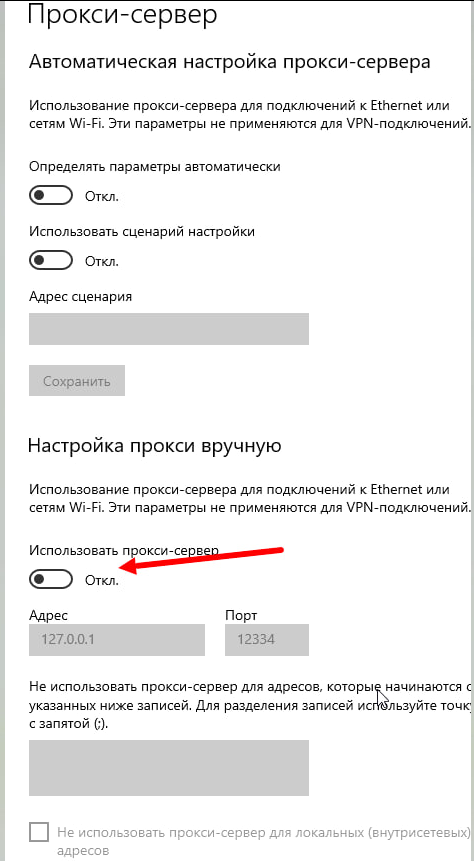
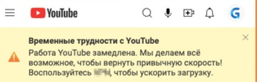
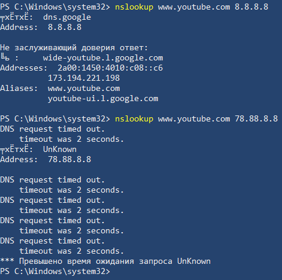

---
tags:
link:
aliases:
img:
description: "FAQ по Zapret: как добавить сайт в hostlist, почему не работают YouTube и Discord, чем мешают SaveFrom, AdGuard и Яндекс Браузер с Яндекс DNS."
---

> [!mirror] Резервное зеркало
> Актуальная версия этой страницы — на основной вики: [wiki.zapret.moe/Zapret/faq](https://wiki.zapret.moe/Zapret/faq)

# ❓ FAQ (часто задаваемые вопросы)
[[home|На главную]]

## Сайт никак не хочет работать
> [!NOTE]  
> Существует несколько способов принудительно добавить свои сайты. 

### Добавить свои сайты
В каждой строке этого файла вы пишете имя сайта (домен первого уровня, без `https:\\`, `www`), к которому нужно применять трюки `nfqws`.
```
blocked-site.com
another-blocked-site.org
example.net
ru
blockedsite.com
^onlyThisSite.com
```

Когда вы пытаетесь зайти на какой-то сайт, `nfqws` "смотрит" на имя этого сайта (из HTTP-заголовка `Host:` или из TLS SNI для HTTPS). Если это имя есть в вашем файле `--hostlist` (или является поддоменом сайта из списка, например, `sub.blocked-site.com` тоже попадет под правило для `blocked-site.com`. Если нужно вписать всю доменную зону `*.ru` то пишите в новой строчке просто `ru`), то `nfqws` применит к этому соединению все настроенные трюки (из `--dpi-desync`, `--hostcase` и т.д. в текущем профиле). Если сайта в списке нет, `nfqws` пропустит трафик к нему без изменений (в рамках этого профиля).

По умолчанию, если в списке есть `example.com`, то и `mail.example.com`, и `www.example.com` тоже будут обрабатываться. Если вы хотите обрабатывать *только* `example.com` и не трогать его поддомены, напишите в файле `^example.com` (с символом `^` в начале).

Запрет не сможет разблокировать сайт если он **заблокирован по айпи**. Для этого следует использовать разблокировку через hosts.

Список доменов у которого нет второго (_других_) IP и следовательно не будут работать через Zapret:
- https://animego.org (если айпишник `185.178.208.138`, но на некоторых провайдерах этот IP пингуется!)
- https://mail.proton.me (если айпишник `3.66.189.153`, `3.73.85.131`, `185.70.42.37`)
- https://www.instagram.com (если айпишник `157.240.205.174`)
- https://static.cdninstagram.com (если айпишник `157.240.205.63`)

Также проверьте что у вас выключен **ЛЮБОЙ VPN и прокси-сервер в Windows** - он также может ломать весь Запрет.



## YouTube никак не хочет работать (все стратегии перепробовал)


Для начала вам следует проверить свои расширения в браузере.

Окно выше окно рассылает **SaveFrom** или **Юбуст**, которое может **мешать** работе Zapret. ЭТО ОКНО **НИКАК НЕ СВЯЗАНО С YOUTUBE** И НЕ ДОЛЖНО ПОЯВЛЯТЬСЯ НА САЙТЕ!

**Отключайте расширения в браузерах перед тем как тестировать Zapret! (_не добавляйте в исключения расширения сайт Ютуба, а именно отключите!_)** Заместо SaveFrom.net рекомендуем использовать для скачивания видеороликов с Ютуба программу: https://github.com/yt-dlp/yt-dlp

Не используйте расширения:
- Savefrom
- Юбуст
- Adblock
- Антизапрет
- Adguard

## Discord
Включённый AdGuard блокирует соединение со звуком у Discord при работе Zapret.

## О Яндекс Браузере и Яндекс ДНС
> [!CAUTION]  
> [Яндекс DNS](https://t.me/bypassblock/134) перестали открывать Discord и другие заблокированные сайты. Не пользуйтесь ими. Рекомендуем сменить их на [**Google DNS**](https://developers.google.com/speed/public-dns) или [**Quad9 DNS**](https://quad9.net/service/service-addresses-and-features).



Мы настоятельно **НЕ** рекомендуем использовать Яндекс Браузер! Он может нарушать работу Zapret. Например:
- Подменять днс (меняется в настройках)
- Просто блокировать ютуб через свои механизмы
- Устанавливать свои расширения, которые мешают работе Ютуба

## У меня не работает mitmproxy
Это известная проблема. Обе программы используют WinDivert. Отключите Zapret и mitmproxy будет работать вновь.
